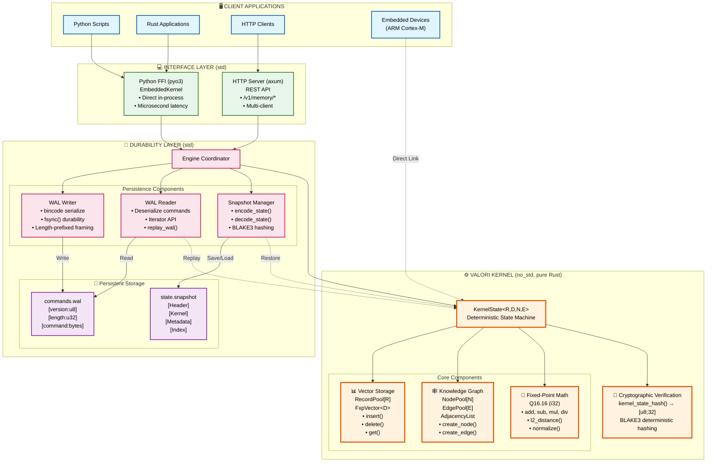
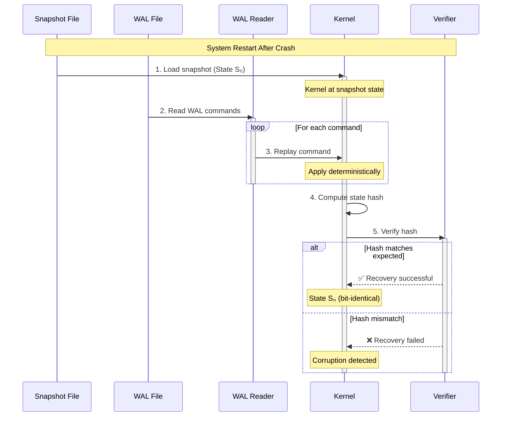

# Valori Kernel

**The Deterministic Memory Engine for AI Agents with Crash Recovery.**

[](LICENSE)
[]()
[](.github/workflows/multi-arch-determinism.yml)

**Valori** is a `no_std` Rust kernel providing a strictly deterministic vector database and knowledge graph. It guarantees **bit-identical state across any architecture** (x86, ARM, WASM) with **crash recovery** and verifiable memory for AI agents.

---

## ⚡ Key Features

### 1. Bit-Identical Determinism (CI-Verified)
Unlike standard vector stores using `f32` (which varies by CPU/compiler), Valori uses **Q16.16 Fixed-Point Arithmetic**.

- ✅ **Guarantee**: Same operations = Same hash on **any** architecture
- ✅ **Automated Proof**: [CI validates](docs/multi-arch-determinism.md) x86, ARM, WASM every commit
- ✅ **Safety**: Inputs validated to `[-32768.0, 32767.0]` range
- ✅ **Contract**: [Build determinism guarantees](docs/build-determinism.md)

**Example**:
```python
# Insert on ARM device
kernel_arm.insert(vector)
hash_arm = kernel_arm.get_state_hash()

# Replay on x86 server
kernel_x86.restore_from_wal(commands)
hash_x86 = kernel_x86.get_state_hash()

assert hash_arm == hash_x86  # ✅ Cryptographically identical!
```

### 2. Crash Recovery via WAL
Deterministic Write-Ahead Log enables bit-perfect recovery.

- ✅ **Durable**: fsync guarantees after each write
- ✅ **Deterministic Replay**: Snapshot + WAL = identical state
- ✅ **Cross-Platform**: ARM device → x86 cloud replay works perfectly
- ✅ **Restart Symmetric**: Resume interrupted operations seamlessly

**Example**:
```rust
// Normal operation - writes go to WAL
engine.insert_record(embedding)?;
engine.save_snapshot()?;

// After crash - automatic recovery
engine.restore_with_wal_replay(snapshot,  wal_path)?;
// ✅ State restored perfectly!
```

See: [WAL Replay Guarantees](docs/wal-replay-guarantees.md)

### 3. `no_std` Embedded Support
Run on microcontrollers without an operating system.

- ✅ **ARM Cortex-M** ready
- ✅ **No heap allocation** (stack/static only)
- ✅ **~4KB RAM** (256 records, 16-dim)
- ✅ **~5µs** insert latency

Perfect for: robotics, drones, autonomous systems, edge AI.

See: [Embedded Quickstart](docs/embedded-quickstart.md)

### 4. Hybrid-Native Architecture
One kernel, two deployment modes:

- **Embedded (FFI)**: Direct in-process linking via `pyo3` - microsecond latency
- **Remote (HTTP)**: Same kernel wrapped in `axum`/`tokio` - horizontal scaling
- **Switch**: Change 1 line of code to go from local dev → production

### 5. "Git for Memory"
Snapshot and restore your entire AI memory state.

- ✅ **Atomic Snapshots**: `[Header][Kernel][Meta][Index]`
- ✅ **Instant Restore**: Checkpoint and resume
- ✅ **Cryptographic Proofs**: Export state hashes for verification
- ✅ **Version Control**: Track memory evolution over time

---

## 🚀 Quick Start

### Python (Easiest)

```bash
pip install valori
```

```python
from valori import EmbeddedKernel

# Create kernel
kernel = EmbeddedKernel(max_records=1024, dim=16)

# Insert embeddings
embedding = model.encode("Hello, world!")
kernel.insert(embedding.tolist())

# Save snapshot
snapshot = kernel.save_snapshot()
hash = kernel.get_state_hash()

# Restore on any device/architecture
kernel2 = EmbeddedKernel(max_records=1024, dim=16)
kernel2.restore_snapshot(snapshot)
assert kernel2.get_state_hash() == hash  # ✅ Identical!
```

### Rust (Embedded)

```toml
[dependencies]
valori-kernel = { version = "0.1", default-features = false }
valori-embedded = "0.1"
```

```rust
#![no_std]

use valori_kernel::state::kernel::KernelState;

const MAX_RECORDS: usize = 256;
const DIM: usize = 16;

fn main() {
    let mut kernel = KernelState::<MAX_RECORDS, DIM, 0, 0>::new();
    
    // Insert vectors from sensors
    // ... your application logic ...
    
    // Export for verification
    let hash = kernel_state_hash(&kernel);
    transmit_to_cloud(hash);
}
```

See: [Embedded Quickstart](docs/embedded-quickstart.md)

### HTTP Server (Production)

```bash
cargo run --release -p valori-node
```

```python
from valori import KernelClient

# Remote mode
client = KernelClient(url="http://localhost:3000")
client.insert([0.1, 0.2, ...])
results = client.search([0.15, 0.25, ...], k=5)
```

---

## 📐 Architecture

Valori uses a **strict layered architecture** ensuring the deterministic kernel remains pure while enabling production durability and multiple deployment modes.



### 🔄 Crash Recovery Flow



### 🎯 Key Properties

| Layer | Characteristics | Guarantees |
|-------|----------------|------------|
| **Kernel** | `no_std`, pure functions, Q16.16 fixed-point | Bit-identical across x86/ARM/WASM |
| **Durability** | WAL + Snapshots, bincode serialization | Crash recovery, deterministic replay |
| **Interface** | HTTP (axum) or FFI (pyo3) | Flexible deployment, same kernel |
| **Storage** | Length-prefixed WAL, structured snapshots | Durability, atomicity |

**Separation of Concerns**: Core kernel stays pure (no I/O) → Durability wrapped outside → Flexible interfaces

See [Architecture Details](architecture.md) for deep dive.

---

## 🎯 Use Cases

### Robotics & Autonomous Systems
- **Problem**: Robot fleet needs shared, verifiable memory
- **Solution**: Deterministic snapshots replicate perfectly across devices
- **Benefit**: ARM robot → x86 cloud → different ARM robot = identical state

### Edge AI with Verification
- **Problem**: Cannot trust device-generated embeddings
- **Solution**: Export cryptographic proof of memory state
- **Benefit**: Cloud can verify computation happened correctly

### Safety-Critical Applications
- **Problem**: Need reproducible AI behavior for certification
- **Solution**: Bit-identical determinism + audit trail via WAL
- **Benefit**: Every decision is reproducible and verifiable

### Multi-Device Coordination
- **Problem**: Drones/robots need synchronized context
- **Solution**: WAL streaming + deterministic replay
- **Benefit**: All devices converge to identical memory state

---

## 📚 Documentation

- **Getting Started**:
  - [Embedded Quickstart](docs/embedded-quickstart.md) - ARM Cortex-M in 10 minutes
  - [Python Guide](docs/python-client.md) - FFI and remote modes
  - [HTTP API](docs/api.md) - REST endpoints

- **Core Concepts**:
  - [Architecture](architecture.md) - System design
  - [Determinism Guarantees](docs/determinism-guarantees.md) - Formal specification
  - [Fixed-Point Arithmetic](docs/core-concepts.md) - Why FXP?

- **Advanced**:
  - [WAL Replay Guarantees](docs/wal-replay-guarantees.md) - Crash recovery
  - [Multi-Arch Validation](docs/multi-arch-determinism.md) - CI proof
  - [Performance Benchmarks](docs/benchmarks.md) - Speed & memory

---

## 🔬 Proof of Determinism

### The Problem: Floating Point Non-Reproducibility

The same embedding model + same input = **different results** on different CPUs:

```python
# x86 output
[0xbd8276f8, 0x3d6bb481, 0x3d1dcdf1, ...]

# ARM output  
[0xbd8276fc, 0x3d6bb470, 0x3d1dcdf9, ...]
      ↑↑           ↑↑           ↑↑
   Different!   Different!   Different!
```

This is **IEEE-754 compliant** but breaks reproducibility.

### Our Solution: Fixed-Point Arithmetic

Valori uses Q16.16 fixed-point (32-bit integers):
- ✅ Bit-identical across **all** architectures
- ✅ Validated in CI: x86 = ARM = WASM
- ✅ No floating point unit required

**Automated proof**: Our CI runs identical tests on 3 architectures and compares cryptographic hashes. If hashes diverge, build fails.

See: [Multi-Architecture Determinism](docs/multi-arch-determinism.md)

---

## 🛠️ Development

```bash
# Build kernel (no_std)
cargo build --lib --release

# Build node server
cargo build --release -p valori-node

# Run tests
cargo test --all-features

# Run determinism validation
cargo test -p valori-node --test multi_arch_determinism --release

# Start server
cargo run --release -p valori-node
```

---

## 📊 Performance

| Operation | Latency | Memory |
|-----------|---------|--------|
| Insert (16-dim) | ~5µs | ~64 bytes |
| L2 Distance | ~2µs | - |
| Snapshot (256 records) | ~100µs | ~4KB |
| WAL Replay (100 cmds) | ~600µs | - |

**Platform**: ARM Cortex-M4 @ 168MHz

---

## 🤝 Contributing

We welcome contributions! See [CONTRIBUTING.md](CONTRIBUTING.md).

**Key areas**:
- Embedded platform testing
- Performance optimization
- Documentation improvements

---

## 📄 License

AGPL-3.0 - See [LICENSE](LICENSE) for details.

---

## 🌟 Why Valori?

Most vector databases sacrifice **reproducibility** for performance. Valori proves you can have both:

✅ **Deterministic** - Bit-identical across any platform  
✅ **Verifiable** - Cryptographic proofs of state  
✅ **Durable** - Crash recovery via WAL  
✅ **Embedded** - Runs on ARM Cortex-M  
✅ **Fast** - Microsecond latencies  
✅ **Proven** - Automated CI validation  

Perfect for robotics, autonomous systems, edge AI, and any application where reproducibility matters.

---

**Ready to build verifiable AI memory?** → [Get Started](docs/embedded-quickstart.md)
