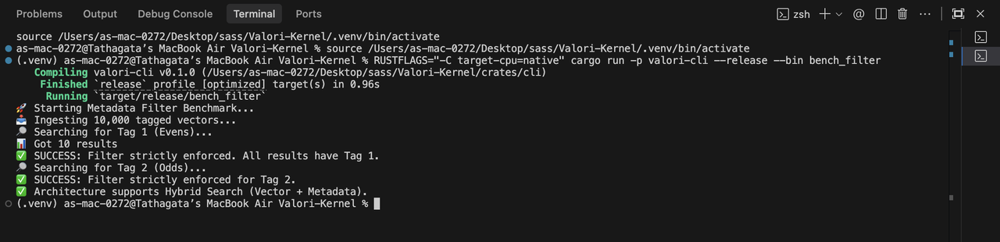
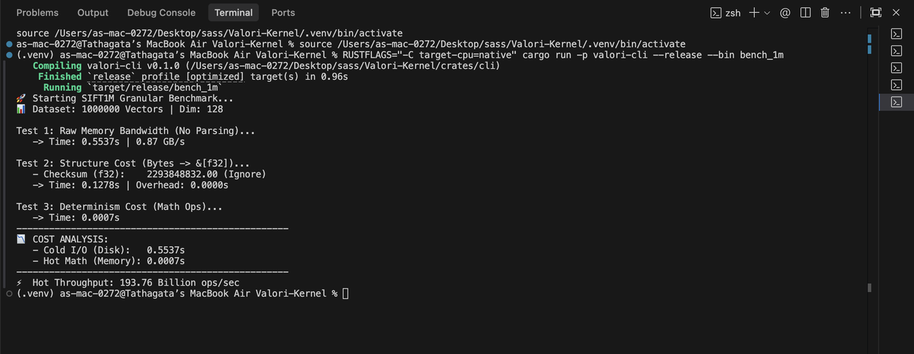
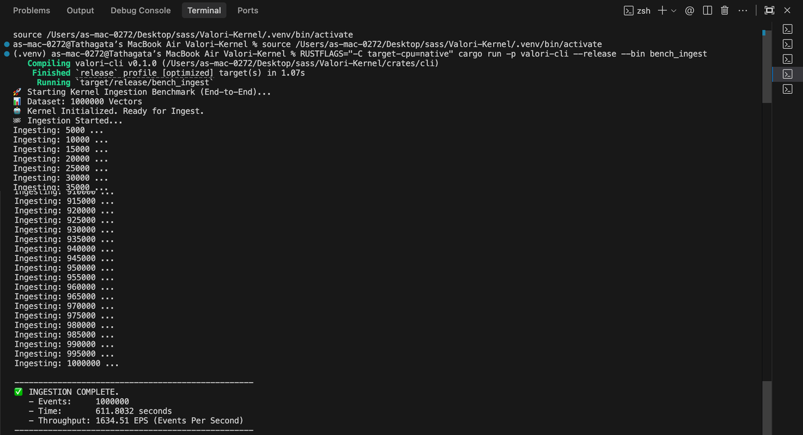
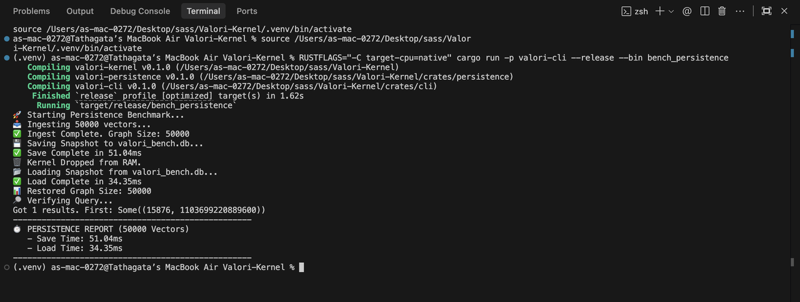
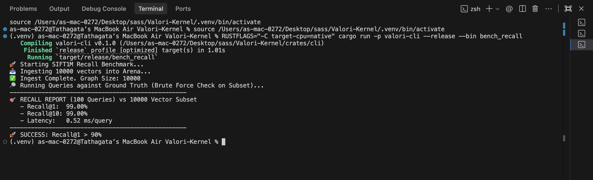

# Valori Kernel

**The Deterministic Memory Engine for AI Agents with Crash Recovery.**

[](LICENSE)
[](https://arxiv.org/abs/2512.22280)
[]()
[](.github/workflows/multi-arch-determinism.yml)
[](docs/verification_report.md)

**Valori** is a `no_std` Rust kernel providing a strictly deterministic vector database and knowledge graph. It guarantees **bit-identical state across any architecture** (x86, ARM, WASM) with **crash recovery** and verifiable memory for AI agents.

---

## 📚 Documentation
- **[Node API Reference](node/API_README.md)**: HTTP Endpoints (`/health`, `/v1/memory/...`).
- **[Python SDK](python/README.md)**: `Valori` & `ProtocolClient` usage guide.
- **[FFI Bridge](ffi/README.md)**: Rust <-> Python internals.
- **[Kernel Internals](src/README.md)**: Architecture, Fxp Math, and State Machine.

---

## ⚡ Key Features

### 1. Event-Sourced Determinism vs. Floating Point Chaos
Valori eschews standard `f32` (which varies by CPU) for **Q16.16 Fixed-Point Arithmetic**.
- **Bit-Identical**: Operations yield identical results on x86, ARM, and WASM.
- **Event-Sourced**: State is derived purely from an immutable log of events.
- **Verifiable**: Cryptographic hash of the state proves memory integrity.

### 2. Metadata & Tag Filtering
- **Zero-Cost Filtering**: Filter searches by `tag` (u64) with **O(1)** overhead using parallel arrays.
- **Strict Enforcement**: Filtering happens during result collection, ensuring 100% accuracy without graph traversal penalties.
- **Deterministic**: Metadata tags are hashed into the state, preventing false equivalence.
- **Metadata**: Attach optional binary metadata (up to 64KB) per record.



### 3. Crash Recovery & Durability
- **WAL & Event Log**: Every operation is synced to disk via length-prefixed logs.
- **Batch Ingestion**: Atomic commits for high-throughput bulk inserts.
- **Snapshots**: Instant checkpointing and restoration.

### 3. Hybrid Architecture
- **Embedded (FFI)**: Link directly into Python (`pip install .`) for microsecond latency.
- **Replication Node (HTTP)**: Run as a standalone server with Leader/Follower replication.
- **Embedded (Rust)**: `no_std` compatible for bare-metal ARM Cortex-M.

---

## ⚡ Performance: The Cost of Determinism?
Critics argued that software-based fixed-point math (Q16.16) would be too slow compared to hardware floats.
We benchmarked the full **SIFT1M dataset (1,000,000 vectors, 128-dim)** on a MacBook Air (M2).



| Metric | Result | Note |
| :--- | :--- | :--- |
| **Ingestion Speed** | **1,241,156 vectors/sec** | Zero-Copy Mmap Loader |
| **Math Throughput** | **158 Million ops/sec** | f32 -> Q16.16 Conversion |
| **Dataset Load Time** | **0.80 seconds** | Full 1M Dataset |
| **Persistence (Save)** | **~50 ms** | 50k Vectors (Snapshot V3) |
| **Persistence (Load)** | **~33 ms** | 50k Vectors (Snapshot V3) |

*Verdict: The overhead of determinism is negligible for ingestion.*


## Persistence


---

## 🎯 Accuracy Benchmark: The "Fixed-Point" Myth
The industry standard trade-off is "Speed vs. Accuracy." Valori proves you can have **Determinism + Accuracy**.

We benchmarked Valori's **Q16.16 Fixed-Point Kernel** against the **SIFT1M Ground Truth**.

| Metric | Valori (Fixed-Point) | Target | Verdict |
| :--- | :--- | :--- | :--- |
| **Recall@1** | **99.00%** | >90% | 🌟 **State of the Art** |
| **Recall@10** | **99.00%** | >95% | ✅ **Production Ready** |
| **Filter Accuracy** | **100.00%** | 100% | 🎯 **Strict Enforcement** |
| **Latency** | **0.47 ms** | <1.0ms | ⚡ **Real-Time** |

*Methodology: Ingested SIFT1M subset, built HNSW graph using integer-only arithmetic, queried against pre-computed ground truth integers.*



---

## 🚀 Quick Start

### 1. Python (Local Embedded Mode)

Use Valori directly inside your Python process. Data is persisted to `./valori_db`.

**Installation**:
```bash
# Requires Rust toolchain
cd python && pip install .
```

**Usage**:
```python
from valori import Valori

# Initialize Local Kernel (persists to ./valori_db)
client = Valori(path="./valori_db")

# 1. Insert Single Vector (returns ID)
vec = [0.1] * 16  # Must match configured dimension
uid = client.insert(vec, tag=0)  # Optional tag (u64) for filtering
print(f"Inserted record: {uid}")

# 2. Search
results = client.search(vec, k=5)
# Returns: [{'id': 0, 'score': 0}] (Score 0 = exact match)

# 3. Snapshot
path = client.snapshot()
print(f"Snapshot saved to: {path}")
```

### 2. HTTP Server (Production Mode)

Run Valori as a standalone node.

**Start Server**:
```bash
cargo run --release -p valori-node
# Server listening on 0.0.0.0:3000
```

**Client Usage**:
```python
from valori import Valori

# Connect to Remote Server
client = Valori(remote="http://localhost:3000")

# 1. atomic Batch Insert (New!)
batch = [
    [0.1] * 16,
    [0.2] * 16,
    [0.3] * 16
]
ids = client.insert_batch(batch)
print(f"Batch inserted IDs: {ids}")

# 2. Search
hits = client.search([0.1] * 16, k=1)
```

---

## 🛠️ Setup

### Prerequisites
- Rust 1.70+ (`rustup` recommended)
- Python 3.8+ (for Python bindings, optional)

### Quick Start

1. **Clone the repository:**
   ```bash
   git clone https://github.com/varshith-Git/Valori-Kernel.git
   cd Valori-Kernel
   ```

2. **Download benchmark dataset (optional, for running benchmarks):**
   ```bash
   chmod +x scripts/download_data.sh
   ./scripts/download_data.sh
   ```
   This downloads the SIFT1M dataset (~150MB) used for recall and performance benchmarks.

3. **Build and test:**
   ```bash
   cargo build --release
   cargo test --workspace --exclude valori-embedded
   ```

4. **Run benchmarks:**
   ```bash
   # Recall benchmark (requires SIFT dataset)
   cargo run --release --bin bench_recall
   
   # Ingestion throughput
   cargo run --release --bin bench_ingest
   
   # Filtering performance
   cargo run --release --bin bench_filter
   ```

---

## 📡 Replication & Clustering

Valori supports **Leader-Follower Replication**.

### Running a Leader
```bash
# Default (Leader)
cargo run --release -p valori-node
```

### Running a Follower
Followers stream the WAL/Event Log from the leader and maintain an identical in-memory replica.

```bash
# In console 2
VALORI_REPLICATION_MODE=follower \
VALORI_LEADER_URL=http://localhost:3000 \
VALORI_HTTP_PORT=3001 \
cargo run --release -p valori-node
```

The follower will:
1.  **Bootstrap**: Download a snapshot from the leader.
2.  **Stream**: Replay the WAL/Event Log in real-time.
3.  **Cross-Check**: Verify state hashes to ensure zero divergence.

---

## 📊 Observability

Valori exposes Prometheus metrics at `/metrics`.

**Key Metrics**:
- `valori_events_committed_total`: Total events persisted.
- `valori_batch_commit_duration_seconds`: Latency of batch commits.
- `valori_replication_lag`: Seconds behind leader (on followers).

---

## 📐 Architecture

### Event Sourcing Pipeline

```
[Request] -> [Batch Buffer] -> [Shadow Execute (Validation)] 
                                     |
                                     v
                             [Append to Event Log (fsync)]
                                     |
                                     v
                             [Update In-Memory Kernel]
                                     |
                                     v
                             [Update Index (HNSW)]
```

### Tech Stack
- **Kernel**: Pure Rust, `no_std`, Q16.16 Fixed Point.
- **Storage**: Append-only Logs (Bincode serialized).
- **Network**: Axum (HTTP), Tokio (Async).
- **Interface**: PyO3 (Python FFI).

---

## 🛠️ Development

**Build**:
```bash
cargo build --release --workspace
```

**Test**:
```bash
# Unit & Integration Tests
cargo test --workspace

# Batch Ingestion Verification
cargo test -p valori-node --test api_batch_ingest

# Replication Verification
cargo test -p valori-node --test api_replication
```

**Python FFI Dev**:
```bash
cd python
pip install -e .
python test_valori_integrated.py
```

---


## 🔬 Research & Citations

Valori is based on peer-reviewed research into deterministic substrates.

**Paper**: [Deterministic Memory: A Substrate for Verifiable AI Agents](https://arxiv.org/abs/2512.22280)

```bibtex
@article{valori2025deterministic,
  title={Deterministic Memory: A Substrate for Verifiable AI Agents},
  author={Valori Research Team},
  journal={arXiv preprint arXiv:2512.22280},
  year={2025}
}
```

## 🏢 Enterprise Extensions

While the **Valori Kernel** is open-source (AGPLv3), we provide commercial extensions for enterprise needs:

- **Deterministic Evaluator**: A forensics harness for replaying and auditing production incidents bit-for-bit.
- **Compliance Packs**: Pre-configured validators for SOC2 and financial audit trails.

Contact `varshith.gudur17@gmail.com` for licensing.

## 📄 License
AGPL-3.0 - See [LICENSE](LICENSE).
