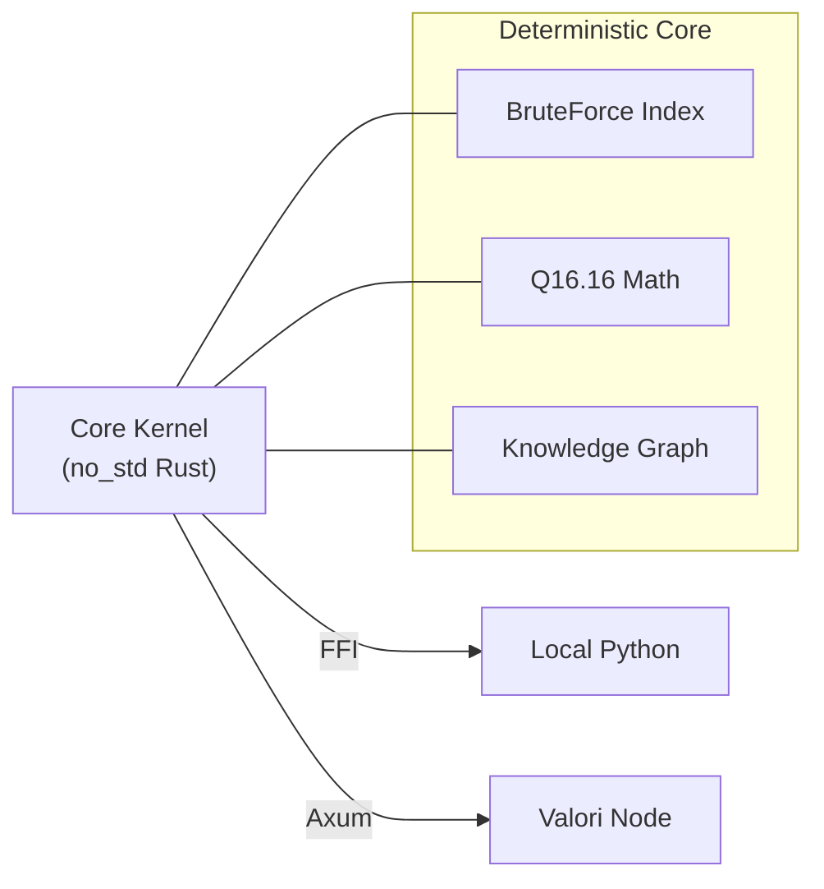

# Valori Kernel

**The Deterministic Memory Engine for AI Agents.**

[](LICENSE)
[]()

**Valori** is a `no_std` Rust kernel providing a strictly deterministic vector database and knowledge graph. It guarantees **bit-identical state across any architecture** (x86, ARM, WASM), enabling verifiable and reproducible AI memory.

---

## ⚡ Technical Highlights

### 1. Bit-Identical Determinism
Unlike standard vector stores using `f32` (which varies by CPU/Compiler), Valori uses a custom **Q16.16 Fixed-Point Arithmetic** engine.
- **Guarantee**: `State + Command_Log = Hash` is identical on a MacBook `M3`, `Intel` Server, or `WASM` runtime.
- **Safety**: Inputs are strictly validated to `[-32768.0, 32767.0]` to prevent overflow.
- **Contract**: See [Build Determinism and Toolchain Contract](docs/build-determinism.md) for why we pin compilers.

### 2. Hybrid-Native Architecture
One kernel, two modes of operation:
- **Embedded (FFI)**: Links directly into your Python process via `pyo3`. Microsecond latency, zero network overhead.
- **Remote (Node)**: The exact same kernel wrapped in `axum`/`tokio` for horizontal scaling.
- **Transition**: Move from local dev to distributed prod by changing **1 line of code**.

### 3. "Git for Memory"
- **Atomic Snapshots**: State is serialized into a verifiable format: `[Header][Kernel][Meta][Index]`.
- **Instant Restore**: Checkpoint low-level state and restore instantly.

---

## Reproducibility Failure in Embeddings (x86 vs ARM)

This repository demonstrates a fundamental problem in modern AI systems:

**The same embedding model, same input, and same code can produce different results on different CPU architectures.**

This is not a bug. This is **IEEE-754 compliant** floating-point behavior.

### Environment

| Machine | Architecture | OS |
| :--- | :--- | :--- |
| PC | x86_64 | Windows |
| Laptop | ARM64 | macOS (Apple Silicon) |

**Python dependencies** (identical on both machines):
- `python==3.10`
- `numpy==1.26.4`
- `sentence-transformers==2.6.1`

### Step 1: Generate embeddings

```python
# embed.py
import numpy as np
from sentence_transformers import SentenceTransformer

model = SentenceTransformer("sentence-transformers/all-MiniLM-L6-v2")

texts = [
    "Revenue for April",
    "What is the profit in April?",
    "April financial summary",
    "Total earnings last month",
    "Completely unrelated sentence"
]

embeddings = model.encode(texts, normalize_embeddings=False)
np.save("embeddings.npy", embeddings)
```

### Step 2: Inspect raw float bits

```python
# inspect_embeddings.py
import numpy as np

emb = np.load("embeddings.npy")

for i in range(5):
    print(hex(emb[0][i].view(np.uint32)))
```

**Output (x86 / Windows)**
```text
0xbd8276f8
0x3d6bb481
0x3d1dcdf1
0xbd601d21
0x3b761ffb
```

**Output (ARM / macOS)**
```text
0xbd8276fc
0x3d6bb470
0x3d1dcdf9
0xbd601d16
0x3b762229
```

### What this means

These values represent the exact bit patterns of the embedding floats. **The values differ before any search or indexing.**

This behavior is:
- ✅ standards-compliant
- ✅ expected
- ⚠️ unavoidable with floats

In other words: **AI memory diverges at the embedding boundary itself.**

### Step 3: Distance computation divergence

```python
# search_float.py
import numpy as np

emb = np.load("embeddings.npy")
query = emb[0]

def l2(a, b):
    acc = 0.0
    for i in range(len(a)):
        d = a[i] - b[i]
        acc += d * d
    return acc

scores = [(i, l2(query, emb[i])) for i in range(len(emb))]
scores.sort(key=lambda x: x[1])

print(scores)
```

### Result

1.  **Distances differ slightly across machines**
2.  **Ordering may differ**
3.  **Downstream retrieval becomes non-replayable**

### Why this matters

If AI memory is stored as floating-point vectors:
- ❌ Retrieval is not reproducible
- ❌ Decisions cannot be replayed
- ❌ Auditing becomes impossible
- ❌ Edge and defense deployments are unsafe

This is not a vector database issue. **It is a numerical determinism issue.**

### Deterministic Alternative (Fixed-Point)

Valori addresses this by enforcing a deterministic memory boundary:

```python
SCALE = 65536

def to_fxp(vec):
    return (vec * SCALE).astype(np.int32)
```

Fixed-point vectors:
- ✅ are bit-identical across architectures
- ✅ produce identical distances
- ✅ guarantee deterministic retrieval

**Key takeaway**: Floating-point embeddings make AI memory non-deterministic by design. Deterministic AI systems require deterministic memory.

---

## 🚀 Quick Start

### Installation

```bash
pip install valori
```

### Mode A: Embedded (Local Research/Dev)
**Transport: FFI (Zero-Copy Memory Access)**
Runs inside your Python process. No server required.

```python
from valori import ProtocolClient

# 1. Initialize (Zero-config)
client = ProtocolClient(embed=my_embedding_fn)

# 2. Upsert (Text -> Chunk -> Embed -> Store)
# Automatically handles chunking and linking nodes.
local_ref = client.upsert_text(
    "Valori uses Q16.16 fixed-point math for determinism.",
    metadata={"source": "readme"}
)

# 3. Search
print(client.search_text("Why is it deterministic?"))
```

### Mode B: Remote (Production/Cloud)
**Transport: HTTP/HTTPS (JSON over TCP)**
Connects to a high-performance Rust server (`valori-node`).

**1. Start the Server**
```bash
# Optimized Release Build
cargo run --release -p valori-node
# > Listening on 0.0.0.0:3000
```

**2. Client Connection**
```python
# exact same API, just add 'remote' URL
# Local Dev:
client = ProtocolClient(embed=my_embedder, remote="http://localhost:3000")

# Production (HTTPS supported!):
client = ProtocolClient(embed=my_embedder, remote="https://testing.com")

# All operations form JSON-RPC calls automatically
client.upsert_text("This data lives in the cloud now.")
```

---

## 🛠️ Architecture



**Core Components:**
- **`valori-kernel`**: The pure state machine. No IO, No Alloc (mostly).
- **`valori-node`**: HTTP Service layer with Persistence (Disk/S3) and HNSW Indexing.
- **`valori` (Python)**: Unified Client implementing the `Memory Protocol`.

## 🔒 Security

Valori Secure Node supports Bearer Token authentication.

- **Enable**: Set `VALORI_AUTH_TOKEN="your-secret-key"` environment variable.
- **Connect**: Pass `api_key` to client.
- **Guide**: See [Authentication & Security](docs/authentication.md) for full details.

## 📦 Performance

- **Latencies**: `<500µs` for raw vector search (Local Mode).
- **Throughput**: Handles thousands of concurrent readers in Node mode (Tokio async).
- **Size**: Core kernel compiles to `<1MB`.

---

## 🔌 Integrations

Valori includes built-in adapters for popular AI frameworks.

### LangChain

```python
from valori.adapters.base import ValoriAdapter
from valori.adapters.langchain import ValoriRetriever

adapter = ValoriAdapter(base_url="http://localhost:3000", api_key="my-key", embed_fn=my_embed)
retriever = ValoriRetriever(adapter, my_embed, k=4)

docs = retriever.get_relevant_documents("What is Q16.16?")
```

### LlamaIndex

```python
from valori.adapters.base import ValoriAdapter
from valori.adapters.llamaindex import ValoriVectorStore

adapter = ValoriAdapter(base_url="http://localhost:3000", api_key="my-key")
store = ValoriVectorStore(adapter)

# Use as VectorStore in StorageContext
```

---

## License
**AGPLv3**. [Read more](LICENSE).
For commercial use, embedding in proprietary devices, or managed hosting, contact us for a [Commercial License](COMMERCIAL_LICENSE.md).
