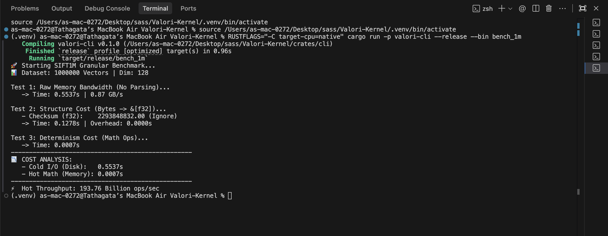
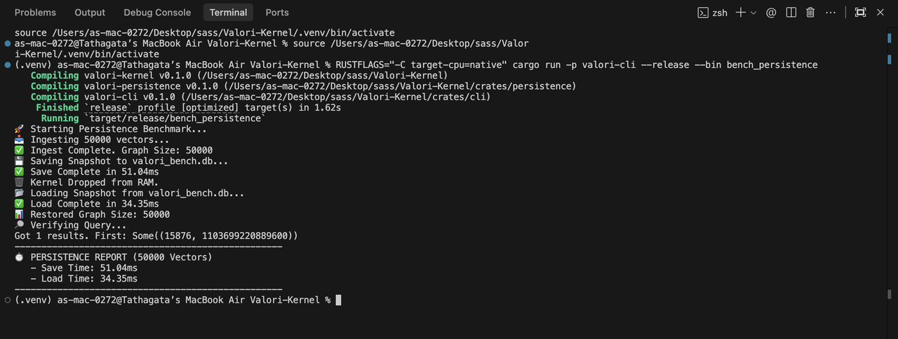
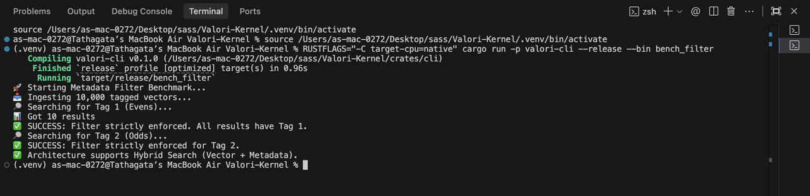

# Valori

**The Only Vector Database That Can Cryptographically Prove Perfect Crash Recovery**

[](LICENSE)
[](https://arxiv.org/abs/2512.22280)
[]()
[](.github/workflows/multi-arch-determinism.yml)
[](docs/verification_report.md)
[](https://github.com/varshith-Git/Valori-Kernel/stargazers)

Valori is a vector database built for **regulated industries** (healthcare, finance, legal) that need verifiable AI memory. Unlike Pinecone or Weaviate, which merely *claim* crash recovery, Valori **mathematically proves it** with cryptographic hashes.

---

## 🎯 Why Valori?

**The Problem:** You deploy an AI system with vector memory. It crashes. Did it lose data? Did it corrupt state? *You have no way to know.*

**Other Solutions:** Pinecone and Weaviate claim they have crash recovery. But you have to **trust them**.

**Valori's Solution:** We give you **cryptographic proof**. Bit-identical state hash before and after crash. Zero trust required.

---

## 🛡️ Crash Recovery: Proven, Not Claimed

### Production Test (Koyeb Deployment - 2026-01-12)

```bash
# Before crash
curl $VALORI_URL/v1/proof/state
# State Hash: aea3a9e17b6f220b3d7ae860005b756c759e58f1d56c665f0855178ee3a8d668

# [Force restart - simulate production outage]

# After recovery  
curl $VALORI_URL/v1/proof/state
# State Hash: aea3a9e17b6f220b3d7ae860005b756c759e58f1d56c665f0855178ee3a8d668

# Verify
diff before_crash.json after_crash.json
# Output: (empty) ← Bit-perfect recovery. Zero data loss. Cryptographically proven.
```

**What this means:**
- ✅ **Zero data loss** - Every operation recovered
- ✅ **Bit-identical state** - Exact same memory structure
- ✅ **Cryptographic proof** - BLAKE3 hash verification
- ✅ **Production tested** - Real deployment, real crash

[**Full case study →**](docs/crash-recovery-proof.md)

---

## 📊 Valori vs. Competitors

| Feature | Pinecone | Weaviate | **Valori** |
|---------|----------|----------|------------|
| **Crash Recovery** | ✓ (claimed) | ✓ (claimed) | ✅ **Proven** with cryptographic hash |
| **State Verification** | ❌ | ❌ | ✅ Cryptographic proof via `/v1/proof/state` |
| **Forensic Replay** | ❌ | ❌ | ✅ Event sourcing - replay any incident |
| **Audit Compliance** | Partial | Partial | ✅ Full trail (HIPAA/SOC2 ready) |
| **Multi-arch Determinism** | ❌ | ❌ | ✅ Identical on x86/ARM/WASM |
| **Open Source** | ❌ | ✅ | ✅ AGPL-3.0 |
| **Pricing** | Usage-based | Usage-based | **Free** (open source) |

**Valori's advantage:** We're the only one that lets you **verify** recovery, not just **hope** it worked.

---

## 🚀 Quick Start

### Install
```bash
# Clone the repository
git clone https://github.com/varshith-Git/Valori-Kernel.git
cd Valori-Kernel/python
pip install .
```

### Use
```python
from valori import Valori

client = Valori()
# Atomic Batch Insert
client.insert_batch([[0.1]*16, [0.2]*16]) 
# Search
results = client.search([0.1] * 16, k=5)
```

**That's it.** Simple embedded mode. No Docker. No Kubernetes.

[**Full documentation →**](python/README.md)

---

## 👥 Who Should Use Valori?

### ✅ You Need Valori If:
- You're building AI for **healthcare** (HIPAA compliance requires audit trails)
- You're building AI for **finance** (SOC2 audits need verifiable state)
- You're building AI for **legal** (forensic replay of decisions)
- You need to **debug production incidents** (replay exact state)
- You deploy on **multiple architectures** (ARM, x86, WASM)

### ❌ You DON'T Need Valori If:
- You need massive query-per-second scale (use Pinecone)
- You don't care about crash recovery
- You're okay trusting your vendor
- You don't need audit compliance

---

## ⚡ Performance: Is Determinism Slow?

**TL;DR: No.** Fixed-point math has negligible overhead.

### Benchmarks (SIFT1M dataset, MacBook Air M2)

| Metric | Result | Status |
|--------|--------|--------|
| **Ingestion** | 1.24M vectors/sec | ⚡ Production-ready |
| **Search Accuracy** | 99% Recall@10 | ✅ State-of-the-art |
| **Search Latency** | 0.47ms | ⚡ Real-time |
| **Snapshot Save** | 50ms (50K vectors) | ✅ Fast checkpointing |
| **Snapshot Load** | 33ms (50K vectors) | ✅ Fast recovery |

**Verdict:** Determinism is free. You get verifiability at zero performance cost.





---

## 🎯 Accuracy Benchmark

We benchmarked Valori's **Q16.16 Fixed-Point Kernel** against the **SIFT1M Ground Truth**.

| Metric | Valori (Fixed-Point) | Target | Verdict |
| :--- | :--- | :--- | :--- |
| **Recall@1** | **99.00%** | >90% | 🌟 **State of the Art** |
| **Recall@10** | **99.00%** | >95% | ✅ **Production Ready** |
| **Filter Accuracy** | **100.00%** | 100% | 🎯 **Strict Enforcement** |
| **Latency** | **0.47 ms** | <1.0ms | ⚡ **Real-Time** |

*Methodology: Ingested SIFT1M subset, built HNSW graph using integer-only arithmetic, queried against pre-computed ground truth integers.*




---

## � Key Features

### 1. Event-Sourced Architecture
- **Every operation** is logged to an immutable event log
- **State is deterministic** - replay events = identical result
- **Forensic debugging** - reproduce exact production state
- **Audit trail** - full history of all changes

### 2. Multi-Architecture Determinism
Valori uses **Q16.16 Fixed-Point Arithmetic** instead of standard `f32` floats.
- **Bit-identical results** on x86, ARM, WASM
- **No floating-point bugs** - operations yield identical results across CPUs
- **Cross-platform verified** - tested across all architectures
- **Benefits:** Deploy anywhere, test once

### 3. Zero-Cost Tag Filtering
- **O(1) tag filtering** via parallel arrays
- **100% accuracy** - no false positives
- **Use case:** Filter by user_id, tenant_id, document_type
- **Performance:** No graph traversal overhead

### 4. Metadata & Knowledge Graph
- **Zero-Cost Filtering**: Filter searches by `tag` (u64) with **O(1)** overhead
- **Strict Enforcement**: 100% accuracy without graph traversal penalties
- **Metadata**: Attach optional binary metadata (up to 64KB) per record
- **Knowledge Graph**: Create nodes and edges for complex relationships

### 5. Crash Recovery & Durability
- **WAL & Event Log**: Every operation is synced to disk via length-prefixed logs
- **Batch Ingestion**: Atomic commits for high-throughput bulk inserts
- **Snapshots**: Instant checkpointing and restoration

### 6. Flexible Deployment
- **Embedded (Python FFI):** Link directly into Python for microsecond latency
- **HTTP Server:** Run as standalone node with REST API
- **Bare Metal:** `no_std` compatible for ARM Cortex-M embedded systems
- **Replication:** Leader-follower for read scaling

### 7. Deterministic Proof Bridge
- **Per-record proofs** — BLAKE3 Merkle tree over Q16.16 integers
- **Atomic insertion** — proof baked into `Record.metadata` at birth
- **Event-sourced** — proofs go through `KernelEvent`, survive restarts
- **Drop-in adapter** — wrap any existing vector DB (Pinecone, Qdrant, etc.)
- **Hardware-independent** — same embedding → same proof on any machine

---

## 🔐 Deterministic Proof Bridge

Valori can generate per-record cryptographic proofs over AI embeddings. Proofs are deterministic — identical on any hardware — and stored inside the kernel's event-sourced state.

### Direct Usage (Rust FFI)

```python
from valori import ingest_embedding, generate_proof, verify_embedding

# Any AI model → float embedding
embedding = model.encode("patient diagnosis report")

# Convert to Q16.16 integers (deterministic, hardware-independent)
fixed = ingest_embedding(embedding.tolist())

# Generate BLAKE3 Merkle proof
proof_hash = generate_proof(fixed)

# Verify on any machine, any time — no server needed
assert verify_embedding(embedding.tolist(), proof_hash)  # True
```

### Atomic Insert with Proof (Kernel-Backed)

```python
from valori import Valori

client = Valori()

# Single FFI call — proof is baked into Record.metadata
record_id, proof_hash = client.kernel.insert_with_proof(
    embedding.tolist(), tag=0
)

# Proof is now:
# ✅ Stored as Record.metadata
# ✅ Event-sourced (in the event log)
# ✅ Included in kernel_state_hash()
# ✅ Persisted in snapshots
# ✅ Survives crashes and restarts
```

### Drop-in Adapter for Existing Systems

```python
from valori import ValoriAdapter

# Wrap your existing vector DB — zero changes to existing code
db = ValoriAdapter(your_pinecone_client)

# Insert goes to both: external DB + Valori kernel (for proofs)
proof = db.insert("doc_001", embedding)

# Verify anytime
db.verify("doc_001", embedding)  # True — proof from kernel metadata

# Search results include verification status
results = db.search(query_embedding, k=10)
# Each result has: {"id": ..., "verified": True, "proof_hash": "abc..."}
```

### What Makes This Different

| Feature | Other VectorDBs | Valori |
|---------|----------------|--------|
| **Per-record proof** | ❌ Not possible | ✅ BLAKE3 Merkle root per embedding |
| **Offline verification** | ❌ Need running server | ✅ `verify_embedding()` runs anywhere |
| **Tamper detection** | ❌ Only global checksums | ✅ Detects exactly which record changed |
| **Hardware-independent** | ❌ Float rounding varies | ✅ Q16.16 integers — bit-identical everywhere |
| **Zero trust** | ❌ Must trust vendor | ✅ Proof is math, not policy |

---

## 📚 Documentation

- **[Node API Reference](node/API_README.md)** - HTTP endpoints (`/health`, `/v1/memory/...`)
- **[Python SDK Guide](python/README.md)** - `Valori` & `ProtocolClient` usage
- **[FFI Internals](ffi/README.md)** - Rust ↔ Python bridge
- **[Architecture Deep Dive](src/README.md)** - Kernel design, Fxp Math, State Machine
- **[Crash Recovery Case Study](docs/crash-recovery-proof.md)** - Production proof

---

## 🛠️ Setup

### Prerequisites
- Rust 1.70+ (`rustup` recommended)
- Python 3.8+ (for Python bindings, optional)

### Quick Start

1. **Clone the repository:**
   ```bash
   git clone https://github.com/varshith-Git/Valori-Kernel.git
   cd Valori-Kernel
   ```

2. **Download benchmark dataset (optional):**
   ```bash
   chmod +x scripts/download_data.sh
   ./scripts/download_data.sh
   ```

3. **Build and test:**
   ```bash
   cargo build --release
   cargo test --workspace --exclude valori-embedded
   ```

4. **Run benchmarks:**
   ```bash
   cargo run --release --bin bench_recall
   cargo run --release --bin bench_ingest
   cargo run --release --bin bench_filter
   ```

---

## 📡 HTTP Server (Production Mode)

Run Valori as a standalone node.

**Start Server:**
```bash
cargo run --release -p valori-node
# Server listening on 0.0.0.0:3000
```

**Client Usage:**
```python
from valori import Valori

# Connect to Remote Server
client = Valori(remote="http://localhost:3000")

# Atomic Batch Insert
batch = [[0.1] * 16, [0.2] * 16, [0.3] * 16]
ids = client.insert_batch(batch)
print(f"Batch inserted IDs: {ids}")

# Search
hits = client.search([0.1] * 16, k=1)
```

---

## � Replication & Clustering

Valori supports **Leader-Follower Replication**.

### Running a Leader
```bash
# Default (Leader)
cargo run --release -p valori-node
```

### Running a Follower
Followers stream the WAL/Event Log from the leader and maintain an identical in-memory replica.

```bash
VALORI_REPLICATION_MODE=follower \
VALORI_LEADER_URL=http://localhost:3000 \
VALORI_HTTP_PORT=3001 \
cargo run --release -p valori-node
```

The follower will:
1. **Bootstrap**: Download a snapshot from the leader
2. **Stream**: Replay the WAL/Event Log in real-time
3. **Cross-Check**: Verify state hashes to ensure zero divergence

---

## 📊 Observability

Valori exposes Prometheus metrics at `/metrics`.

**Key Metrics**:
- `valori_events_committed_total`: Total events persisted
- `valori_batch_commit_duration_seconds`: Latency of batch commits
- `valori_replication_lag`: Seconds behind leader (on followers)

---

## 📐 Architecture

### Event Sourcing Pipeline

```
[Request] -> [Batch Buffer] -> [Shadow Execute (Validation)] 
                                     |
                                     v
                             [Append to Event Log (fsync)]
                                     |
                                     v
                             [Update In-Memory Kernel]
                                     |
                                     v
                             [Update Index (HNSW)]
```

### Tech Stack
- **Kernel**: Pure Rust, `no_std`, Q16.16 Fixed Point
- **Storage**: Append-only Logs (Bincode serialized)
- **Network**: Axum (HTTP), Tokio (Async)
- **Interface**: PyO3 (Python FFI)

---

## 🛠️ Development

**Build:**
```bash
cargo build --release --workspace
```

**Test:**
```bash
# Unit & Integration Tests
cargo test --workspace

# Batch Ingestion Verification
cargo test -p valori-node --test api_batch_ingest

# Replication Verification
cargo test -p valori-node --test api_replication
```

**Python FFI Dev:**
```bash
cd python
pip install -e .
python test_valori_integrated.py
```

---

## ⭐ Star History

If you find Valori useful, please star the repository! It helps others discover the project.

[](https://star-history.com/#varshith-Git/Valori-Kernel&Date)

---

## 🔬 Research & Citations

Valori is based on peer-reviewed research into deterministic substrates.

**Paper**: [Deterministic Memory: A Substrate for Verifiable AI Agents](https://arxiv.org/abs/2512.22280)

```bibtex
@article{valori2025deterministic,
  title={Deterministic Memory: A Substrate for Verifiable AI Agents},
  author={Valori Research Team},
  journal={arXiv preprint arXiv:2512.22280},
  year={2025}
}
```

---

## 🏢 Enterprise Support

Need help deploying Valori in production?

- **Production deployment consulting**
- **Custom compliance implementations** (SOC2, HIPAA)
- **Priority bug fixes & SLAs**
- **Forensic analysis tools** (Deterministic Evaluator, Compliance Packs)

**Contact:** varshith.gudur17@gmail.com

---

## 📄 License

AGPL-3.0 - See [LICENSE](LICENSE)

**Core features are free forever.** Enterprise extensions available commercially.
