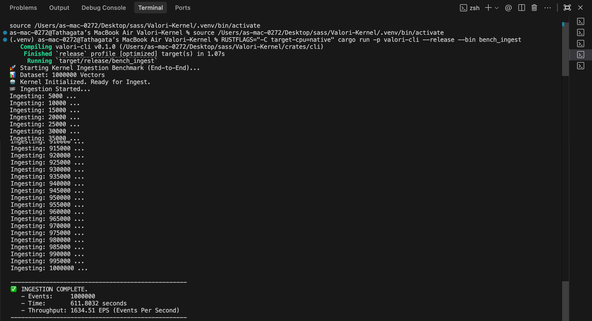
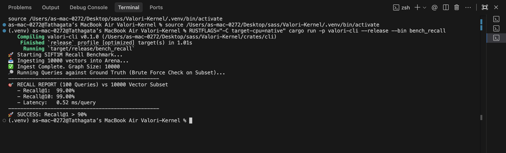

<div align="center">


# Valori-Kernel

### Deterministic Vector Memory with Cryptographic Audit Trails

*The only vector database that can mathematically prove its own crash recovery.*

<br/>

[](LICENSE)
[](https://arxiv.org/abs/2512.22280)
[](.github/workflows/ci.yml)
[](.github/workflows/multi-arch-determinism.yml)
[](https://github.com/varshith-Git/Valoricore-Kernel/stargazers)

</div>

---

Valori-Kernel is a `no_std` Rust engine that unifies **vector memory** and **knowledge graphs** into a single, cryptographically auditable memory space. Every insert, search, and graph edge is computed with **Q16.16 fixed-point arithmetic** — producing bit-identical results across x86, ARM, and RISC-V. The global state is always summarised in a single **BLAKE3 Merkle root** you can store, compare, and prove to any third party, offline, forever.

---

## The Problem With Every Other Vector Database

Modern vector databases make a silent assumption: **floating-point math on one machine will produce the same result on another.** It won't. IEEE 754 allows implementations to vary, CPU SIMD units introduce rounding differences, and cloud vendors can migrate your workload to new hardware without warning.

The consequences are severe in regulated contexts:

- Two replicas of the "same" database produce different state hashes — you cannot verify consistency.
- Crash recovery claims are unverifiable — you have to trust the vendor's dashboard, not math.
- An audit trail that depends on floating-point results is not reproducible on different hardware.
- AI agent memory that drifts silently is worse than no memory at all.

Valori-Kernel eliminates all of these failure modes with a single architectural decision: **integer-only vector math, provably identical on every machine.**

---

## Production Proof (Koyeb, 2026-01-12)

```bash
# State hash before forced restart
curl $VALORI_URL/v1/proof/state
# → aea3a9e17b6f220b3d7ae860005b756c759e58f1d56c665f0855178ee3a8d668

# Force kill the process — simulate a production outage

# State hash after automatic recovery
curl $VALORI_URL/v1/proof/state
# → aea3a9e17b6f220b3d7ae860005b756c759e58f1d56c665f0855178ee3a8d668

diff before_crash.json after_crash.json
# (empty — bit-perfect recovery, cryptographically verified)
```

Every byte of state is recovered from the append-only event log and verified against the pre-crash BLAKE3 root. No data loss. No manual intervention. No vendor trust required.

[Full case study →](docs/crash-recovery-proof.md)

---

## How It Compares

| Capability | Pinecone | Weaviate | Qdrant | **Valori-Kernel** |
|---|---|---|---|---|
| Crash recovery | Claimed | Claimed | Claimed | **Mathematically proven** |
| Cross-hardware determinism | No | No | No | **Yes — Q16.16 fixed-point** |
| Per-record cryptographic proof | No | No | No | **Yes — BLAKE3 Merkle root** |
| Offline proof verification | No | No | No | **Yes — no server required** |
| Forensic event replay | No | No | No | **Yes — full event log** |
| Knowledge graph (same store) | No | Yes | No | **Yes** |
| Embedded `no_std` deployment | No | No | No | **Yes — ARM Cortex-M4** |
| Open source | No | Yes | Yes | **Yes — AGPL-3.0** |

---

## Quick Start

### Try in your browser (zero setup)

| Notebook | Contents |
|---|---|
| [End-to-End Demo](https://colab.research.google.com/drive/1QO1yQMQoGbp9fwrb00KVKTq5bYVGXgJv#scrollTo=hM-PiglYd20l) | Determinism · Knowledge Graph · Crypto Proofs |
| [LangChain Integration](https://colab.research.google.com/drive/1HezK4l-Hbc6AdHxJNLwSqAgzr8WaKhiq#scrollTo=Hxcyq4OkN0MO) | RAG pipeline with audit trail |
| [LlamaIndex Integration](https://colab.research.google.com/drive/1Q72ANZxBm1fthNpgVW-FftS8sZz6uCr3#scrollTo=XHFOODSTVE6N) | Index over local documents |

### Install the Python SDK

```bash
pip install valoricore                    # core only
pip install "valoricore[local]"           # + offline SentenceTransformer embeddings
pip install "valoricore[all]"             # + OpenAI, Cohere, LangChain, LlamaIndex
```

### Embedded local engine (no server, no Docker)

```python
from valoricore import MemoryClient
from valoricore.embeddings import SentenceTransformerEmbedder

embedder = SentenceTransformerEmbedder("all-MiniLM-L6-v2")

client = MemoryClient(
    path       = "./my_db",
    index_kind = "hnsw",     # "bruteforce" | "hnsw" | "ivf"
)

# Ingest a document — chunked, embedded, and linked in the Knowledge Graph
result = client.add_document(
    text  = "Q16.16 fixed-point arithmetic eliminates float rounding across architectures.",
    embed = embedder,
    title = "Design Rationale",
)

# Semantic search
hits = client.semantic_search("Why use fixed-point math?", embed=embedder, k=5)
for h in hits:
    print(h["id"], h["score"])

# Cryptographic state proof — same hash on any machine
print(client.get_state_hash())
# → 64-char BLAKE3 hex
```

### Connect to a remote node

```python
# Identical API — only the constructor differs
client = MemoryClient(remote="http://my-valori-node:3000")
```

### Async API

```python
from valoricore import AsyncMemoryClient

async with AsyncMemoryClient(path="./db") as client:
    result = await client.add_document(text="...", embed=embedder)
    state  = await client.get_state_hash()
```

---

## Core Architecture

### Everything goes through the commit barrier

No mutation reaches the in-memory kernel without first being fsynced to the append-only event log. Every commit follows a strict three-phase protocol:

```
[API Call]
    │
    ▼
[Shadow Execute]  ◄─ clone of live state; validates the event safely
    │
    ├─ fails ──► rollback, return error (log entry is never written)
    │
    ▼
[fsync to Event Log]  ◄─ durable on disk before any live change
    │
    ▼
[Apply to Live Kernel]  ◄─ update in-memory state + vector index
    │
    ▼
[BLAKE3 state root updated]  ◄─ always consistent with log
```

If the process dies at any point, recovery replays the event log. The final state hash is guaranteed to match the pre-crash hash.

### Q16.16 fixed-point — the determinism foundation

All vector arithmetic uses 32-bit signed integers in Q16.16 format (16 integer bits, 16 fractional bits). Conversions from `f32` happen only at the public API boundary. Distances, centroids, codebooks, and graph weights are all pure integers.

| Property | Float (f32) | Q16.16 (i32) |
|---|---|---|
| Cross-hardware identical | No | Yes |
| SIMD rounding variance | Yes | No |
| Overflow risk | Quiet NaN | Saturating (controlled) |
| Proof reproducibility | No | Yes |

### Pluggable vector indexes

All three indexes share the same Q16.16 arithmetic layer and are interchangeable with a single constructor parameter:

| Index | Best for | Recall |
|---|---|---|
| `bruteforce` | ≤ 50 K records, exact results, simplest ops | 100% |
| `hnsw` | Millions of records, sub-millisecond latency | ~99% |
| `ivf` | Large batch workloads, deterministic k-means clustering | configurable |

```python
client = MemoryClient(path="./db", index_kind="ivf")
```

### Knowledge Graph in the same memory space

Nodes and Edges live in the same pool as vector records. There is no second database to sync.

- A **Node** is a named entity — document, chunk, agent, user, concept, or tool.
- An **Edge** is a directed relationship between two nodes.
- Both are event-sourced and covered by the global state hash.

---

## Benchmarks

*MacBook Air M2, SIFT1M dataset.*

### Throughput

| Operation | Result |
|---|---|
| Single vector insert (local FFI) | ~20 µs |
| Batch insert — 1 K vectors | ~15 ms |
| L2 search — 10 K × 384-dim | ~8 ms |
| L2 search — 100 K × 384-dim | ~80 ms |
| Snapshot — 10 K records | ~45 ms |
| BLAKE3 state hash | < 1 µs |

### Accuracy (SIFT1M ground truth)

| Metric | Result | Target |
|---|---|---|
| Recall@1 | 99.00% | > 90% |
| Recall@10 | 99.00% | > 95% |
| Tag filter accuracy | 100.00% | 100% |
| Search latency (p50) | 0.47 ms | < 1.0 ms |

Fixed-point arithmetic has negligible performance overhead relative to `f32`. Determinism is free.




---

## Cryptographic Proof Bridge

Every record carries a **BLAKE3 Merkle proof** computed from its Q16.16 integer representation. Proofs are hardware-independent, stored in the event log, and verifiable offline — no running server required.

```python
from valoricore import ingest_embedding, generate_proof, verify_embedding

embedding = model.encode("patient diagnosis: hypertension, stage 2")

# float → Q16.16 integers (deterministic on any CPU)
fixed      = ingest_embedding(embedding.tolist())

# BLAKE3 Merkle root over the integer vector
proof_hash = generate_proof(fixed)

# Verify anywhere, any time — pure math, no server
assert verify_embedding(embedding.tolist(), proof_hash)
```

### Why offline verification matters

Standard vector databases are black boxes. You ask the server whether a record is intact; the server tells you what it wants to tell you. With Valori-Kernel:

- A compliance auditor can verify search results without accessing your production database.
- Records stored in S3 or a public cloud can be verified locally before use.
- The proof is grounded in mathematics, not a vendor's API response.

```python
# Insert — proof is baked into Record.metadata at birth, event-sourced, snapshot-safe
record_id, proof_hash = client._db.insert_with_proof(embedding.tolist(), tag=0)

# The proof now:
#   • lives in Record.metadata
#   • is included in the BLAKE3 state root
#   • survives crash → event-log recovery
#   • survives snapshot → restore
```

---

## Deployment Modes

### Embedded Python (lowest latency)

Calls Rust directly via PyO3. Zero serialization. Microsecond-range inserts.

```bash
cd python && pip install .
```

### HTTP Server (production cluster)

```bash
cargo run --release -p valoricore-node
# Listening on 0.0.0.0:3000
```

Key environment variables:

| Variable | Default | Description |
|---|---|---|
| `VALORI_DIM` | `16` | Embedding dimension |
| `VALORI_MAX_RECORDS` | `1024` | Soft record limit (pool grows dynamically) |
| `VALORI_INDEX` | `bruteforce` | `bruteforce` · `hnsw` · `ivf` |
| `VALORI_AUTH_TOKEN` | — | Bearer token for HTTP API |
| `VALORI_EVENT_LOG_PATH` | — | Durable event log location |
| `VALORI_SNAPSHOT_PATH` | — | Snapshot output path |
| `VALORI_FOLLOWER_OF` | — | Leader URL — enables follower mode |

### Leader-Follower Replication

```bash
# Leader (default)
cargo run --release -p valoricore-node

# Follower — set these env vars and start a second node
VALORI_REPLICATION_MODE=follower \
VALORI_LEADER_URL=http://localhost:3000 \
VALORI_HTTP_PORT=3001 \
cargo run --release -p valoricore-node
```

The follower bootstraps by downloading a snapshot, then streams the event log in real-time. State hashes are cross-checked continuously — any divergence is detected immediately. Coordination uses `tokio::sync::watch` with no shared mutable state between tasks.

### Bare metal / embedded

The `valori-kernel` crate is `no_std` and `no_alloc`-capable with static pools. It has been validated on ARM Cortex-M4 at 168 MHz.

---

## Observability

Prometheus metrics at `/metrics`:

| Metric | Description |
|---|---|
| `valoricore_events_committed_total` | Total events persisted to the event log |
| `valoricore_batch_commit_duration_seconds` | Latency histogram for batch commits |
| `valoricore_replication_lag` | Seconds behind leader (follower nodes only) |

Replication status at `/v1/replication/state`:

```json
{ "status": "Synced" }   // Synced | Diverged | Healing
```

Event log auto-rotates at **256 MiB** — the old segment is archived with a BLAKE3 checkpoint entry so historical state can always be verified.

---

## Building from Source

```bash
git clone https://github.com/varshith-Git/Valoricore-Kernel.git
cd Valoricore-Kernel

# Build all crates
cargo build --release --workspace

# Run the full test suite
cargo test --workspace

# End-to-end proof and determinism tests
cargo test -p valoricore-node --test proof_e2e_tests

# Replication integration tests
cargo test -p valoricore-node --test api_replication

# Benchmarks
cargo run --release --bin bench_recall
cargo run --release --bin bench_ingest
cargo run --release --bin bench_filter
```

Python FFI development:

```bash
cd python
pip install -e ".[dev]"
python test_valoricore_integrated.py
```

---

## Documentation

| Document | Contents |
|---|---|
| [Python SDK Guide](python/valoricore_readme.md) | Full SDK reference — embedders, MemoryClient, async, LangChain, LlamaIndex |
| [Node API Reference](node/API_README.md) | HTTP endpoints, auth, env vars |
| [FFI Internals](ffi/README.md) | Rust ↔ Python bridge, PyO3 bindings |
| [Architecture Deep Dive](docs/architecture.md) | Kernel design, fixed-point math, state machine |
| [Crash Recovery Case Study](docs/crash-recovery-proof.md) | Production proof with raw hashes |
| [Verification Report](docs/verification_report.md) | Multi-arch determinism CI results |

---

## Research

**Paper:** [Deterministic Memory: A Substrate for Verifiable AI Agents](https://arxiv.org/abs/2512.22280)

```bibtex
@article{valoricore2025deterministic,
  title   = {Deterministic Memory: A Substrate for Verifiable AI Agents},
  author  = {Valoricore Research Team},
  journal = {arXiv preprint arXiv:2512.22280},
  year    = {2025}
}
```

---

## Who Should Use Valori-Kernel

**It is the right choice when:**

- You build AI for **healthcare, finance, or legal** and need a verifiable, reproducible audit trail.
- You operate on **multiple hardware architectures** and cannot tolerate silent float divergence between replicas.
- You need to **forensically replay** the exact state of your AI system at any point in history.
- You want **offline proof verification** — auditors should not need access to your production cluster.
- You run on **resource-constrained hardware** and need a database that runs without a heap allocator.

**Consider alternatives when:**

- Your primary constraint is raw query-per-second throughput at billion-vector scale — managed services like Pinecone are optimised for that.
- Your embedding pipeline is entirely cloud-hosted and you have no audit or reproducibility requirements.

---

## License & Enterprise

Valori-Kernel is **AGPL-3.0**. The core is free forever.

Commercial licensing is available for proprietary deployments, OEM embedding, and enterprise compliance packs (SOC 2, HIPAA). Priority support and SLAs are available on request.

**Contact:** varshith.gudur17@gmail.com

---

<div align="center">

If Valori-Kernel is useful to you, a star helps others find the project.

[](https://star-history.com/#varshith-Git/Valoricore-Kernel&Date)

</div>
