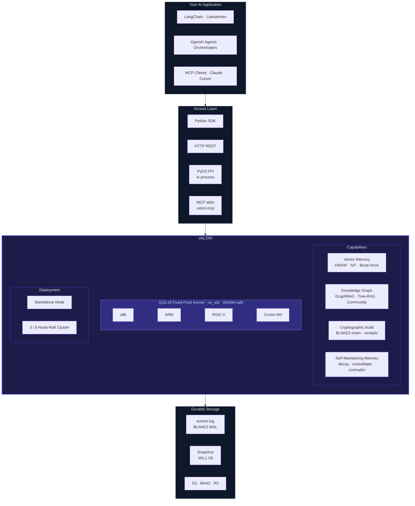

<div align="center">


# Valori

**The vector database that can mathematically prove it never lost your data.**

[](https://pypi.org/project/valoricore/)
[](LICENSE-MIT)
[](https://github.com/varshith-Git/Valori-Kernel/actions)
[](.github/workflows/multi-arch-determinism.yml)
[](https://arxiv.org/abs/2512.22280)
[](https://github.com/varshith-Git/Valori-Kernel/actions/workflows/test-count.yml)

*Q16.16 fixed-point arithmetic · BLAKE3 hash-chained audit log · openraft consensus · offline verifiable proofs*

</div>

---

## The Problem

Every vector database makes a silent assumption: float arithmetic on one machine produces the same result on another. It does not. SIMD units, cloud hardware migrations, and IEEE 754 implementation variance mean replicas silently diverge — and you can never verify they haven't.

In AI systems this compounds: agent memory drifts between restarts, crash recovery is unverifiable, and an audit trail built on float results cannot be reproduced anywhere else.

**Valori eliminates all of this with one decision: integer-only vector math, provably identical on every machine.**

---

## Production Proof

```bash
# State hash before a forced restart
curl $VALORI_URL/v1/proof/state
# → {"final_state_hash": [174, 163, 169, 225, 123, 111, 34, 11, ...]}

# kill -9 — no graceful shutdown, no flush

# State hash after automatic recovery
curl $VALORI_URL/v1/proof/state
# → {"final_state_hash": [174, 163, 169, 225, 123, 111, 34, 11, ...]}
# identical — bit-perfect recovery, cryptographically verified
```

Every byte of state is recovered from the append-only, BLAKE3-chained event log and verified against the pre-crash root. No data loss. No manual intervention. No trust required.

---

## Where Valori Sits in Your Stack


```mermaid
flowchart TB
    subgraph APP["Your AI Application"]
        direction LR
        A1["LangChain · LlamaIndex"]
        A2["OpenAI Agents · Orchestrators"]
        A3["MCP Clients · Claude · Cursor"]
    end

    subgraph ACCESS["Access Layer"]
        direction LR
        S1["Python SDK"]
        S2["HTTP REST"]
        S3["PyO3 FFI\nin-process"]
        S4["MCP stdio\nvalori-mcp"]
    end

    subgraph VALORI["  VALORI  "]
        direction TB

        subgraph CAPS["Capabilities"]
            direction LR
            C1["Vector Memory\nHNSW · IVF · Brute-force"]
            C2["Knowledge Graph\nGraphRAG · Tree-RAG · Community"]
            C3["Cryptographic Audit\nBLAKE3 chain · receipts"]
            C4["Self-Maintaining Memory\ndecay · consolidate · contradict"]
        end

        subgraph KERN["Q16.16 Fixed-Point Kernel  ·  no_std  ·  WASM-safe"]
            direction LR
            K1["x86"] ~~~ K2["ARM"] ~~~ K3["RISC-V"] ~~~ K4["Cortex-M4"]
        end

        subgraph DEPLOY["Deployment"]
            direction LR
            D1["Standalone Node"]
            D2["3 / 5-Node Raft Cluster"]
        end
    end

    subgraph STORAGE["Durable Storage"]
        direction LR
        ST1["events.log\nBLAKE3 WAL"]
        ST2["Snapshot\nVAL1 V6"]
        ST3["S3 · MinIO · R2"]
    end

    APP --> ACCESS --> VALORI --> STORAGE

    style APP      fill:#0f172a,color:#e2e8f0,stroke:#475569
    style ACCESS   fill:#0f172a,color:#e2e8f0,stroke:#475569
    style VALORI   fill:#1e1b4b,color:#e2e8f0,stroke:#6366f1,stroke-width:2px
    style CAPS     fill:#1e1b4b,color:#e2e8f0,stroke:#4338ca
    style KERN     fill:#312e81,color:#c7d2fe,stroke:#818cf8
    style DEPLOY   fill:#1e1b4b,color:#e2e8f0,stroke:#4338ca
    style STORAGE  fill:#0f172a,color:#e2e8f0,stroke:#475569
```

---

## Key Features

| | |
|---|---|
| **Determinism** | Q16.16 fixed-point — bit-identical across x86, ARM, RISC-V, Cortex-M4; NEON/AVX2/SSE4.1 SIMD with scalar fallback |
| **Audit trail** | Append-only BLAKE3-chained event log; offline verifiable with no server |
| **Tamper detection** | Locates the exact altered event, byte offset, and commit timestamp |
| **Raft cluster** | 3/5-node consensus via openraft 0.9 + tonic/gRPC + mTLS |
| **GraphRAG** | Vector search + subgraph traversal in one call, one consistent snapshot |
| **Agent memory (MCP)** | `valori-mcp` — verifiable recall with BLAKE3 receipt; works with Claude Desktop |
| **Recency decay** | `decay_half_life_secs` fades older memories in ranking without touching the state hash |
| **Valori Reranker** | Server-side hybrid retrieval — vector top-K pooled then re-scored by term frequency; 90% accuracy on hard lexical queries, 0.4 s latency, no external dependency |
| **Built-in ingest** | `POST /v1/ingest` — chunk + embed + insert + graph + audit in one call; `POST /v1/ingest/update` — diff-based document update (BLAKE3 content hash, re-embeds only changed chunks); `POST /v1/ingest?async=true` + `GET /v1/ingest/status/:job_id` — non-blocking background ingest; works in standalone and 3/5-node cluster; `VALORI_EMBED_PROVIDER=ollama\|openai\|custom`; `/v1/ingest/document` for chunking only |
| **Tree-RAG** | `POST /v1/tree/{build,query,verify}` — navigate a doc's table-of-contents to the right section with breadcrumb + line citations and a replayable BLAKE3 retrieval receipt; deterministic, no embeddings, catches tampering |
| **Self-maintaining memory** | `consolidate` (supersede a memory) and `contradict` (flag conflicts) commit `Supersedes`/`Contradicts` edges to the audit chain |
| **Multi-tenancy** | Up to 1 024 named collections; per-tenant API keys with RBAC |
| **Point-in-time reads** | Replay to any past state hash or log index |
| **GDPR erasure** | Crypto-shredding — DEK destruction = O(1) erasure, audit chain stays intact |
| **Embedded** | `no_std` / `no_alloc` kernel; runs on microcontrollers with no heap |
| **S3 offload** | Snapshot archival + WAL rotation to S3/MinIO/R2 |

→ [Full feature list and phase history](docs/phases/README.md)

---

## Performance

Measured on Apple Silicon M-series · release build · k=10.
Reproduce: `python3 benchmarks/local_perf.py --million`

### Batch insert throughput by embedding model

| Model | Dim | Batch 100 | Batch 1,000 | Batch 10,000 |
|---|---|---|---|---|
| baseline / custom | 128 | 20,800 rec/s | 98,150 rec/s | **177,705 rec/s** |
| nomic-embed-text · all-MiniLM-L6-v2 | 384 | 18,431 rec/s | 62,719 rec/s | **81,971 rec/s** |
| BGE-base · E5-base · bert-base | 768 | 14,284 rec/s | 36,815 rec/s | **47,143 rec/s** |
| OpenAI ada-002 · text-embedding-3-small | 1,536 | 9,734 rec/s | 19,929 rec/s | **25,196 rec/s** |

> **Batch size warning:** `insert_batch` with fewer than 100 records is **slower than a plain `insert` loop** — per-call overhead dominates at small sizes. Always use batches of ≥ 100; the sweet spot is 1,000–10,000.

### HNSW search latency by embedding model (10K records, k=10)

| Model | Dim | HNSW p50 | HNSW QPS | Brute p50 | Brute QPS |
|---|---|---|---|---|---|
| baseline / custom | 128 | 0.050 ms | 19,759 q/s | 1.224 ms | 810 q/s |
| nomic-embed-text · all-MiniLM-L6-v2 | 384 | 0.146 ms | 4,486 q/s | 3.329 ms | 273 q/s |
| BGE-base · E5-base · bert-base | 768 | 0.269 ms | 3,674 q/s | 7.338 ms | 135 q/s |
| OpenAI ada-002 · text-embedding-3-small | 1,536 | 0.523 ms | 1,897 q/s | 14.923 ms | 66 q/s |

> **Index selection warning:** Brute force is O(N) — latency grows linearly with dataset size. It becomes unviable above ~50K records at any dimension. **HNSW is mandatory for production read-heavy workloads above 50K records.** Build cost is paid once and survives snapshot/restore; search stays sub-millisecond regardless of dataset size.

### Search latency vs dataset size (HNSW, dim=128, k=10)

| Records | p50 | p99 | QPS |
|---|---|---|---|
| 1,000 | 0.05 ms | — | ~20,000 q/s |
| 10,000 | 0.05 ms | 0.069 ms | 19,759 q/s |
| 1,000,000 | **0.107 ms** | 0.138 ms | **9,199 q/s** |

→ **Sub-millisecond search at 1 million records.**

### Search latency vs dataset size (bruteforce, dim=128, k=10)

| Records | p50 | p95 | p99 | QPS |
|---|---|---|---|---|
| 1,000 | 0.129 ms | 0.131 ms | 0.135 ms | 7,820 q/s |
| 10,000 | 1.224 ms | 1.285 ms | 1.354 ms | 810 q/s |
| 50,000 | 10.129 ms | 10.735 ms | 11.336 ms | 98 q/s |
| 1,000,000 | 247.815 ms | 288.795 ms | 308.291 ms | 3 q/s |

### Search latency vs dataset size (bruteforce, dim=384, k=10) — measured 2026-07-08

Apple M-series · release build · NEON SIMD · random Gaussian vectors · localhost HTTP

| Records | p50 | p95 | p99 |
|---|---|---|---|
| 1,000 | 6.5 ms | 6.7 ms | 6.8 ms |
| 5,000 | 28.8 ms | 29.6 ms | 78.3 ms |
| 10,000 | 56.3 ms | 56.6 ms | 57.8 ms |
| 25,000 | 138.9 ms | 139.3 ms | 140.0 ms |
| 50,000 | 275.1 ms | 277.7 ms | 279.6 ms |

> SIMD (NEON/AVX2) is active for L2 distance and dot product. At dim=384 the current throughput ceiling is cache-miss cost from heap-allocated per-record vectors (~5.5 µs/record). **Switch to `VALORI_INDEX=hnsw` for N > 10k at dim=384** to stay sub-millisecond.

### Index comparison @ 1 million records (dim=128, k=10)

| Index | Build time | p50 | p99 | QPS |
|---|---|---|---|---|
| **HNSW** | 4.4 min (one-time) | **0.107 ms** | **0.138 ms** | **9,199 q/s** |
| IVF | 28 s | 58.35 ms | 66.05 ms | 16 q/s |
| Brute force | 27 s | 247.41 ms | 297.01 ms | 4 q/s |

### Snapshot timing

| Records | Dim | Size | `snapshot()` | `restore()` | `save_snapshot()` |
|---|---|---|---|---|---|
| 10,000 | 128 | 5.2 MB | 2.2 ms | 4.3 ms | 4.7 ms |
| 10,000 | 384 | 14.9 MB | 5.9 ms | 6.0 ms | 12.4 ms |
| 10,000 | 768 | 29.6 MB | 10.0 ms | 16.3 ms | 20.6 ms |
| 10,000 | 1,536 | 58.9 MB | 18.8 ms | 29.5 ms | 44.7 ms |
| 50,000 | 128 | 25.8 MB | 10.1 ms | 21.6 ms | 26.7 ms |

### Batch size sweet spot (dim=128, bruteforce, 10K total records)

| Batch size | Throughput |
|---|---|
| 1 (single inserts) | 2,512 rec/s |
| 10 | 1,936 rec/s ⚠️ slower than single |
| 100 | 14,561 rec/s |
| 500 | 60,805 rec/s |
| 1,000 | 95,147 rec/s |
| **10,000** | **174,963 rec/s** |

---

## Get Started

> **New contributor?** `bash dev-setup.sh` — one script installs Rust, the wasm32 target, Python SDK, and UI deps with OS detection and version gates. See [Build from Source](#build-from-source) and [CONTRIBUTING.md](CONTRIBUTING.md).

**Not writing code?** → [Option 2 — Web dashboard](#option-2--web-dashboard-no-code-60-seconds) is the fastest path. Point-and-click project management, no terminal after the first `docker compose up`.

**Writing code?** Pick a client:

**Which client should I use?**

| Client | Install / import | Use when |
|---|---|---|
| `MemoryClient` | `pip install "valoricore[local]"` · `from valoricore import MemoryClient` | No server — Rust kernel runs inside your Python process (offline, embedded, CI) |
| `SyncRemoteClient` | `pip install valoricore` · `from valoricore.remote import SyncRemoteClient` | `valori-node` is running and you want synchronous HTTP calls |
| `AsyncRemoteClient` | same · `from valoricore.remote import AsyncRemoteClient` | Same node, but in an `async`/`await` context (FastAPI, asyncio) |
| `ClusterClient` | same · `from valoricore.remote import ClusterClient` | 3/5-node Raft cluster — pass all node URLs, leader failover is automatic |

Everything else (`Valoricore`, `ValoricoreAdapter`, `LocalClient`) is an advanced wrapper or legacy alias — you don't need it to get started.

---

### Option 1 — Python SDK, embedded (~30 seconds, no server, no compile)

```bash
pip install valoricore
```

```python
# Copy-paste runnable — no server, no API key, no ellipses.
import math, os, shutil
from valoricore import MemoryClient

DIM = 16
DB = "./hello_valori"
if os.path.exists(DB): shutil.rmtree(DB)

def embed(text):
    s = sum(ord(c) for c in text)
    return [math.sin(s + i * 0.3) for i in range(DIM)]

db = MemoryClient(path=DB, dim=DIM)
db.add_document(text="Valori proves it never lost your data.", embed=embed)
db.add_document(text="Fixed-point math is bit-identical on every machine.", embed=embed)

hits = db.semantic_search("cryptographic proof", embed=embed, k=2)
for h in hits:
    print(f"score={h['score']:.4f}  {h.get('metadata','')[:60]}")

print(db.get_state_hash())  # run this on any machine → same 64-char hex
shutil.rmtree(DB)
```

Run it twice, run it on a different OS — the hash is always identical. That's the guarantee.

**See tamper detection in 10 more lines:**

```python
# Continue from the snippet above (before shutil.rmtree).
good_hash = db.get_state_hash()

# Flip one byte in the event log — simulating silent corruption or a malicious edit.
with open(f"{DB}/events.log", "r+b") as f:
    f.seek(64); b = f.read(1)[0]; f.seek(64); f.write(bytes([b ^ 0xFF]))

# Reload from the corrupted log.
db2 = MemoryClient(path=DB, dim=DIM)
corrupt_hash = db2.get_state_hash()

print(good_hash == corrupt_hash)   # False — one bit changed the entire hash
print(f"expected : {good_hash}")
print(f"replayed : {corrupt_hash}")
# An attacker cannot forge a matching hash without breaking BLAKE3.
```

Full demo with `valori-verify` exact-byte-offset detection: [`examples/tamper_demo.py`](examples/tamper_demo.py)

To use a real embedding model instead of the mock `embed()` function:

```bash
pip install "valoricore[local]"
```

```python
from valoricore import MemoryClient
from valoricore.embeddings import SentenceTransformerEmbedder

embedder = SentenceTransformerEmbedder("all-MiniLM-L6-v2")  # downloads ~90 MB once
db = MemoryClient(path="./my_db", dim=384)
db.add_document(text="The patient presented with hypertension.", embed=embedder)
hits = db.semantic_search("blood pressure", embed=embedder, k=5)
print(db.get_state_hash())
```

The Rust kernel runs inside your Python process via PyO3 — no server, no Docker, no Rust toolchain needed.

### Option 2 — Web dashboard (no code, ~60 seconds)

The fastest path if you're not writing code — a full point-and-click UI over your Valori node.

```bash
docker compose up -d              # start the node (port 3000)
cd ui && npm install && npm run dev                # start the dashboard (port 3001)
# open http://localhost:3001
```

**What you get:**
- **Project manager home** — create named, isolated workspaces; each project gets its own node, port, and data directory under `~/.valori/projects/<name>/`
- **Persistent state** — opening a project auto-starts its node and restores all data; closing it writes a final snapshot and locks files at rest
- **Live activity** — count-up stats (records, nodes, edges), an activity heatmap, and a timeline of every committed event
- **No URL hardcoding** — the UI proxies to the node through Next.js API routes, so there's nothing to configure

The UI talks to the node server-side (Next.js API routes → node HTTP), so the node port never needs to be exposed to the browser directly. Safe to use behind a firewall.

---

### Option 3 — Docker, raw HTTP / Python SDK (~60 seconds, prebuilt image)

```bash
docker compose up -d
curl http://localhost:3000/health   # → {"status":"ok",...}
```

```bash
pip install valoricore
```

```python
# Copy-paste runnable after `docker compose up -d`.
# docker-compose.yml sets VALORI_DIM=1536, so vectors must be length 1536.
import math
from valoricore.remote import SyncRemoteClient

db  = SyncRemoteClient("http://localhost:3000")
dim = 1536
vec = [math.sin(i * 0.01) for i in range(dim)]   # deterministic placeholder vector

db.insert(vec, text="Valori proves it never lost your data.")
db.insert([math.cos(i * 0.01) for i in range(dim)], text="Fixed-point math, bit-identical everywhere.")

hits = db.search(vec, k=2)
for h in hits:
    print(f"score={h['score']:.4f}  {h.get('metadata','')[:60]}")

print(db.get_state_hash())   # same hex on every replica
```

Other search modes (swap for any of the `db.search` calls above):

```python
hits = db.search(vec, k=5, query_text="my query")                   # hybrid rerank
hits = db.search(vec, k=5, decay_half_life_secs=86400)              # recency-aware
hits = db.search(vec, k=5, metadata_filter={"author": "Alice"})     # metadata filter
hits = db.search(vec, k=5, metadata_filter={"year": {"gte": 2020}}) # range filter
```

Edit `docker-compose.yml` to change `VALORI_DIM` (default: 1536), add auth, or mount S3.

### Option 4 — One-call document ingest (chunk + embed on-node)

Add an embedding provider to Docker so clients can POST raw text — no client-side embedding needed:

```bash
VALORI_EMBED_PROVIDER=ollama VALORI_EMBED_MODEL=nomic-embed-text \
VALORI_EMBED_URL=http://localhost:11434 VALORI_DIM=768 \
  docker compose up -d
```

```python
from valoricore.remote import SyncRemoteClient

db = SyncRemoteClient("http://localhost:3000")
result = db.ingest(text, source="paper.pdf", strategy="auto", collection="research")
print(f"{result['chunk_count']} chunks inserted, doc node {result['document_node_id']}")

# Update the document later — only changed chunks are re-embedded:
updated = db.ingest_update(result["document_node_id"], new_text, source="paper-v2.pdf")
print(f"kept {updated['kept_count']}, added {updated['added_count']}, removed {updated['removed_count']}")

# Background ingest — returns immediately, poll for completion:
job_id = db.ingest_async(text, source="large-doc.pdf", collection="research")
status = db.ingest_status(job_id)   # {"status": "pending"|"running"|"done"|"error", ...}

# Graph node management:
db.delete_node(node_id, collection="research")   # cascade-removes all incident edges
```

**Tree-RAG — jump to the right section instead of similar text:**

```python
built = db.tree_build(handbook_markdown, doc_name="handbook")
ans   = db.tree_query(built["tree"], "how many sick days do I get?")
print(ans["answer"], "—", ans["citations"][0]["breadcrumb"])  # lands on "… > Sick Leave"
assert db.tree_verify(built["tree"], ans["receipt"])          # proves it wasn't altered
```

### Option 5 — 3-node cluster

```bash
cargo install --path crates/valori-cli
valori setup   # interactive wizard
```

→ [Cluster setup guide](docs/CLUSTER.md) · [Docker Compose](docker-compose.cluster.yml) · [Helm chart](deploy/helm/valori/) · [AWS/Azure Terraform](docs/DEPLOY_AWS.md)

### Option 6 — Agent memory via MCP

```bash
VALORI_URL=http://localhost:3000 valori-mcp
```

```json
{ "mcpServers": { "valori": {
  "command": "valori-mcp",
  "env": { "VALORI_URL": "http://localhost:3000" }
} } }
```

→ [`crates/valori-mcp/README.md`](crates/valori-mcp/README.md)


---

## Build from Source

> **Note:** Options 1 and 2 above don't require this. Build from source when you want to modify the Rust code, run CI, or start the node without Docker.
>
> **`dev-setup.sh`** — run once after cloning. Detects macOS/Linux, checks OS version, installs Rust via `rustup`, adds the `wasm32-unknown-unknown` target, installs `maturin` and the Python SDK in editable mode (`pip install -e python/`), and installs UI npm deps. After it finishes you have a fully wired dev environment.

```bash
# One-time setup — run from repo root
bash dev-setup.sh

# Build
cargo build --release -p valori-node

# Run (first-time cold compile: ~3–5 min; subsequent builds: ~10 s)
VALORI_DIM=128 \
VALORI_EVENT_LOG_PATH=./data/events.log \
VALORI_SNAPSHOT_PATH=./data/snapshot.bin \
VALORI_SNAPSHOT_INTERVAL=60 \
  ./target/release/valori-node

# Tests
cargo test -p valori-kernel -p valori-node
```

Requires Rust 1.80+. For the Python FFI extension: `pip install maturin && maturin develop`.

---

## Documentation

**[docs/README.md](docs/README.md)** — start here. Routes you by use case (trying it out / building an app / deploying / verifying / contributing) before listing the full reference index.

Key docs directly:

| Doc | What it covers |
|---|---|
| [docs/getting-started.md](docs/getting-started.md) | First insert, search, collections, auth — all deployment modes |
| [docs/api-reference.md](docs/api-reference.md) | Complete HTTP API reference (all `/v1/` endpoints) |
| [docs/python-reference.md](docs/python-reference.md) | Full Python SDK reference — all four clients |
| [docs/CLUSTER.md](docs/CLUSTER.md) | Cluster setup, operations, failover |
| [docs/DR.md](docs/DR.md) | Backup, restore, cross-region DR runbook |
| [docs/CAPACITY.md](docs/CAPACITY.md) | Capacity planning — vectors/GB, WAL growth, S3 cost |
| [docs/THREAT_MODEL.md](docs/THREAT_MODEL.md) | Security model and BLAKE3 MAC analysis |
| [docs/DEPLOYMENT.md](docs/DEPLOYMENT.md) | Docker, Kubernetes, S3, Terraform |
| [docs/authentication.md](docs/authentication.md) | API keys, RBAC, mTLS |
| [docs/core-concepts.md](docs/core-concepts.md) | Fixed-point math, audit chain, determinism |
| [docs/phases/README.md](docs/phases/README.md) | Full build history and phase reports |
| [benchmarks/RESULTS.md](benchmarks/RESULTS.md) | Benchmarks and comparison vs Pinecone/Qdrant/Weaviate |

---

## Research

**Paper:** [Valori: A Deterministic Memory Substrate for AI Systems](https://arxiv.org/abs/2512.22280)

```bibtex
@article{gudur2025valori,
  title   = {Valori: A Deterministic Memory Substrate for AI Systems},
  author  = {Gudur, Varshith},
  journal = {arXiv preprint arXiv:2512.22280},
  year    = {2025}
}
```

---

## License

Dual-licensed under **MIT OR Apache-2.0** — free for commercial use.

**Contact:** varshith.gudur17@gmail.com

---

<div align="center">

*Built in Rust. Proven in production. Auditable by mathematics.*

If Valori is useful to you, a star helps others find the project.

[](https://star-history.com/#varshith-Git/Valoricore-Kernel&Date)

</div>
