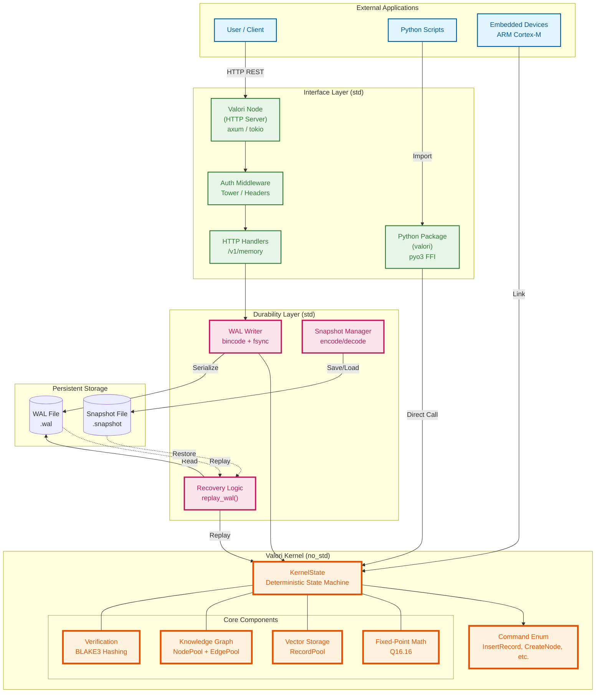

# Valori Kernel Architecture

This document outlines the complete architecture of Valori, including the deterministic kernel, WAL persistence, crash recovery, and deployment modes.

---

## System Overview

Valori is built as a **layered architecture** with a pure deterministic kernel at its core, wrapped by durability and interface layers.



---

## Layer Breakdown

### 1. Core Layer (no_std)

**Location**: `src/` (valori-kernel)

**Purpose**: Pure deterministic logic - no I/O, no randomness, no timestamps

**Components**:
- **KernelState**: Deterministic state machine
  - `RecordPool`: Vector storage
  - `NodePool`: Knowledge graph nodes
  - `EdgePool`: Knowledge graph edges
  - `AdjacencyList`: Graph topology

- **Fixed-Point Math**: Q16.16 arithmetic for cross-platform determinism
  - All operations use i32 (no f32/f64)
  - Range: `[-32768.0, 32767.999]`
  - Precision: ~0.000015

- **Commands**: State transitions
  ```rust
  enum Command {
      InsertRecord { id, vector },
      DeleteRecord { id },
      CreateNode { node_id, kind, record },
      CreateEdge { edge_id, kind, from, to },
      ...
  }
  ```

- **Verification**: BLAKE3 cryptographic hashing
  - State hash: `hash(all_records || all_nodes || all_edges)`
  - Deterministic across architectures

**Critical Property**: `#![no_std]` - Runs without operating system

---

### 2. Durability Layer (std)

**Location**: `node/src/` (wal_writer.rs, recovery.rs)

**Purpose**: Crash recovery and persistence

**Components**:

#### WAL Writer
- Serializes commands via bincode
- Writes to disk with fsync
- Format: `[version:u8][length:u32][command:bytes]`
- Guarantees: Durable, ordered

#### Recovery Logic
- Reads WAL file
- Replays commands on kernel
- Validates state hash
- Guarantees: Deterministic replay

#### Snapshot Manager
- Encodes/decodes kernel state
- Format: `[Header][Kernel][Metadata][Index]`
- Includes cryptographic hash

**Critical Properties**:
- `Snapshot + WAL = Bit-Identical State`
- Cross-platform replay (ARM WAL → x86 kernel)

---

### 3. Interface Layer (std)

**Location**: `node/src/` (HTTP server), `ffi/` (Python bindings)

**Purpose**: Exposes kernel via multiple interfaces

**HTTP Server (valori-node)**:
- axum web framework
- REST API: `/v1/memory/*`
- Authentication middleware
- JSON request/response

**Python FFI (valori-ffi)**:
- pyo3 bindings
- Embedded mode: Direct kernel access
- Remote mode: HTTP client
- Unified API

---

## Data Flow

### Normal Operation

```
1. Client Request
   ↓
2. Interface Layer (HTTP/FFI)
   ↓
3. WAL Writer (serialize + fsync)
   ↓
4. Kernel (apply command)
   ↓
5. Response (with new state hash)
```

### Crash Recovery

```
1. System Restart
   ↓
2. Load Snapshot
   ↓
3. Read WAL File
   ↓
4. Replay Commands (deterministic)
   ↓
5. Verify State Hash
   ↓
6. Resume Operations
```

---

## Determinism Guarantee

### Formal Specification

```
Given:
  S₀ = Initial state
  C = [c₁, c₂, ..., cₙ] = Command sequence

Then:
  Apply(S₀, C) on Architecture A
    = 
  Apply(S₀, C) on Architecture B
  
For all A, B ∈ {x86, ARM, WASM, RISC-V, ...}
```

### Implementation

1. **No Floating Point**: All math uses Q16.16 fixed-point (i32)
2. **No Randomness**: No UUIDs, no timestamps, no system clocks
3. **Deterministic Serialization**: bincode with fixed settings
4. **Fixed Ordering**: Sequential command application

### Validation

- **Automated CI**: Tests on x86, ARM, WASM
- **Hash Comparison**: Cryptographic (BLAKE3)
- **Failure = Build Break**: Any divergence fails CI

---

## Deployment Modes

### 1. Embedded (no_std)

**Target**: ARM Cortex-M, RISC-V, bare metal

```rust
#![no_std]

let mut kernel = KernelState::<256, 16, 64, 128>::new();
kernel.apply(&cmd)?;
```

**Properties**:
- No heap allocation
- ~4KB RAM
- ~5µs insert latency
- Perfect for robotics, drones, IoT

### 2. Python Embedded (FFI)

**Target**: Local development, single-process

```python
from valori import EmbeddedKernel

kernel = EmbeddedKernel(max_records=1024, dim=16)
kernel.insert(embedding)
```

**Properties**:
- Direct kernel access (no network)
- Microsecond latency
- In-process memory

### 3. HTTP Server (Remote)

**Target**: Production, horizontal scaling

```bash
VALORI_BIND=0.0.0.0:3000 \
VALORI_WAL_PATH=commands.wal \
VALORI_SNAPSHOT_PATH=state.snapshot \
cargo run --release -p valori-node
```

**Properties**:
- REST API
- Multi-client
- WAL persistence
- Crash recovery

---

## Why This Architecture?

### Layered Separation

**Core (no_std)** → Pure logic, portable everywhere  
**Durability (std)** → Crash recovery, optional  
**Interface (std)** → HTTP/FFI, swappable  

### Benefits

1. **Portability**: Kernel runs on any platform
2. **Testability**: Pure functions, no I/O mocking
3. **Verifiability**: Core logic is auditable
4. **Flexibility**: Switch deployment modes easily

### Trade-offs

- **No async in kernel**: Keeps it simple, deterministic
- **Serialization overhead**: Worth it for crash recovery
- **Fixed-point precision**: ~0.000015 vs f32's ~0.0000001

---

## WAL Rotation Strategy

### Production Setup

```
commands.wal        ← Active WAL (current writes)
commands.wal.1      ← Rotated WAL (after snapshot)
state.snapshot      ← Latest snapshot
state.snapshot.1    ← Previous snapshot (backup)
```

### Snapshot Procedure

1. Take snapshot → `state.snapshot.tmp`
2. Rename active WAL → `commands.wal.1`
3. Create new WAL → `commands.wal` (fresh)  
4. Rename snapshot → `state.snapshot`
5. Delete old rotated files

### Recovery Procedure

1. Load `state.snapshot`
2. Replay `commands.wal` (if exists)
3. Verify state hash
4. Resume

---

## Cross-Platform Verification

### Use Case: Robot Fleet

```
Robot A (ARM Cortex-M4)
  ↓ Insert mission data
  ↓ Export snapshot + WAL
  ↓ Transmit to cloud

Cloud Verifier (x86_64)
  ↓ Receive snapshot + WAL
  ↓ Restore + Replay
  ↓ Verify state hash
  ↓ ✅ Cryptographic proof of correctness

Robot B (ARM Cortex-M7)
  ↓ Receive snapshot + WAL
  ↓ Restore + Replay  
  ↓ Continue mission with shared context
```

All robots converge to **bit-identical** state.

---

## Performance Characteristics

| Operation | Kernel | With WAL | With HTTP |
|-----------|--------|----------|-----------|
| Insert (16-dim) | ~5µs | ~1-10ms | ~2-20ms |
| L2 Distance | ~2µs | N/A | N/A |
| Snapshot (256 records) | ~100µs | +fsync | +network |
| WAL Replay (100 cmds) | ~600µs | +disk read | N/A |

**Platform**: ARM Cortex-M4 @ 168MHz

---

## Security Model

### Threat Model

- **In Scope**: Data integrity, crash recovery, replay attacks
- **Out of Scope**: Network encryption (use TLS), authentication (use tokens)

### Mitigations

- **State Hash**: Detects tampering
- **WAL Integrity**: fsync guarantees
- **Deterministic Replay**: Prevents non-deterministic attacks
- **No Timestamps**: Prevents timing attacks

### Future Enhancements

- WAL checksums (CRC32/BLAKE3)
- Snapshot encryption
- mTLS for node-to-node

---

## Further Reading

- [Core Concepts](docs/core-concepts.md) - Vectors, graph, FXP
- [Determinism Guarantees](docs/determinism-guarantees.md) - Formal spec
- [WAL Replay](docs/wal-replay-guarantees.md) - Recovery details
- [Embedded Quickstart](docs/embedded-quickstart.md) - ARM guide
- [Multi-Arch CI](docs/multi-arch-determinism.md) - Automated proof
