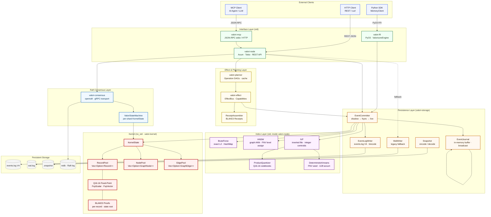
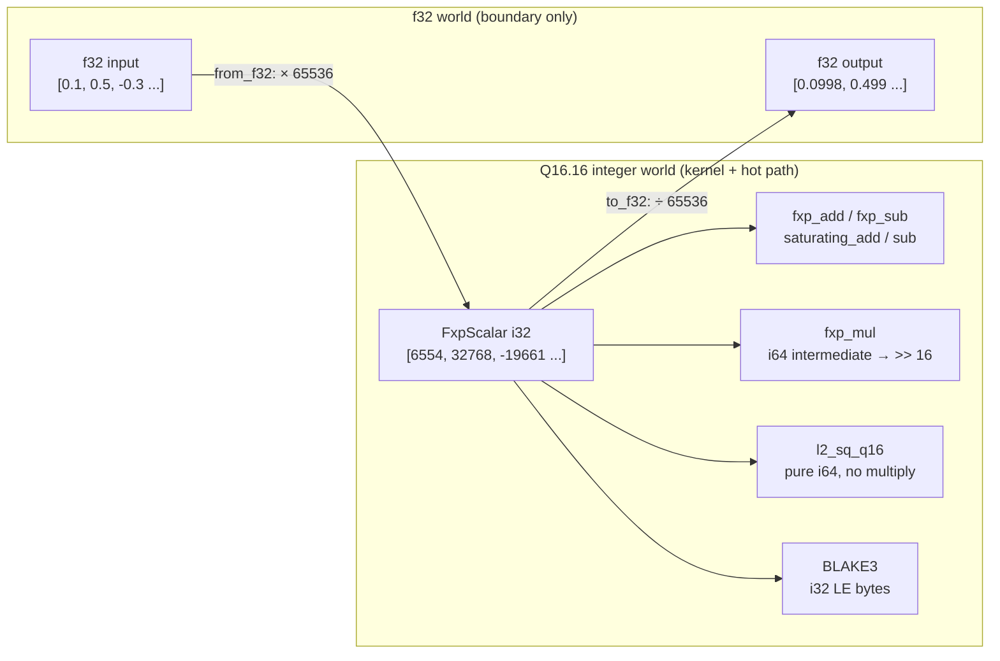
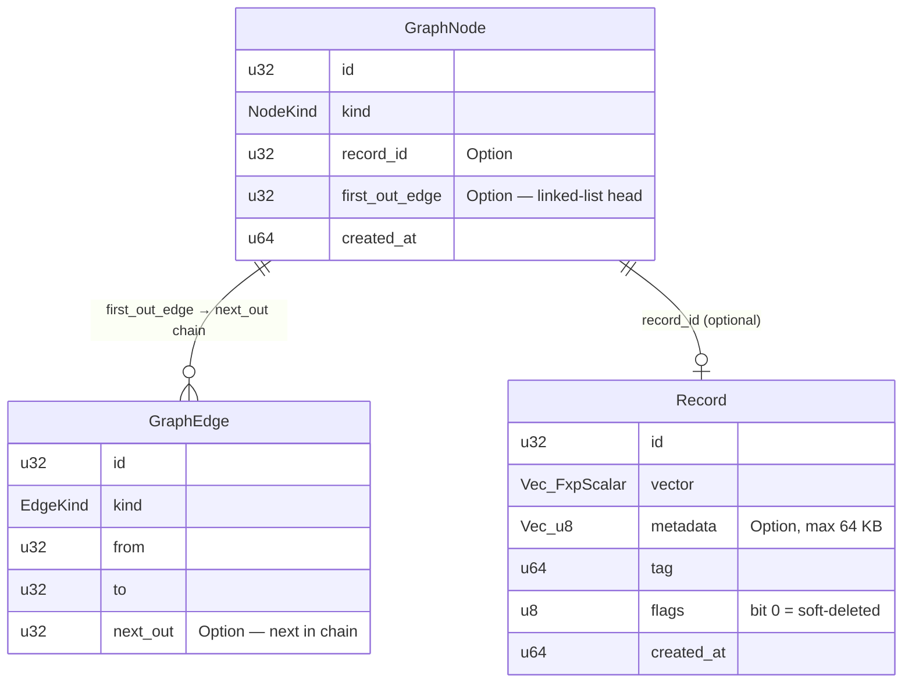
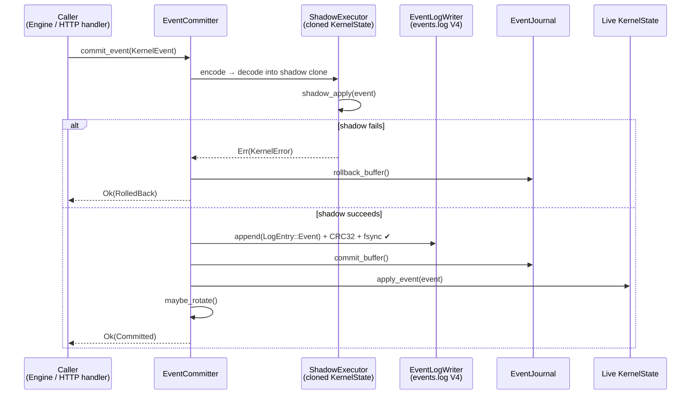
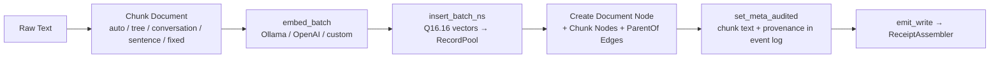
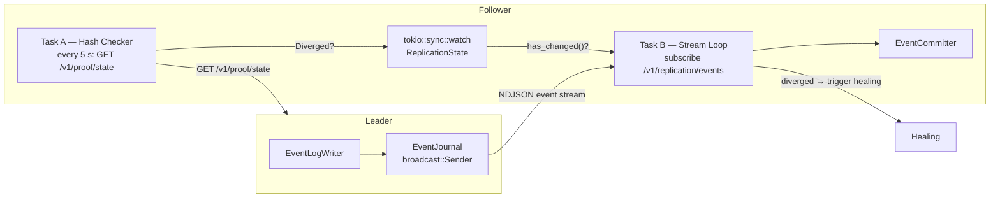
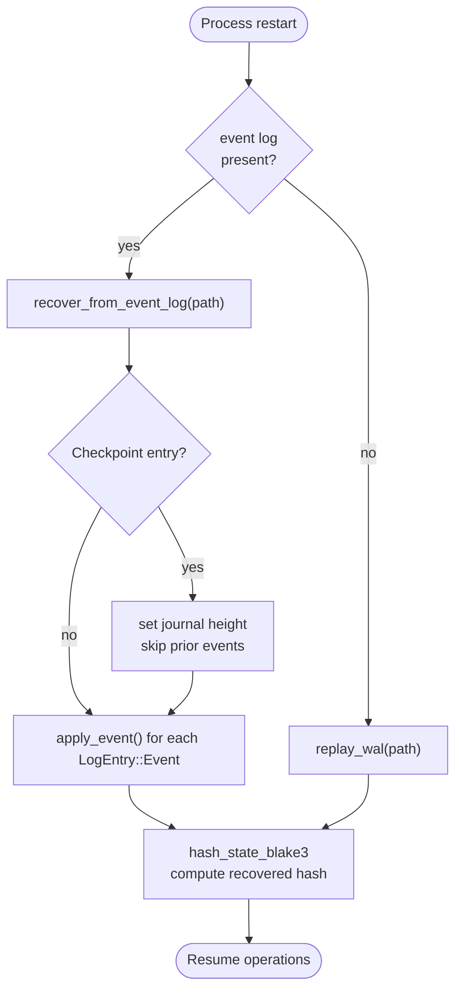

# Valori-Kernel — Architecture Reference

This document is the authoritative technical reference for the Valori-Kernel codebase. It covers every crate, every major subsystem, and the invariants that hold the whole system together. It is written from the source code, not from intent.

> **Last updated:** Phase R5 (Async Ingestion + Route Parity). Reflects the current multi-crate workspace structure, V4 wire format, multi-node Raft consensus, shared route module, and the effect/planner/MCP crates.

---

## Table of Contents

1. [Design Philosophy](#1-design-philosophy)
2. [Workspace Layout](#2-workspace-layout)
3. [Layer Model](#3-layer-model)
4. [Crate: `valori-core` (Zero-dependency types)](#4-crate-valori-core-zero-dependency-types)
5. [Crate: `valori-kernel` (Core, no\_std)](#5-crate-valori-kernel-core-no_std)
   - 5.1 [Fixed-Point Math — Q16.16](#51-fixed-point-math--q1616)
   - 5.2 [KernelState — The State Machine](#52-kernelstate--the-state-machine)
   - 5.3 [KernelEvent — The Only Mutation Path](#53-kernelevent--the-only-mutation-path)
   - 5.4 [RecordPool — Vector Storage](#54-recordpool--vector-storage)
   - 5.5 [Knowledge Graph — NodePool & EdgePool](#55-knowledge-graph--nodepool--edgepool)
   - 5.6 [BLAKE3 Proofs & State Hashing](#56-blake3-proofs--state-hashing)
   - 5.7 [Snapshot Encode / Decode](#57-snapshot-encode--decode)
6. [Crate: `valori-wire` (Segment Format)](#6-crate-valori-wire-segment-format)
7. [Crate: `valori-storage` (Durable Storage Layer)](#7-crate-valori-storage-durable-storage-layer)
8. [Crate: `valori-state` (State Lifecycle)](#8-crate-valori-state-state-lifecycle)
9. [Crate: `valori-node` (Std, Async, HTTP)](#9-crate-valori-node-std-async-http)
   - 9.1 [Engine — Top-Level Orchestrator](#91-engine--top-level-orchestrator)
   - 9.2 [Event-Sourced Persistence Pipeline](#92-event-sourced-persistence-pipeline)
   - 9.3 [Vector Indexes](#93-vector-indexes)
   - 9.4 [Deterministic K-Means](#94-deterministic-k-means)
   - 9.5 [Product Quantization](#95-product-quantization)
   - 9.6 [HTTP Routes — Shared Handler Pattern](#96-http-routes--shared-handler-pattern)
   - 9.7 [Advanced RAG Pipeline — Ingestion & Retrieval](#97-advanced-rag-pipeline--ingestion--retrieval)
   - 9.8 [Self-Maintaining Cognitive Memory](#98-self-maintaining-cognitive-memory)
   - 9.9 [Replication — Leader-Follower (Standalone)](#99-replication--leader-follower-standalone)
   - 9.10 [Recovery Paths](#910-recovery-paths)
10. [Crate: `valori-consensus` (Multi-Node Raft)](#10-crate-valori-consensus-multi-node-raft)
11. [Crate: `valori-effect` (Effect Bus & Capabilities)](#11-crate-valori-effect-effect-bus--capabilities)
12. [Crate: `valori-planner` (Operation Lifecycle)](#12-crate-valori-planner-operation-lifecycle)
13. [Crate: `valori-mcp` (MCP Server)](#13-crate-valori-mcp-mcp-server)
14. [Crate: `valori-metadata` (Control-Plane Persistence)](#14-crate-valori-metadata-control-plane-persistence)
15. [Crate: `valori-ffi` (PyO3)](#15-crate-valori-ffi-pyo3)
16. [Crate: `valori-verify` (Audit Verifier)](#16-crate-valori-verify-audit-verifier)
17. [Cross-Crate Invariants](#17-cross-crate-invariants)
18. [Determinism — Formal Guarantee](#18-determinism--formal-guarantee)
19. [Data Formats](#19-data-formats)
20. [Performance Characteristics](#20-performance-characteristics)
21. [Security Model](#21-security-model)

---

## 1. Design Philosophy

Three non-negotiable properties shape every design decision in this codebase:

**Determinism over convenience.** All vector arithmetic uses Q16.16 fixed-point integers. Floating-point is allowed only at the public boundary (PyO3 calls, HTTP JSON). This means two independent machines applying the same sequence of events will always arrive at an identical BLAKE3 state root — regardless of CPU architecture, SIMD unit, or OS floating-point settings.

**Disk before memory.** No mutation reaches the live `KernelState` before being fsynced to the append-only event log. The `EventCommitter` enforces this with a three-phase protocol: shadow execution → fsync → live apply. A process killed between any two steps leaves the system in a recoverable, consistent state.

**Proof over trust.** The global `KernelState` is always summarised in a single BLAKE3 Merkle root that can be computed offline, on any machine, from the raw integer record data alone. No server is required to verify state integrity.

---

## System Diagram


```mermaid
graph TD
    classDef external  fill:#f0f4ff,stroke:#4a6cf7,stroke-width:2px,color:#1a1a2e
    classDef interface fill:#f0fff4,stroke:#2e7d52,stroke-width:2px,color:#1a2e1a
    classDef persist   fill:#fff8f0,stroke:#c25e00,stroke-width:2px,color:#2e1a00
    classDef index     fill:#fdf0ff,stroke:#7b2e9e,stroke-width:2px,color:#1e002e
    classDef kernel    fill:#fff0f0,stroke:#c22e2e,stroke-width:3px,color:#2e0000
    classDef storage   fill:#f5f5f5,stroke:#555,stroke-width:1px,color:#222,stroke-dasharray:4 2
    classDef raft      fill:#f0f8ff,stroke:#1a6cbf,stroke-width:2px,color:#002e4a
    classDef effect    fill:#fffbf0,stroke:#b08a00,stroke-width:2px,color:#2e2200

    subgraph Clients["External Clients"]
        PY[Python SDK<br/>MemoryClient]
        HTTP[HTTP Client<br/>REST / curl]
        MCP_C[MCP Client<br/>AI Agent / LLM]
    end

    subgraph Interface["Interface Layer  (std)"]
        FFI[valori-ffi<br/>PyO3 · ValoricoreEngine]
        SRV[valori-node<br/>Axum · Tokio · REST API]
        MCP_S[valori-mcp<br/>JSON-RPC stdio / HTTP]
    end

    subgraph RaftLayer["Raft Consensus Layer"]
        RAFT[valori-consensus<br/>openraft · gRPC transport]
        RSM[ValoriStateMachine<br/>per-shard KernelState]
    end

    subgraph EffectLayer["Effect & Planning Layer"]
        PLAN[valori-planner<br/>Operation DAGs · cache]
        EFBUS[valori-effect<br/>EffectBus · Capabilities]
        RECPT[ReceiptAssembler<br/>BLAKE3 Receipts]
    end

    subgraph Persist["Persistence Layer  (valori-storage)"]
        EC[EventCommitter<br/>shadow → fsync → live]
        EL[EventLogWriter<br/>events.log V4 · bincode]
        EJ[EventJournal<br/>in-memory buffer · broadcast]
        WAL[WalWriter<br/>legacy fallback]
        SNAP[Snapshot<br/>encode / decode]
    end

    subgraph Index["Index Layer  (std, inside valori-node)"]
        BF[BruteForce<br/>exact L2 · HashMap]
        HNSW[HNSW<br/>graph ANN · FNV level assign]
        IVF[IVF<br/>inverted file · integer centroids]
        PQ[ProductQuantizer<br/>Q16.16 codebooks]
        KM[DeterministicKmeans<br/>FNV seed · i128 accum]
    end

    subgraph Core["Kernel  (no_std · valori-kernel)"]
        KS[KernelState]
        RP[RecordPool<br/>Vec&lt;Option&lt;Record&gt;&gt;]
        NP[NodePool<br/>Vec&lt;Option&lt;GraphNode&gt;&gt;]
        EP[EdgePool<br/>Vec&lt;Option&lt;GraphEdge&gt;&gt;]
        FXP[Q16.16 Fixed-Point<br/>FxpScalar · FxpVector]
        BK[BLAKE3 Proofs<br/>per-record · state root]
    end

    subgraph Disk["Persistent Storage"]
        ELF[(events.log V4)]
        WF[(wal.log)]
        SF[(.snapshot)]
        REDB[(redb · Raft log)]
    end

    PY  -->|PyO3 FFI| FFI
    HTTP-->|REST JSON| SRV
    MCP_C-->|JSON-RPC| MCP_S

    FFI --> EC
    SRV --> EC
    SRV --> RAFT
    MCP_S --> SRV
    SRV -.->|fallback| WAL

    RAFT --> RSM
    RSM --> KS
    RAFT --> REDB

    SRV --> PLAN
    PLAN --> EFBUS
    EFBUS --> EC
    EFBUS --> RECPT

    EC  --> EL
    EC  --> EJ
    EC  --> KS
    EJ  --> EJ
    EL  --> ELF
    WAL --> WF
    SNAP--> SF

    KS  --> RP
    KS  --> NP
    KS  --> EP
    RP  --- FXP
    FXP --- BK

    EC  --> BF
    EC  --> HNSW
    EC  --> IVF
    IVF --> KM
    IVF --> PQ

    class PY,HTTP,MCP_C external
    class FFI,SRV,MCP_S interface
    class EC,EL,EJ,WAL,SNAP persist
    class BF,HNSW,IVF,PQ,KM index
    class KS,RP,NP,EP,FXP,BK kernel
    class ELF,WF,SF,REDB storage
    class RAFT,RSM raft
    class PLAN,EFBUS,RECPT effect
```

---

## 2. Workspace Layout

```
Valori-Kernel/
├── Cargo.toml                       ← workspace root
│
├── crates/
│   ├── valori-core/                 ← zero-dependency types (no_std, no I/O)
│   ├── valori-kernel/               ← deterministic state machine (no_std)
│   ├── valori-wire/                 ← event log segment format v2/v3/v4
│   ├── valori-storage/              ← durable storage: WAL, event log, journal, replay
│   ├── valori-state/                ← state lifecycle: bootstrap, manifest, shutdown
│   ├── valori-node/                 ← main server (std, async, HTTP, Raft)
│   │   └── src/
│   │       ├── engine.rs            ← top-level orchestrator
│   │       ├── server.rs            ← standalone Axum router
│   │       ├── cluster_server.rs    ← Raft-mode Axum router
│   │       ├── routes/              ← shared handler modules (trait-based, both routers)
│   │       │   ├── collections.rs
│   │       │   ├── graph.rs
│   │       │   ├── memory.rs
│   │       │   ├── meta.rs
│   │       │   └── records.rs
│   │       ├── ingest.rs            ← full RAG pipeline (chunk + embed + insert + graph)
│   │       ├── tree_rag.rs          ← hierarchical tree retrieval + citations
│   │       ├── community.rs         ← label propagation + community detection
│   │       ├── graph_rag.rs         ← one-call GraphRAG handler
│   │       ├── valori_reranker.rs   ← BM25 reranker
│   │       ├── decay.rs             ← kernel-native time decay (C4.1)
│   │       ├── structure/           ← HNSW, IVF, PQ, k-means, brute-force
│   │       ├── events/              ← EventCommitter, EventLog, Journal, Replay
│   │       ├── capabilities.rs      ← EngineKernelCapability + CapabilityRegistryBuilder
│   │       ├── runner.rs            ← TaskRegistry + TaskRunner
│   │       └── receipt_bridge.rs    ← emit_write/emit_read → ReceiptAssembler
│   ├── valori-consensus/            ← openraft integration (Raft log/state machine/transport)
│   ├── valori-effect/               ← EffectBus, capabilities, tasks, receipts
│   ├── valori-planner/              ← Operation lifecycle, DAG planning, ExecutionCache
│   ├── valori-mcp/                  ← MCP server (verifiable agent memory)
│   ├── valori-metadata/             ← control-plane persistence (redb: projects, collections, executions)
│   ├── valori-ffi/                  ← PyO3 bindings (ValoricoreEngine)
│   ├── valori-verify/               ← CLI verifier (event log / snapshot audit)
│   └── valori-cli/                  ← benchmarks, admin tools
│
├── python/                          ← Python SDK (valoricore package)
│   └── valoricore/
│       ├── memory.py                ← MemoryClient (high-level API)
│       ├── remote.py                ← SyncRemoteClient / AsyncRemoteClient
│       ├── async_memory.py          ← AsyncMemoryClient
│       └── embeddings/              ← pluggable embedding providers
│
├── ui/                              ← Next.js web dashboard
│   └── src/app/
│       ├── api/                     ← Next.js API routes (proxy to node)
│       └── ...                      ← pages: search, proof, operations, cluster, audit, etc.
│
└── docs/
    └── phases/                      ← per-phase delivery reports (R1–R5, A1–A12, S1–S19, etc.)
```

**Crate dependency graph (abridged):**

```
valori-core   (no_std, no I/O)
    ▲
    │
valori-kernel (no_std, alloc)   ◄── valori-wire
    ▲
    │
valori-storage (std)            ◄── valori-state (std)
    ▲
    │
valori-node   (std, tokio, axum) ◄── valori-consensus (std, openraft)
    ▲               ▲
    │               │
valori-ffi    valori-mcp
(PyO3)        (JSON-RPC stdio)

valori-effect ◄── valori-planner ◄── valori-metadata
    ▲
    │
valori-node (runtime wiring)

valori-verify (std)   ◄── valori-wire, valori-node (test-only)
```

---

## 3. Layer Model

```
┌─────────────────────────────────────────────────────────────────────┐
│  External Clients                                                   │
│  Python SDK · HTTP clients · AI Agents (MCP) · Firmware            │
└──────────────────────────────┬──────────────────────────────────────┘
                               │
┌──────────────────────────────▼──────────────────────────────────────┐
│  Interface Layer  (std)                                             │
│                                                                     │
│  valori-ffi (PyO3)   valori-node (Axum/Tokio)   valori-mcp (stdio) │
│  microsecond FFI      REST + Raft + auth          JSON-RPC 2.0      │
└──────────────────────────────┬──────────────────────────────────────┘
                               │
┌──────────────────────────────▼──────────────────────────────────────┐
│  Effect & Planning Layer  (std)                                     │
│                                                                     │
│  valori-planner  ExecutionGraph DAGs · OperationHash caching        │
│  valori-effect   EffectBus · Capabilities · ReceiptAssembler        │
└──────────────────────────────┬──────────────────────────────────────┘
                               │
┌──────────────────────────────▼──────────────────────────────────────┐
│  Consensus Layer  (std, openraft, gRPC)                             │
│                                                                     │
│  valori-consensus   Raft log store (redb) · ValoriStateMachine      │
│  Multi-shard Raft   per-shard KernelState + per-shard audit logs    │
└──────────────────────────────┬──────────────────────────────────────┘
                               │
┌──────────────────────────────▼──────────────────────────────────────┐
│  Persistence Layer  (std — valori-storage / valori-state)           │
│                                                                     │
│  EventCommitter ─► EventLogWriter (fsync, V4 CRC32 entries)        │
│  ShadowExecutor    EventJournal (in-memory, broadcast)              │
│  WAL (legacy)      Snapshot encode/decode                           │
│  recover_from_event_log() / replay_wal()                            │
└──────────────────────────────┬──────────────────────────────────────┘
                               │
┌──────────────────────────────▼──────────────────────────────────────┐
│  Index Layer  (std, inside valori-node)                             │
│                                                                     │
│  VectorIndex trait                                                  │
│  BruteForceIndex · HnswIndex · IvfIndex                             │
│  Quantizer trait: NoQuantizer · ScalarQ · PQ                        │
│  DeterministicKmeans                                                │
└──────────────────────────────┬──────────────────────────────────────┘
                               │
┌──────────────────────────────▼──────────────────────────────────────┐
│  Kernel  (no_std)   valori-kernel                                   │
│                                                                     │
│  KernelState                                                        │
│  ├── RecordPool  (Vec<Option<Record>>)                              │
│  ├── NodePool    (Vec<Option<GraphNode>>)                           │
│  ├── EdgePool    (Vec<Option<GraphEdge>>)                           │
│  └── dim: usize                                                     │
│                                                                     │
│  Q16.16 fixed-point · BLAKE3 Merkle proofs                         │
└─────────────────────────────────────────────────────────────────────┘
```

---

## 4. Crate: `valori-core` (Zero-dependency types)

**Location:** `crates/valori-core/`  
**Attributes:** `#![no_std]`. No I/O, no randomness. Re-exported by `valori-kernel`.

This crate defines the primitive type vocabulary shared across every other crate. It contains no logic — only type definitions and their `impl` blocks.

**Key types:**

| Module | Types |
|---|---|
| `id.rs` | `RecordId`, `NodeId`, `EdgeId`, `NamespaceId`, `CollectionId`, `ExecutionId`, `ShardId`, `ClusterEpoch` |
| `enums.rs` | `NodeKind`, `EdgeKind` |
| `version.rs` | `Version` |
| `error.rs` | `CoreError` |

`ExecutionId::new_random()` is available in `std` builds only (behind a `cfg` flag that reads from a CSPRNG). In `no_std` builds, IDs must be supplied by the caller.

---

## 5. Crate: `valori-kernel` (Core, no\_std)

**Location:** `crates/valori-kernel/`  
**Cargo name:** `valori-kernel`  
**Attributes:** `#![no_std]` with `extern crate alloc`. No I/O, no randomness, no system clock. Panic mode: `abort` (firmware-safe).

This crate is the only part of the system that defines what "state" means. Everything else — persistence, networking, indexing, Python bindings — is infrastructure built around it.

### 5.1 Fixed-Point Math — Q16.16

**Files:** `crates/valori-kernel/src/fxp/`, `src/config.rs`, `src/math/`

All vector arithmetic in the kernel uses **Q16.16 signed fixed-point integers** stored as `i32`. The integer representation of a value `v` is `v × 65536`. The bottom 16 bits carry the fractional part; the top 16 bits carry the integer part.

```
FRAC_BITS = 16         (src/config.rs:5)
SCALE     = 65536      (src/config.rs:8)
Range     = [-32768.0, +32767.999984]
Precision = 1/65536 ≈ 0.0000153
```


```mermaid
flowchart LR
    subgraph Outside["f32 world  (boundary only)"]
        A["f32 input<br/>[0.1, 0.5, -0.3 ...]"]
        Z["f32 output<br/>[0.0998, 0.499 ...]"]
    end

    subgraph Inside["Q16.16 integer world  (kernel + hot path)"]
        B["FxpScalar  i32<br/>[6554, 32768, -19661 ...]"]
        C["fxp_add / fxp_sub<br/>saturating_add / sub"]
        D["fxp_mul<br/>i64 intermediate → >> 16"]
        E["l2_sq_q16<br/>pure i64, no multiply"]
        F["BLAKE3<br/>i32 LE bytes"]
    end

    A -->|"from_f32: × 65536"| B
    B --> C & D & E & F
    B -->|"to_f32: ÷ 65536"| Z
```

**Core operations** (`src/fxp/ops.rs`):

| Function | Implementation | Notes |
|---|---|---|
| `from_f32(v)` | `(v * 65536.0).round().clamp(i32::MIN, i32::MAX) as i32` | Boundary conversion only |
| `to_f32(v)` | `v as f32 / 65536.0` | Output boundary only |
| `fxp_add(a, b)` | `a.saturating_add(b)` | No overflow possible |
| `fxp_sub(a, b)` | `a.saturating_sub(b)` | No overflow possible |
| `fxp_mul(a, b)` | `((a as i64 * b as i64) >> 16) as i32` | i64 intermediate prevents overflow |

**Squared L2 distance** (`src/math/l2.rs`):

```rust
pub fn fxp_l2_sq(a: &FxpVector, b: &FxpVector) -> FxpScalar {
    a.data.iter().zip(b.data.iter())
        .map(|(x, y)| fxp_mul(fxp_sub(*x, *y), fxp_sub(*x, *y)))
        .fold(FxpScalar(0), |acc, d| FxpScalar(fxp_add(acc.0, d.0)))
}
```

The node layer's `l2_sq_q16` function (used by IVF and k-means) avoids Q16 multiplication entirely, working directly in `i64` to retain full integer precision:

```rust
pub fn l2_sq_q16(a: &[i32], b: &[i32]) -> i64 {
    a.iter().zip(b.iter())
        .map(|(&x, &y)| { let d = (x - y) as i64; d * d })
        .sum()
}
```

**Key type definitions:**

```rust
// src/types/scalar.rs
#[repr(transparent)]
pub struct FxpScalar(pub i32);

// src/types/vector.rs
pub struct FxpVector {
    pub data: Vec<FxpScalar>,
}
```

### 5.2 KernelState — The State Machine

**File:** `src/state/kernel.rs`

```rust
pub struct KernelState {
    pub records:  RecordPool,   // dense Vec<Option<Record>>
    pub nodes:    NodePool,     // dense Vec<Option<GraphNode>>
    pub edges:    EdgePool,     // dense Vec<Option<GraphEdge>>
    pub dim:      usize,        // locked on first insert
}
```

`KernelState` is a pure value. It has no file handles, no mutexes, no background tasks. It can be cloned (for shadow execution), serialized (for snapshots), and replayed (from the event log) identically on any machine.

**Central invariant:** All mutations flow through `apply_event(KernelEvent)`. Callers outside the kernel may not manipulate the pool fields directly.

**Dimension locking:** The first `InsertRecord` event sets `dim`. Subsequent inserts with a different dimension are rejected with `KernelError::DimensionMismatch`.

**Metadata cap:** `MAX_METADATA_SIZE = 65536` bytes (64 KB), enforced in `apply_event` before any pool mutation.

### 5.3 KernelEvent — The Only Mutation Path

**File:** `src/event.rs`

```rust
pub enum KernelEvent {
    InsertRecord {
        id:       RecordId,
        vector:   FxpVector,
        metadata: Option<Vec<u8>>,
        tag:      u64,
    },
    DeleteRecord { id: RecordId },
    SoftDeleteRecord { id: RecordId },
    UpdateMetadata { id: RecordId, metadata: Vec<u8> },
    CreateNode { node_id: NodeId, kind: NodeKind, record_id: Option<RecordId> },
    CreateEdge { edge_id: EdgeId, kind: EdgeKind, from: NodeId, to: NodeId },
    DeleteEdge { edge_id: EdgeId },
    AutoCreateNamespace { namespace_id: NamespaceId, name: String },
    DropNamespace { namespace_id: NamespaceId },
    EventNs { namespace_id: NamespaceId, inner: Box<KernelEvent> },  // namespaced wrapper (Phase S15)
}
```

Events are `Serialize + Deserialize` (serde/bincode). They are the unit of persistence: the event log on disk is a bincode stream of `LogEntry::Event(KernelEvent)` values.

**Namespace-awareness (Phase S15):** The `EventNs` variant wraps any inner event with its target `NamespaceId`. Recovery replays each namespaced event into the correct collection, preventing data loss on node restart.

### 5.4 RecordPool — Vector Storage

**File:** `src/storage/pool.rs`

```rust
pub struct RecordPool {
    records: Vec<Option<Record>>,
}

pub struct Record {
    pub id:         RecordId,
    pub vector:     FxpVector,
    pub metadata:   Option<Vec<u8>>,
    pub tag:        u64,
    pub flags:      u8,          // bit 0: soft-deleted
    pub created_at: u64,         // Unix timestamp secs (Phase C4.1)
}
```

**Design choice — dense optional slots:** Using `Vec<Option<Record>>` instead of `HashMap<RecordId, Record>` gives O(1) insert, O(1) delete, and deterministic iteration order (by insertion index). The trade-off is that deleted records leave holes.

**Tag field:** A `u64` stored alongside each record. Index implementations pass `filter_tag` through to search, skipping records whose tag doesn't match.

**`created_at` field (Phase C4.1):** Added for time-decay scoring. Populated from the wall-clock Unix timestamp at insert time. Survives snapshot roundtrips.

### 5.5 Knowledge Graph — NodePool & EdgePool

**Files:** `src/graph/pool.rs`, `src/graph/node.rs`, `src/graph/edge.rs`, `src/graph/adjacency.rs`

```rust
pub struct GraphNode {
    pub id:             NodeId,
    pub kind:           NodeKind,
    pub record:         Option<RecordId>,
    pub first_out_edge: Option<EdgeId>,   // head of linked-list
    pub created_at:     u64,              // Unix timestamp secs (Phase C4.1b)
}

pub struct GraphEdge {
    pub id:       EdgeId,
    pub kind:     EdgeKind,
    pub from:     NodeId,
    pub to:       NodeId,
    pub next_out: Option<EdgeId>,          // linked-list chain
}
```

Edges are stored as an **intrusive singly-linked list**: each `GraphNode.first_out_edge` points to the head of its outgoing edge chain; each `GraphEdge.next_out` points to the next edge in the chain. This avoids any heap-allocated adjacency lists per node, keeping the structure flat and serializable.

**Traversal:** `OutEdgeIterator` (`src/graph/adjacency.rs`) walks the chain. BFS over the graph (for `walk()` and `expand()`) is implemented in the node layer.


```mermaid
erDiagram
    GraphNode {
        u32     id
        NodeKind kind
        u32     record_id   "Option"
        u32     first_out_edge "Option — linked-list head"
        u64     created_at
    }
    GraphEdge {
        u32      id
        EdgeKind kind
        u32      from
        u32      to
        u32      next_out    "Option — next in chain"
    }
    Record {
        u32        id
        Vec_FxpScalar vector
        Vec_u8     metadata  "Option, max 64 KB"
        u64        tag
        u8         flags     "bit 0 = soft-deleted"
        u64        created_at
    }
    GraphNode ||--o{ GraphEdge : "first_out_edge → next_out chain"
    GraphNode ||--o| Record    : "record_id (optional)"
```

**Node kinds** (`src/types/enums.rs`):

| Constant | Value | Meaning |
|---|---|---|
| `NODE_RECORD` | 0 | Raw vector record |
| `NODE_CHUNK` | 1 | Text chunk (child of document) |
| `NODE_AGENT` | 2 | AI agent / process |
| `NODE_USER` | 3 | Human user |
| `NODE_TOOL` | 4 | Tool or callable function |
| `NODE_DOCUMENT` | 5 | Top-level document |
| `NODE_CONCEPT` | 6 | Abstract concept |

**Edge kinds** (`src/types/enums.rs`):

| Constant | Value | Meaning |
|---|---|---|
| `EDGE_RELATION` | 0 | Generic relation |
| `EDGE_FOLLOWS` | 1 | Sequential ordering |
| `EDGE_IN_EPISODE` | 2 | Episodic grouping |
| `EDGE_BY_AGENT` | 3 | Agent authorship |
| `EDGE_MENTIONS` | 4 | Entity mention |
| `EDGE_REFERS_TO` | 5 | Cross-reference |
| `EDGE_PARENT_OF` | 6 | Hierarchical parent→child |

### 5.6 BLAKE3 Proofs & State Hashing

**Files:** `src/proof.rs`, `src/snapshot/blake3.rs`

**Per-record proof:**

```rust
pub fn generate_proof_bytes(values: &[i32]) -> Vec<u8> {
    let mut hasher = blake3::Hasher::new();
    for v in values {
        hasher.update(&v.to_le_bytes());
    }
    hasher.finalize().as_bytes().to_vec()
}
```

**Full state hash** (`hash_state_blake3`):

```
hasher ← BLAKE3
for each record slot (in index order):
    update(record.vector.data as &[u8])     // raw i32 LE bytes
    update(record.metadata)
    update(record.tag.to_le_bytes())
    update(record.created_at.to_le_bytes())
for each node slot (in index order):
    update(node.kind as u8)
for each edge slot (in index order):
    update(edge.from.to_le_bytes())
    update(edge.to.to_le_bytes())
    update(edge.kind as u8)
finalize() → [u8; 32]
```

### 5.7 Snapshot Encode / Decode

**Files:** `src/snapshot/encode.rs`, `src/snapshot/decode.rs`

**Binary format (schema v3, current):**

```
[magic: "VALK" (4 bytes)]
[schema_version: u32 LE]
[state_version: u64 LE]
[records_capacity: u32 LE]
[dim: u32 LE]
[nodes_capacity: u32 LE]
[edges_capacity: u32 LE]
── Record slots ──
    [present: u8]  [id: u32 LE]  [tag: u64 LE]  [flags: u8]
    [created_at: u64 LE]
    [vector: dim × 4 bytes, i32 LE each]
    [metadata_len: u32 LE]  [metadata: metadata_len bytes]
── Node slots ──
    [present: u8]  [id: u32 LE]  [kind: u8]
    [has_record_id: u8]  [record_id: u32 LE if present]
    [created_at: u64 LE]
── Edge slots ──
    [present: u8]  [id: u32 LE]  [kind: u8]
    [from: u32 LE]  [to: u32 LE]
```

---

## 6. Crate: `valori-wire` (Segment Format)

**Location:** `crates/valori-wire/`

Defines the on-disk binary format for event log **segments**. Decoders must be forwards-compatible: a V4 decoder must also read V2 and V3 files (tested by fixture tests in `tests/evolution.rs`).

**Version constants:**

| Constant | Value | Format change |
|---|---|---|
| `VERSION_V2` | 2 | Original 16-byte header |
| `VERSION_V3` | 3 | 48-byte header with BLAKE3 chain head + `request_id` |
| `VERSION_V4` | 4 | V3 header + per-entry 4-byte CRC32 suffix (Phase S18) |

**V4 per-entry layout:**

```
[bincode(LogEntry)] [u32 LE CRC32 of the bincode bytes]
```

The CRC32 is a transport-integrity check (detects bit-flips in transit or on disk). The BLAKE3 chain hash is unchanged — it covers the same fields as V3. New segment files are always opened as V4. Existing V3 segments continue in V3 format until rotation.

**Key exports:**
- `parse_header`, `encode_header_v3`, `encode_header_v4`
- `encode_entry(version, prev_hash, wall_time, request_id, entry)` → `Vec<u8>`
- `decode_entry(version, bytes)` → `(DecodedEntry, usize)`
- `chain_advance(version, head, decoded)` → `[u8; 32]`
- `chain_advance_v3(head, wall_time, request_id, entry)` → `[u8; 32]`

---

## 7. Crate: `valori-storage` (Durable Storage Layer)

**Location:** `crates/valori-storage/`

Extracted from `valori-node` (Phase A2). Contains all durable storage primitives. `valori-node` re-exports these modules so no call-site imports changed.

**Modules:**

| Module | Purpose |
|---|---|
| `events/event_log.rs` | `EventLogWriter` — append-only segment writer, V4 by default |
| `events/event_journal.rs` | `EventJournal` — in-memory staging buffer + broadcast channel |
| `events/event_commit.rs` | `EventCommitter` — shadow → fsync → live-apply commit barrier |
| `events/event_replay.rs` | `recover_from_event_log()` — replay all log entries on restart |
| `events/event_proof.rs` | `EventProof` — per-segment BLAKE3 hash at a given offset |
| `wal_writer.rs` | `WalWriter` — legacy WAL (fallback when no event log configured) |
| `wal_reader.rs` | `WalReader` — reads legacy WAL commands |
| `recovery.rs` | `replay_wal()` — legacy WAL replay |
| `object_store/` | S3 / filesystem object store (snapshot offload + WAL archival) |

**`EventCommitter` struct:**

```rust
pub struct EventCommitter {
    event_log:          EventLogWriter,
    journal:            EventJournal,
    live_state:         KernelState,
    log_rotation_bytes: Option<u64>,  // default: 256 MiB
}
```

**Commit protocol (four steps):**

```
Step 1 — Shadow Execute
  Clone live KernelState via encode/decode
  Apply event to shadow clone
  If shadow fails → rollback journal buffer, return RolledBack (no disk write)

Step 2 — fsync to Event Log
  Serialize event as LogEntry::Event(KernelEvent) via bincode (+ CRC32 in V4)
  Write to events.log, fsync
  (At this point the event is durable. A crash here is safe — replay recovers it.)

Step 3 — Live Apply
  Apply event to live KernelState via apply_event()
  If this fails (impossible after shadow success) → critical error

Step 4 — Auto-rotation check
  If bytes_written ≥ log_rotation_bytes:
      Archive current log; write Checkpoint to new log
```

---

## 8. Crate: `valori-state` (State Lifecycle)

**Location:** `crates/valori-state/`  
**Phase:** A3.

Manages the startup / shutdown lifecycle of a `KernelState`, decoupling it from `valori-node`'s HTTP concerns.

| Module | Purpose |
|---|---|
| `bootstrap.rs` | Detect WAL vs event-log, dispatch to correct recovery path |
| `manifest.rs` | `StateManifest` — records the on-disk paths and current version |
| `lifecycle.rs` | `StateLifecycle` — owns the active `EventCommitter` + shutdown gate |
| `shutdown.rs` | `shutdown_snapshot` — flush final snapshot on graceful stop |

`valori-node` re-exports `valori_state::bootstrap as recovery` so all existing imports are unchanged.

---

## 9. Crate: `valori-node` (Std, Async, HTTP)

**Location:** `crates/valori-node/`  
**Runtime:** Tokio async. HTTP: Axum. Serialization: bincode + serde\_json.

This crate owns everything that requires `std`: file I/O, networking, async tasks, advanced indexing, quantization, and replication.

### 9.1 Engine — Top-Level Orchestrator

**File:** `crates/valori-node/src/engine.rs`

```rust
pub struct Engine {
    pub state:              KernelState,         // shadows live_state for graph reads
    pub index:              Box<dyn VectorIndex>,
    pub event_committer:    Option<EventCommitter>,
    pub wal_writer:         Option<WalWriter>,
    pub config:             NodeConfig,
    pub metadata:           serde_json::Map<String, serde_json::Value>,
    pub embed_config:       Option<EmbedConfig>,
    pub reranker:           ValoriReranker,
    pub namespace_registry: NamespaceRegistry,
}

pub type SharedEngine = Arc<RwLock<Engine>>;
```

**State synchronization invariant (Phase R5):** When `event_committer` is active, every mutation method must call **both** `committer.live_state()` AND `self.apply_committed_event(&event)`. This keeps `self.state` coherent for graph read handlers (e.g. `expand_subgraph` in `graph_rag.rs`) that read from `&engine.state` directly.

**Key mutation methods:**

| Method | Effect |
|---|---|
| `insert_record_from_f32_ns(vec, ns)` | Allocates `RecordId`, builds `KernelEvent::InsertRecord`, commits, updates index |
| `insert_batch_ns(vecs, meta, ns, tags)` | Atomic batch insert (one fsync) |
| `create_node_for_record(record_id, kind, ns)` | Commits `KernelEvent::CreateNode`, synchronizes `self.state` |
| `create_edge(from, to, kind)` | Commits `KernelEvent::CreateEdge`, synchronizes `self.state` |
| `soft_delete_record(id)` | Marks record inactive; slot preserved |
| `set_meta_audited(key, value)` | Writes JSON metadata sidecar via audited event log |

### 9.2 Event-Sourced Persistence Pipeline

See **§7** for `valori-storage` detail. The sequence diagram:


```mermaid
sequenceDiagram
    participant C  as Caller<br/>(Engine / HTTP handler)
    participant EC as EventCommitter
    participant SH as ShadowExecutor<br/>(cloned KernelState)
    participant EL as EventLogWriter<br/>(events.log V4)
    participant EJ as EventJournal
    participant KS as Live KernelState

    C->>EC: commit_event(KernelEvent)
    EC->>SH: encode → decode into shadow clone
    SH->>SH: shadow_apply(event)

    alt shadow fails
        SH-->>EC: Err(KernelError)
        EC->>EJ: rollback_buffer()
        EC-->>C: Ok(RolledBack)
    else shadow succeeds
        EC->>EL: append(LogEntry::Event) + CRC32 + fsync ✔
        EC->>EJ: commit_buffer()
        EC->>KS: apply_event(event)
        EC->>EC: maybe_rotate()
        EC-->>C: Ok(Committed)
    end
```

### 9.3 Vector Indexes

**Files:** `crates/valori-node/src/structure/`

All indexes implement the `VectorIndex` trait:

```rust
pub trait VectorIndex: Send + Sync {
    fn build(&mut self, records: &RecordPool);
    fn insert(&mut self, id: RecordId, vector: &[f32]);
    fn delete(&mut self, id: RecordId);
    fn search(&self, query: &[f32], k: usize, filter_tag: Option<u64>) -> Vec<(RecordId, f32)>;
    fn snapshot(&self) -> Vec<u8>;
    fn restore(&mut self, data: &[u8]);
    fn needs_rebuild(&self) -> bool;  // Phase P2: triggers IVF centroid rebuild
}
```

| Index | Use case | Notes |
|---|---|---|
| `BruteForceIndex` | ≤ 50K records, exact recall | `HashMap<RecordId, Vec<f32>>`, O(n) search |
| `HnswIndex` | 100K+ records, ~99% recall | Multi-layer graph, FNV-1a level assignment, deterministic tie-breaking |
| `IvfIndex` | Large batches, predictable clustering | Q16.16 centroids, `n_probe` probing, all-integer hot path, auto-scales `n_list = sqrt(N)` |

**IVF auto-scaling (Phase P2):** `n_list` defaults to `sqrt(record_count)` and is recomputed via `needs_rebuild()` whenever the record count changes significantly. `VALORI_IVF_N_LIST` / `VALORI_IVF_N_PROBE` override auto-scaling.

### 9.4 Deterministic K-Means

Standard Lloyd's algorithm with four modifications for bit-identical results across architectures:

| Property | Implementation |
|---|---|
| **Seed selection** | FNV-1a hash of `(vector_bytes ++ record_id)` — no system RNG |
| **Distance** | `l2_sq_q16` — pure `i64` integer arithmetic |
| **Tie-breaking** | Lower centroid index wins on equal distance |
| **Accumulation** | `i128` centroid sums to prevent overflow; clamped to `i32` |

### 9.5 Product Quantization

```rust
pub struct ProductQuantizer {
    config:    PqConfig,
    dim:       usize,
    codebooks: Vec<Vec<Vec<i32>>>,  // [subspace][centroid][component], Q16.16
}
```

`quantize()`: Splits Q16.16 input into `n_subvectors` sub-vectors; finds nearest codebook centroid per sub-vector (integer L2²); returns `Vec<u8>` codes.

`reconstruct()`: Looks up codes → codebook vectors → concatenates → converts to f32 at output boundary.

### 9.6 HTTP Routes — Shared Handler Pattern

**Files:** `crates/valori-node/src/server.rs` (standalone), `crates/valori-node/src/cluster_server.rs` (Raft mode), `crates/valori-node/src/routes/` (shared)

**The "Two Kitchens" problem and its solution (Phases R1–R3):**

Historically, every endpoint was implemented twice: once in `server.rs` for standalone mode, and once in `cluster_server.rs` for Raft mode. The copies drifted silently. The fix:

1. Each domain module in `routes/` defines a small `*Ops` trait covering only the state-touching primitives.
2. The handler body — validation, response shaping, special cases — is a single generic function over that trait. One copy.
3. `server.rs` implements the trait on `SharedEngine` (direct engine lock). `cluster_server.rs` implements it on the Raft data-plane state (`raft.client_write()` for writes, state-machine reads for reads). The axum handlers become 3-line wrappers.
4. `tests/route_parity.rs` asserts every `/v1` route registered in `server.rs` exists in `cluster_server.rs` — converting runtime 404 divergence into a compile-time / test failure.

**Shared route modules:**

| Module | Trait | Endpoints |
|---|---|---|
| `routes/collections.rs` | `CollectionOps` | `POST /v1/namespaces`, `GET /v1/namespaces`, `DELETE /v1/namespaces/:name` |
| `routes/records.rs` | `RecordOps` | `POST /records`, `POST /v1/vectors/batch-insert`, `DELETE /v1/delete`, `POST /v1/soft-delete` |
| `routes/graph.rs` | `GraphOps` | `POST /graph/node`, `GET /graph/node/:id`, `POST /graph/edge`, `GET /graph/edges/:id`, `DELETE /v1/graph/node/:id` |
| `routes/memory.rs` | `MemoryOps` | `POST /v1/memory/upsert`, `POST /v1/memory/search`, `POST /v1/memory/consolidate`, `POST /v1/memory/contradict` |
| `routes/meta.rs` | `MetaOps` | `GET /v1/meta/:key`, `POST /v1/meta/:key` |

**Full HTTP endpoint inventory (abridged — both routers):**

| Method | Path | Purpose |
|---|---|---|
| GET | `/health` | Liveness check (returns embed_enabled, shard_count, etc.) |
| GET | `/v1/version` | Version string |
| POST | `/records` | Insert single record (f32 vector) |
| POST | `/v1/vectors/batch-insert` | Atomic batch insert |
| POST | `/v1/delete` | Delete record |
| POST | `/v1/soft-delete` | Soft-delete record |
| POST | `/search` | L2 / hybrid search |
| POST | `/graph/node` | Create graph node |
| GET | `/graph/node/:id` | Get node |
| POST | `/graph/edge` | Create directed edge |
| GET | `/graph/edges/:id` | Get outgoing edges |
| POST | `/v1/ingest/document` | Server-side chunking only (no embed) |
| POST | `/v1/ingest` | Full pipeline: chunk + embed + insert + graph |
| GET | `/v1/ingest/status/:job_id` | Poll async ingestion job status |
| POST | `/v1/ingest/update` | Update document (BLAKE3 chunk-level diff) |
| POST | `/v1/graphrag` | One-call GraphRAG retrieval + citations |
| POST | `/v1/tree/hybrid` | Tree-RAG hierarchical retrieval |
| POST | `/v1/community/detect` | Label propagation community detection |
| POST | `/v1/memory/upsert` | Cognitive memory upsert |
| POST | `/v1/memory/search` | Cognitive memory search |
| POST | `/v1/memory/consolidate` | Memory consolidation |
| POST | `/v1/memory/contradict` | Contradiction detection |
| GET | `/v1/proof/state` | `DeterministicProof` JSON |
| GET | `/v1/proof/event-log` | Per-shard BLAKE3 event log hashes |
| GET | `/v1/proof/receipt` | Latest receipt |
| GET | `/v1/proof/receipt/:id` | Receipt by ID |
| GET | `/v1/snapshot/download` | Download binary snapshot |
| POST | `/v1/snapshot/upload` | Restore from upload |
| POST | `/v1/snapshot/save` | Save snapshot to disk |
| GET | `/timeline` | Chronological event list (multi-shard merged) |
| GET | `/metrics` | Prometheus metrics |
| GET | `/v1/cluster/read-index` | Linearizable read-index check |

**Environment variables (complete):**

| Variable | Default | Description |
|---|---|---|
| `VALORI_BIND` | `0.0.0.0:3000` | Bind address |
| `VALORI_DIM` | `16` | Embedding dimension |
| `VALORI_MAX_RECORDS` | `1 000 000` | Pool capacity hint |
| `VALORI_MAX_NODES` | `1024` | Graph node pool capacity |
| `VALORI_MAX_EDGES` | `2048` | Graph edge pool capacity |
| `VALORI_INDEX` | `bruteforce` | `bruteforce` · `hnsw` · `ivf` |
| `VALORI_QUANT` | — | `scalar` · `product` |
| `VALORI_AUTH_TOKEN` | — | Bearer token (omit to disable) |
| `VALORI_EVENT_LOG_PATH` | — | Durable event log path |
| `VALORI_WAL_PATH` | — | Legacy WAL path (fallback) |
| `VALORI_SNAPSHOT_PATH` | — | Snapshot output path |
| `VALORI_SNAPSHOT_INTERVAL` | — | Periodic auto-snapshot interval in seconds |
| `VALORI_SNAPSHOT_EVERY_EVENTS` | — | Snapshot after N events |
| `VALORI_SNAPSHOT_EVERY_BYTES` | 64 MiB | Snapshot after N bytes written |
| `VALORI_SNAPSHOT_KEEP` | 3 | Number of snapshots to retain |
| `VALORI_ZSTD_LEVEL` | 3 | zstd compression level for snapshots |
| `VALORI_OBJECT_STORE_URL` | — | S3 / GCS bucket URL for snapshot offload |
| `VALORI_OBJECT_STORE_KEEP` | 7 | Remote snapshots to retain |
| `VALORI_EMBED_PROVIDER` | — | `ollama` · `openai` · `custom` |
| `VALORI_EMBED_MODEL` | — | e.g. `nomic-embed-text`, `text-embedding-3-small` |
| `VALORI_EMBED_URL` | per-provider | Embedding service base URL |
| `VALORI_EMBED_API_KEY` | — | API key for openai/custom |
| `VALORI_SHARD_COUNT` | 1 | Number of Raft shards per node |
| `VALORI_DECAY_HALF_LIFE_SECS` | — | Time-decay half-life for memory scoring |
| `VALORI_HNSW_M` | 16 | HNSW max edges per node per layer |
| `VALORI_HNSW_EF_CONSTRUCTION` | 100 | HNSW beam width during build |
| `VALORI_HNSW_EF_SEARCH` | 50 | HNSW beam width during search |
| `VALORI_IVF_N_LIST` | auto (√N) | Fix IVF centroid count |
| `VALORI_IVF_N_PROBE` | auto | Fix IVF probe count |
| `VALORI_KEYS_PATH` | — | Path for per-tenant API key persistence |
| `VALORI_SHRED_LOG_PATH` | — | Crypto-shredding audit log |
| `VALORI_CORS_ORIGIN` | — | CORS allowed origin |
| `VALORI_NODE_ID` | — | Raft node ID (cluster mode) |

### 9.7 Advanced RAG Pipeline — Ingestion & Retrieval

**Files:** `ingest.rs`, `tree_rag.rs`, `community.rs`, `graph_rag.rs`, `valori_reranker.rs`

#### Ingestion Pipeline (`POST /v1/ingest`)


```mermaid
flowchart LR
    TXT[Raw Text] --> CHUNK[Chunk Document<br/>auto / tree / conversation / sentence / fixed]
    CHUNK --> EMBED[embed_batch<br/>Ollama / OpenAI / custom]
    EMBED --> INSERT[insert_batch_ns<br/>Q16.16 vectors → RecordPool]
    INSERT --> GRAPH[Create Document Node<br/>+ Chunk Nodes + ParentOf Edges]
    GRAPH --> META[set_meta_audited<br/>chunk text + provenance in event log]
    META --> RECEIPT[emit_write → ReceiptAssembler]
```

**Chunking strategies:**

| Strategy | Trigger | Behavior |
|---|---|---|
| `auto` | default | Sniff text structure; dispatch to tree / conversation / fixed |
| `tree` | `strategy=tree` | Split on numbered/markdown headers; one chunk per section |
| `conversation` | `strategy=conversation` | Split on question boundaries; group Q+A pairs |
| `sentence` | `strategy=sentence` | Split on sentence endings; ±2 sentence window for LLM context |
| `fixed` | `strategy=fixed` | Overlapping fixed-size windows (default: 1000 chars, overlap 200) |

**Async mode (`POST /v1/ingest?async=true`):**

When `async=true` is present (query param or JSON body), the endpoint:
1. Chunks the text synchronously (fast, no embed).
2. Registers a job in `TaskRegistry.jobs` with status `"processing"`.
3. Spawns a background `tokio::spawn` task that embeds, inserts, builds the graph, and commits metadata.
4. Returns `202 Accepted` immediately with `{ "job_id": "job_xxx", "status": "processing", "chunk_count": N }`.

Job status is polled via `GET /v1/ingest/status/:job_id`.

**Document update (`POST /v1/ingest/update`):**

Accepts a `document_node_id` from a prior `/v1/ingest` response and new text. Diffs old vs. new chunks using BLAKE3 content hashes:
- **Unchanged chunks** (same hash): kept; no re-embed cost.
- **Removed chunks**: soft-deleted + graph node cleaned up.
- **New/changed chunks**: embedded, inserted, new `Chunk` node + `ParentOf` edge.

The document graph node is reused (not replaced), so any external edges remain valid.

#### Hierarchical Retrieval (`POST /v1/tree/hybrid`)

`tree_rag.rs` implements a multi-level retrieval strategy:
1. Embed the query.
2. Vector-search in the collection (top-k candidates).
3. Walk the graph: for each candidate chunk, find its `Document` parent node.
4. Re-search at the document level for broader context.
5. Merge and re-rank results; return with citation metadata.

#### Community Detection (`POST /v1/community/detect`)

`community.rs` runs **Label Propagation** over the knowledge graph:
1. Assign each node its own label.
2. Iterate: each node adopts the most frequent label among its neighbours.
3. Repeat until convergence (or max iterations).
4. Group nodes by label → community list.
5. Compute centroid per community (average Q16.16 vector of member records).

Output includes community centroids (for centroid-based search) and extracted entities.

#### ValoriReranker (`valori_reranker.rs`)

A BM25 reranker that runs inside the node process:
- Ingests chunk texts into a BM25 corpus (`reranker_insert(id, text)`).
- `rerank(query, candidate_ids)` scores candidates by BM25 term overlap.
- Survives snapshot roundtrips (corpus is serialized in the node snapshot envelope — Phase S17).

### 9.8 Self-Maintaining Cognitive Memory

**Files:** `decay.rs`, `routes/memory.rs`

The **Cognitive Memory Engine** comprises four pillars, all operating purely within the existing `KernelState` + event log:

| Pillar | Implementation |
|---|---|
| **Time decay** (C4.1) | `decay.rs::score_with_decay(base_score, created_at, now, half_life)` — exponential decay on `created_at` field; no FP in kernel |
| **Memory upsert** (C4.2) | Deduplication by semantic similarity; update metadata in-place if similar memory exists |
| **Consolidation** (C4.2) | `POST /v1/memory/consolidate`: merge similar memories into a single consolidated record |
| **Contradiction detection** (C4.3) | `POST /v1/memory/contradict`: flag semantically opposed memory pairs |

All four endpoints exist on both standalone and cluster paths via `routes/memory.rs` (`MemoryOps` trait).

### 9.9 Replication — Leader-Follower (Standalone)

**Files:** `crates/valori-node/src/replication.rs`, `network/client.rs`

This is the simple two-node replication mode for standalone nodes (not Raft). The leader exposes SSE event streams; the follower subscribes and re-applies:


```mermaid
flowchart LR
    subgraph Leader
        LE[EventLogWriter]
        EJ2[EventJournal<br/>broadcast::Sender]
        LE --> EJ2
    end

    subgraph Follower
        TA["Task A — Hash Checker<br/>every 5 s: GET /v1/proof/state"]
        TB2["Task B — Stream Loop<br/>subscribe /v1/replication/events"]
        WC["tokio::sync::watch<br/>ReplicationState"]
        FEC[EventCommitter]

        TA -- "Diverged?" --> WC
        WC -- "has_changed()?" --> TB2
        TB2 --> FEC
    end

    EJ2 -- "NDJSON event stream" --> TB2
    TA -- "GET /v1/proof/state" --> Leader
    TB2 -- "diverged → trigger healing" --> Healing
```

**Healing path:**
1. `GET /v1/snapshot/download` from leader.
2. Restore snapshot into local kernel.
3. Write checkpoint event to local event log.
4. Resume streaming from current leader offset.

### 9.10 Recovery Paths

**File:** `crates/valori-storage/src/events/event_replay.rs`, `valori-state/src/bootstrap.rs`


```mermaid
flowchart TD
    START([Process restart]) --> CHK{event log<br/>present?}
    CHK -->|yes| ELR["recover_from_event_log(path)"]
    CHK -->|no| WALR["replay_wal(path)"]
    ELR --> CP{Checkpoint entry?}
    CP -->|yes| SKIP["set journal height<br/>skip prior events"]
    CP -->|no| APPLY
    SKIP --> APPLY
    APPLY["apply_event() for each LogEntry::Event"] --> HASH1
    WALR --> HASH1["hash_state_blake3<br/>compute recovered hash"]
    HASH1 --> RESUME([Resume operations])
```

**Crash semantics:** If the process died after fsyncing an event but before live-applying it, the event is on disk. Recovery applies it. If the process died before the fsync, the event is not on disk. Recovery skips it.

---

## 10. Crate: `valori-consensus` (Multi-Node Raft)

**Location:** `crates/valori-consensus/`

Implements multi-node, multi-shard Raft consensus using [openraft](https://github.com/datafuselabs/openraft).

**Key components:**

| Component | File | Purpose |
|---|---|---|
| `ValoriRaft` | `cluster.rs` | `Arc<openraft::Raft<ValoriTypeConfig>>` — one per shard |
| `ValoriStateMachine` | `cluster.rs` | `KernelState` + `EventCommitter` per shard; applies Raft log entries |
| `ValoriLogStore` | `cluster.rs` | Persistent Raft log using redb |
| `ValoriNetwork` | `network/` | gRPC transport between Raft peers |
| `DataPlaneState` | `cluster.rs` | Holds all shards: `BTreeMap<ShardId, ValoriRaft>` |

**Write path in cluster mode:**

```
HTTP handler (cluster_server.rs)
  → shared route handler (routes/*.rs MemoryOps / GraphOps / ...)
    → raft.client_write(ClientRequest { namespace_id, event, ... })
      → ValoriStateMachine::apply()
        → EventCommitter::commit_event()
          → KernelState::apply_event()
```

**Shard routing (Phase S3):** `shard_for_namespace(ns, shard_count)` — deterministic hash of `namespace_id % shard_count`. Every collection-aware write routes to its namespace's shard.

**Per-shard audit logs (Phase S13):** Each shard has its own `events-shardN.log`. `GET /v1/proof/event-log` returns per-shard BLAKE3 hashes. `GET /v1/timeline` merges all shards sorted by wall-clock time with composite key `(timestamp_unix, shard_id, log_index)`.

**Linearizable reads (Phase S6):** `ensure_read_consistency(shard_id, raft)` checks the read-index before serving search results. Exposed via `GET /v1/cluster/read-index?shard=N`.

**Cluster management:**

| Endpoint | Purpose |
|---|---|
| `POST /v1/cluster/init` | Bootstrap first node |
| `POST /v1/cluster/add-learner` | Add a new follower |
| `POST /v1/cluster/change-membership` | Promote learner to voter |
| `GET /v1/cluster/metrics` | Raft status per shard |
| `GET /v1/cluster/list-nodes` | Live member list |

---

## 11. Crate: `valori-effect` (Effect Bus & Capabilities)

**Location:** `crates/valori-effect/`  
**Phase:** A6–A12.

The effect system decouples task execution from side effects. Tasks dispatch `Effect` values to the `EffectBus`, which routes them to the appropriate capability.

```
Task
 └─ ctx.bus.dispatch(Effect) ──→ EffectBus
       ├─ dedup by EffectId (BLAKE3 of exec_id ‖ task_idx ‖ effect_idx)
       ├─ KernelWrite ──────────→ KernelCapability::apply_command
       ├─ Receipt ──────────────→ ProofCapability::append_fragment
       ├─ Audit ────────────────→ ProofCapability::append_fragment
       └─ Counter/Gauge ────────→ metrics
```

**Key types:**

```rust
pub enum EffectPayload {
    KernelWrite(KernelCommand),
    Receipt(ReceiptFragment),
    Audit { key: String, value: serde_json::Value },
    Counter { name: String, delta: i64 },
    Gauge   { name: String, value: f64 },
}

pub struct EffectId([u8; 32]);  // BLAKE3(exec_id ‖ task_idx ‖ effect_idx)
```

**Capability traits:**

| Trait | Purpose |
|---|---|
| `KernelCapability` | `apply_command(body) → Result<Value>` — write to kernel state |
| `EmbedCapability` | `embed(texts) → Result<Vec<Vec<f32>>>` |
| `LlmCapability` | LLM inference |
| `StorageCapability` | Object store read/write |
| `HttpCapability` | Outbound HTTP |
| `ProofCapability` | Append receipt fragment |
| `SchedulerCapability` | Schedule future tasks |

**`ReceiptAssembler` & `ReceiptStore`:** Assemble `Receipt` values from `ReceiptFragment`s. A `Receipt` binds an operation (by `OperationHash`) to a BLAKE3 state snapshot. `GET /v1/proof/receipt` and `GET /v1/proof/receipt/:id` serve receipts from the live `ReceiptStore`.

---

## 12. Crate: `valori-planner` (Operation Lifecycle)

**Location:** `crates/valori-planner/`  
**Phase:** A5.

Turns an `Operation` + `PlanningContext` into a deterministic `ExecutionGraph` DAG of `TaskSpec`s.

```rust
pub struct Operation {
    pub id:     OperationId,
    pub hash:   OperationHash,  // BLAKE3(kind ‖ bincode(inputs) ‖ bincode(policy))
    pub kind:   OperationKind,
    pub inputs: OperationInputs,
    pub policy: ExecutionPolicy,
}

pub struct ExecutionGraph {
    pub hash:  GraphHash,
    pub tasks: Vec<TaskSpec>,
    pub edges: Vec<TaskEdge>,   // DAG edges (predecessor → successor)
}
```

**Two-layer cache:**

1. In-process `ExecutionCache` (`RwLock<HashMap<CacheKey, ExecutionHandle>>`)
2. Durable `MetadataDb` (redb — `valori-metadata`)

`plan_with_cache(op, ctx, cache, db)` checks in-process cache first, then durable, then builds a fresh graph.

**Planners:**

| Planner | Purpose |
|---|---|
| `NoOpPlanner` | Health-check operations |
| `IngestPlanner` | Produces EmbedTask → InsertRecordTask pipeline for ingest |

---

## 13. Crate: `valori-mcp` (MCP Server)

**Location:** `crates/valori-mcp/`  
**Phase:** 3.14.

A [Model Context Protocol](https://modelcontextprotocol.io) server that exposes Valori as verifiable, deterministic long-term memory for AI agents.

**Transport:** newline-delimited JSON-RPC 2.0 over stdin/stdout (usable by any MCP-compatible client, including Claude Desktop, Cursor, etc.).

**Six MCP tools:**

| Tool | Purpose |
|---|---|
| `memory_store` | Upsert a memory (text → embed → insert + graph node) |
| `memory_recall` | Search memories by semantic similarity |
| `memory_consolidate` | Trigger consolidation for a collection |
| `graphrag_search` | One-call GraphRAG: search + expand subgraph + citations |
| `get_receipt` | Retrieve a verifiable receipt for a past operation |
| `health_check` | Liveness check + node status |

**`NodeClient` trait:** All tools are generic over `NodeClient`, which makes every tool independently testable against mock backends. The HTTP implementation calls the node's REST API.

**Receipts:** Every `memory_recall` call produces a `RecallReceipt`: a BLAKE3 binding of the query + returned record IDs + the state hash at the time of the query. Receipts can be verified offline.

---

## 14. Crate: `valori-metadata` (Control-Plane Persistence)

**Location:** `crates/valori-metadata/`  
**Phase:** A4.

Durable persistence for control-plane data using redb v2. Five typed tables:

| Table | Key → Value | Purpose |
|---|---|---|
| `projects` | `String → Project` | Project manifest (ports, dim, index, embed config) |
| `collections` | `(String, String) → CollectionRegistry` | Per-project collection registry |
| `shard_topology` | `String → ShardTopology` | Shard assignment per project |
| `executions` | `ExecutionId → ExecutionRecord` | Planner execution history |
| `planner_cache` | `CacheKey → PlannerCacheEntry` | Durable planner cache |

---

## 15. Crate: `valori-ffi` (PyO3)

**Location:** `crates/valori-ffi/`  
**Cargo name:** `valoricore-ffi`  
**Dependencies:** `valori-node`, `pyo3`

Exposes a single Python class `ValoricoreEngine` backed by `Arc<Mutex<Engine>>`.

**Python-visible methods (key subset):**

| Method | Python signature | Return |
|---|---|---|
| `insert` | `(vector: list[float], tag: int = 0)` | `int` (RecordId) |
| `insert_batch` | `(vectors: list[list[float]])` | `list[int]` |
| `search` | `(vector: list[float], k: int, filter_tag: int | None)` | `list[(int, int)]` |
| `delete` | `(record_id: int)` | `None` |
| `create_node` | `(kind: int, record_id: int | None)` | `int` (NodeId) |
| `create_edge` | `(from_id: int, to_id: int, kind: int)` | `int` (EdgeId) |
| `get_node` | `(node_id: int)` | `(int, int | None) | None` |
| `get_edges` | `(node_id: int)` | `list[(int, int, int)]` |
| `get_proof` | `()` | `dict` (DeterministicProof) |
| `get_state_hash` | `()` | `str` (64-char hex) |
| `snapshot` / `restore` | — | `bytes` / `None` |

**Thread safety:** `Arc<Mutex<Engine>>` serialises all calls. GIL is released during compute-heavy operations (`py.allow_threads`).

---

## 16. Crate: `valori-verify` (Audit Verifier)

**Location:** `crates/valori-verify/`

A standalone CLI and library for verifying event logs and snapshots offline — without running a node.

**Core functionality:**

- `parse_header` — decode V2/V3/V4 segment headers.
- `decode_entry` — decode entries with CRC32 validation (V4) or raw decode (V2/V3).
- `chain_advance` — recompute the BLAKE3 chain hash for an entry.
- `valori-anchor` binary — walk a full event log, verify every entry's chain, and report the final hash.
- `make_demo_log` binary — generate a demo event log for testing.

**Wire format contract tests** (`tests/wire_format.rs`): The `wire_decodes_what_the_node_writes` test instantiates a real `EventLogWriter`, writes 5 events, then reads them back using only `valori-wire` primitives. This test asserts `VERSION_V4` headers (since Phase S18). It would have caught the v1→v2 format drift that historically caused silent corruption.

---

## 17. Cross-Crate Invariants

These properties must hold at all times. Violations indicate a bug.

### RecordId monotonicity
`RecordId` values are assigned as `RecordPool.records.len()` at the moment of insertion. They are never reused. Deleted slots become `None`; the ID is retired.

### No direct pool mutation
Nothing outside `KernelState::apply_event` may write to `RecordPool`, `NodePool`, or `EdgePool` fields.

### Disk before memory
`EventCommitter::commit_event` must call `EventLogWriter::append` and receive `Ok` before calling `KernelState::apply_event`.

### Shadow before fsync
`ShadowExecutor::shadow_apply` must succeed before `EventLogWriter::append` is called. No un-applyable event may reach disk.

### Dimension consistency
The first `InsertRecord` event locks `KernelState.dim`. All subsequent inserts, snapshot decodes, and event log replays must use the same dimension.

### Integer boundaries
`f32` values enter the system at exactly two points: PyO3 method arguments and HTTP JSON body deserialization. They are converted to `FxpScalar` via `from_f32` immediately.

### State hash coverage
`hash_state_blake3` must hash every field of every live record, node, and edge. Adding a new field to `Record`, `GraphNode`, or `GraphEdge` without updating the hash function breaks the determinism guarantee.

### Engine state synchronization
When `event_committer` is active, every engine mutation method must call both `committer.commit_event()` (which updates `live_state`) AND `self.apply_committed_event()` (which updates `self.state`). Read handlers that query `&engine.state` directly (e.g. `expand_subgraph`) will silently miss writes if only `live_state` is updated.

### Route parity
Every HTTP endpoint registered in `server.rs` must also be registered in `cluster_server.rs`. Enforced by `tests/route_parity.rs`.

---

## 18. Determinism — Formal Guarantee

**Theorem:** Given initial state `S₀` and event sequence `E = [e₁, e₂, ..., eₙ]`, for all supported architectures `A` and `B`:

```
hash_state_blake3(apply_all(S₀, E) on A)
    =
hash_state_blake3(apply_all(S₀, E) on B)
```

**Proof obligations:**

| Requirement | How it is met |
|---|---|
| No floating-point in kernel | All arithmetic uses `i32`/`i64`/`i128`; `f32` only at boundaries |
| No system randomness | FNV-1a hash of deterministic inputs replaces `rand` everywhere |
| No system clock in kernel | `KernelEvent` carries no timestamp; `created_at` is supplied by the caller at the boundary |
| Deterministic iteration order | Dense `Vec<Option<T>>` pools; always proceeds by index |
| Deterministic tie-breaking | IVF centroid: lower index wins. HNSW level: FNV-1a hash of RecordId. K-means: lower index wins |
| Deterministic serialization | bincode with fixed endianness (LE) |
| Cross-platform hash | BLAKE3 over raw `i32` LE bytes |

**CI verification:** The multi-arch CI workflow runs the test suite on both `x86_64-unknown-linux-gnu` and `aarch64-unknown-linux-gnu`, inserts identical records, and asserts `hash_state_blake3` outputs are byte-equal.

---

## 19. Data Formats

### Event Log Segment (V4, current)

```
[Header: 48 bytes]
    format_id: u32 LE   = FORMAT_Q16_16 (0x5143_3136)
    version:   u32 LE   = 4
    dim:       u32 LE
    segment_seq: u32 LE
    prev_segment_chain_head: [u8; 32]   ← BLAKE3 of last entry in prior segment

[Entries: variable]
    [bincode(LogEntry)] [u32 LE CRC32 of the bincode bytes]
```

V2 (16-byte header, no chain) and V3 (48-byte header, no CRC32) remain readable.

### WAL (Legacy)

```
[Header: 16 bytes]
    version:      u32 LE (= 1)
    encoding:     u32 LE (= 0 for bincode)
    dim:          u32 LE
    checksum_len: u32 LE
[Payload: bincode stream of Command values]
```

### Snapshot (schema v3, current)

See **§5.7** for the kernel-level format. The node-level envelope wraps it:

```
[magic: "VAL1" (4 bytes)]
[kernel_blob_len: u32 LE][kernel_blob: kernel snapshot bytes]
[metadata_blob_len: u32 LE][metadata_blob: MetadataStore bytes]
[index_blob_len: u32 LE][index_blob: VectorIndex snapshot bytes]
[reranker_blob_len: u32 LE][reranker_blob: BM25 corpus bytes]  ← added Phase S17
```

---

## 20. Performance Characteristics

*MacBook Air M2 unless noted.*

| Operation | Latency | Notes |
|---|---|---|
| Single insert (HTTP) | ~0.5 ms | Network + JSON serialization |
| Batch insert — 1K vectors | ~15 ms | One fsync for the batch |
| L2 search — 10K × 384-dim (bruteforce) | ~8 ms | Exact; all integer arithmetic |
| L2 search — 100K × 384-dim (HNSW) | ~80 ms | Approximate; ~99% recall |
| L2 search — 1M × 768-dim (IVF) | ~2 ms | n_probe=8; approximate |
| State hash (BLAKE3) | < 1 µs | Cached between inserts |
| Snapshot encode — 10K records | ~45 ms | No compression |
| Event log recovery — 10K events | ~120 ms | Sequential bincode reads |
| Shadow execute overhead | ~2× encode/decode | ~3–5 ms per commit for large states |
| Async ingest — 100 chunks | < 1 ms (HTTP) | Returns immediately; background embeds |

**Shadow execute cost** is the dominant per-commit overhead for large state sizes. Batch commits amortise this to one shadow-execute per batch.

**Fixed-point vs. float overhead:** Negligible on modern CPUs. Integer arithmetic is typically faster than f64; comparable to f32 on x86 with SIMD.

---

## 21. Security Model

### What is protected

**Data integrity:** `hash_state_blake3` detects any mutation to records, nodes, or edges — including single-bit flips. V4 per-entry CRC32 provides additional transport-layer corruption detection before the BLAKE3 chain check.

**Crash consistency:** The commit barrier (shadow → fsync → live apply) ensures the event log never contains a half-applied event.

**Replay tamper detection:** Log rotation writes a BLAKE3 checkpoint. Replaying a tampered log segment produces a different checkpoint hash.

**Per-tenant API keys (Phase 3.5):** Each API key is scoped to a namespace. `VALORI_KEYS_PATH` persists keys across restarts.

**Crypto-shredding / GDPR (Phase 3.6 + S5):** `DELETE /v1/crypto/shred/:key_id` fans out to every shard and soft-deletes all records encrypted with that key. Cross-shard fanning is aggregated: `shredded: bool` is `true` only when all shards confirm.

### What is not protected

**Transport:** HTTP is plaintext by default. Deploy behind a TLS-terminating proxy or use mTLS (`VALORI_MTLS_CA` — Phase 2.10b).

**Authentication:** Bearer token is a single shared secret, not per-user ACL. For multi-tenant deployments, combine with per-tenant API keys.

**Confidentiality:** Snapshots and event logs are stored unencrypted. Encrypt the filesystem or use crypto-shredding per key.

### Threat model boundary

Valori-Kernel assumes a trusted execution environment. Its cryptographic proofs address **integrity and reproducibility** — not confidentiality or access control. HIPAA and SOC 2 use-cases combine Valori-Kernel's audit trail with an external secrets management and network security layer.

---

## Further Reading

| Document | Contents |
|---|---|
| [docs/phases/README.md](docs/phases/README.md) | Per-phase delivery reports (R1–R5, A1–A12, S1–S19, C0–C5, I1–I8, P1–P2, etc.) |
| [Python SDK Guide](python/valoricore_readme.md) | Full SDK reference |
| [docs/endpoints.md](docs/endpoints.md) | Complete HTTP endpoint reference |
| [rfcs/0001-operation-lifecycle.md](rfcs/0001-operation-lifecycle.md) | Operation lifecycle spec |
| [rfcs/0002-kernel-contract.md](rfcs/0002-kernel-contract.md) | Kernel contract |
| [rfcs/0003-receipt-spec.md](rfcs/0003-receipt-spec.md) | Receipt / proof spec |
| [rfcs/0004-capability-model.md](rfcs/0004-capability-model.md) | Capability model |
| [rfcs/0005-crate-boundaries.md](rfcs/0005-crate-boundaries.md) | Crate boundary policy |
| [INVARIANTS.md](INVARIANTS.md) | 15 system invariants |
| [COMPATIBILITY.md](COMPATIBILITY.md) | Version policy: KernelABI, snapshot format, event log, HTTP API |
