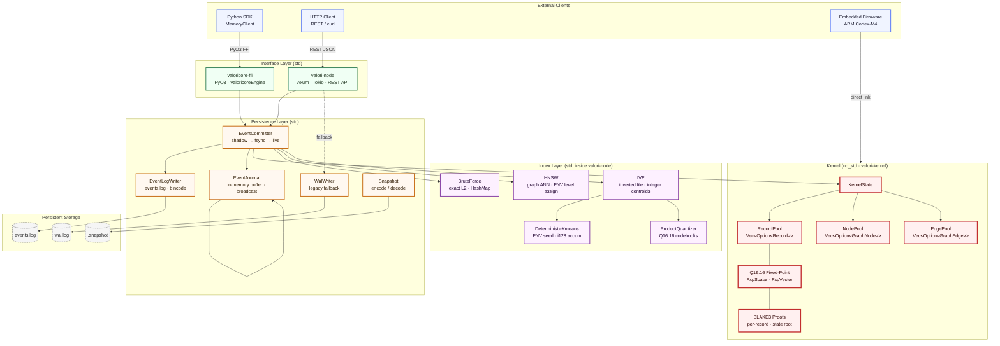
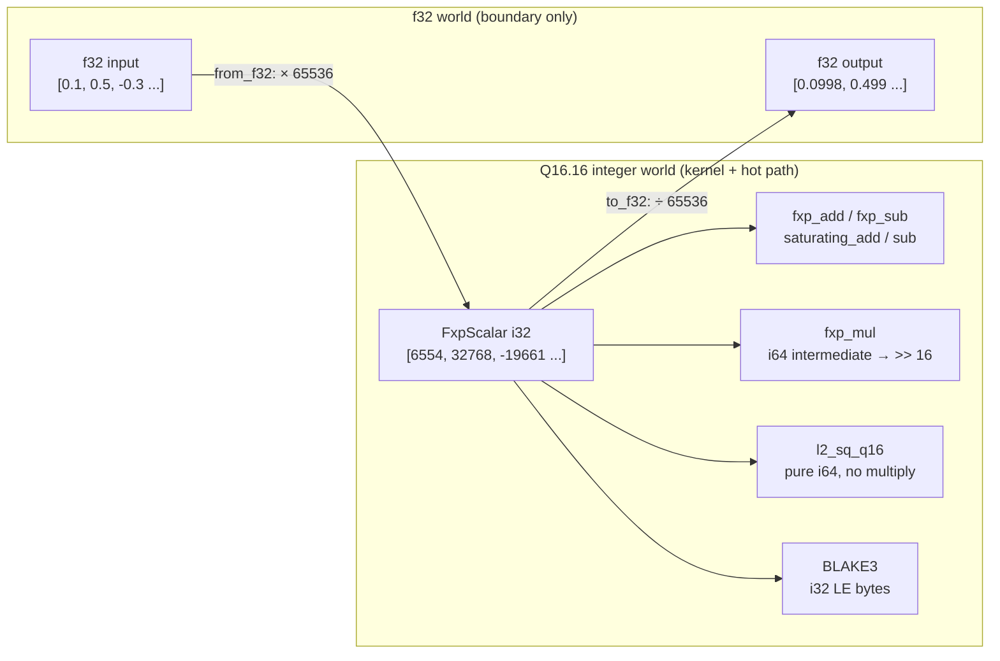
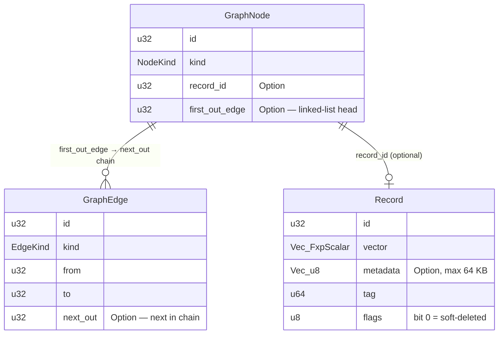
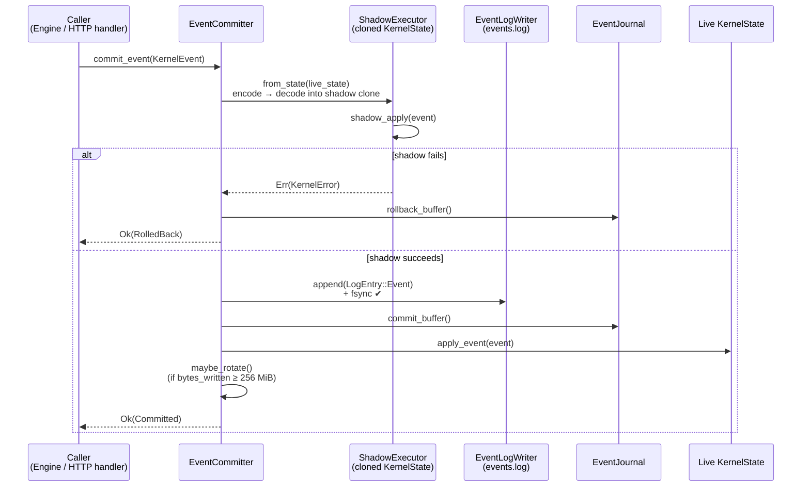
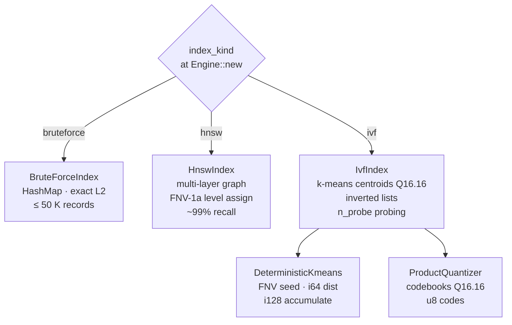
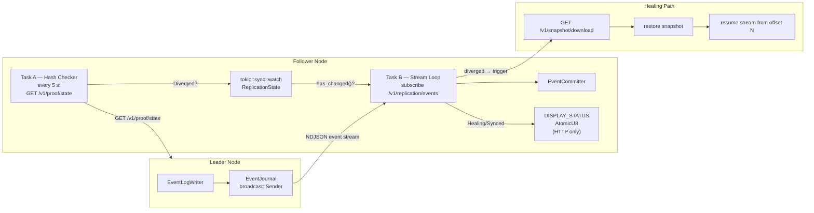
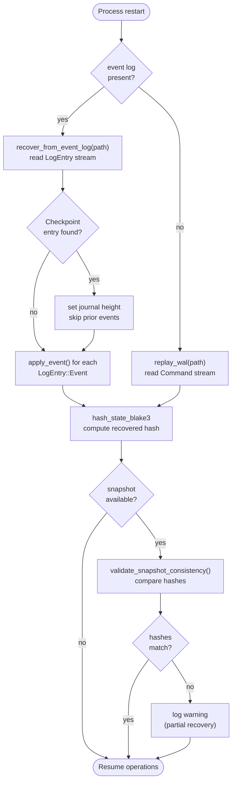
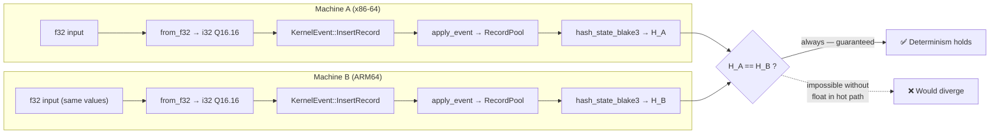

# Valori-Kernel — Architecture Reference

This document is the authoritative technical reference for the Valori-Kernel codebase. It covers every crate, every major subsystem, and the invariants that hold the whole system together. It is written from the source code, not from intent.

---

## Table of Contents

1. [Design Philosophy](#1-design-philosophy)
2. [Workspace Layout](#2-workspace-layout)
3. [Layer Model](#3-layer-model)
4. [Crate: `valori-kernel` (Core, no\_std)](#4-crate-valori-kernel-core-no_std)
   - 4.1 [Fixed-Point Math — Q16.16](#41-fixed-point-math--q1616)
   - 4.2 [KernelState — The State Machine](#42-kernelstate--the-state-machine)
   - 4.3 [KernelEvent — The Only Mutation Path](#43-kernelevent--the-only-mutation-path)
   - 4.4 [RecordPool — Vector Storage](#44-recordpool--vector-storage)
   - 4.5 [Knowledge Graph — NodePool & EdgePool](#45-knowledge-graph--nodepool--edgepool)
   - 4.6 [BLAKE3 Proofs & State Hashing](#46-blake3-proofs--state-hashing)
   - 4.7 [Snapshot Encode / Decode](#47-snapshot-encode--decode)
5. [Crate: `valori-node` (Std, Async)](#5-crate-valori-node-std-async)
   - 5.1 [Engine — Top-Level Orchestrator](#51-engine--top-level-orchestrator)
   - 5.2 [Event-Sourced Persistence Pipeline](#52-event-sourced-persistence-pipeline)
   - 5.3 [Vector Indexes](#53-vector-indexes)
   - 5.4 [Deterministic K-Means](#54-deterministic-k-means)
   - 5.5 [Product Quantization](#55-product-quantization)
   - 5.6 [HTTP Server — Routes & Handlers](#56-http-server--routes--handlers)
   - 5.7 [Replication — Leader-Follower](#57-replication--leaderFollower)
   - 5.8 [Recovery Paths](#58-recovery-paths)
6. [Crate: `valoricore-ffi` (PyO3)](#6-crate-valoricore-ffi-pyo3)
7. [Crate: `valori-embedded`](#7-crate-valori-embedded)
8. [Cross-Crate Invariants](#8-cross-crate-invariants)
9. [Determinism — Formal Guarantee](#9-determinism--formal-guarantee)
10. [Data Formats](#10-data-formats)
11. [Performance Characteristics](#11-performance-characteristics)
12. [Security Model](#12-security-model)

---

## 1. Design Philosophy

Three non-negotiable properties shape every design decision in this codebase:

**Determinism over convenience.** All vector arithmetic uses Q16.16 fixed-point integers. Floating-point is allowed only at the public boundary (PyO3 calls, HTTP JSON). This means two independent machines applying the same sequence of events will always arrive at an identical BLAKE3 state root — regardless of CPU architecture, SIMD unit, or OS floating-point settings.

**Disk before memory.** No mutation reaches the live `KernelState` before being fsynced to the append-only event log. The `EventCommitter` enforces this with a three-phase protocol: shadow execution → fsync → live apply. A process killed between any two steps leaves the system in a recoverable, consistent state.

**Proof over trust.** The global `KernelState` is always summarised in a single BLAKE3 Merkle root that can be computed offline, on any machine, from the raw integer record data alone. No server is required to verify state integrity.

---

## System Diagram


```mermaid
graph TD
    classDef external  fill:#f0f4ff,stroke:#4a6cf7,stroke-width:2px,color:#1a1a2e
    classDef interface fill:#f0fff4,stroke:#2e7d52,stroke-width:2px,color:#1a2e1a
    classDef persist   fill:#fff8f0,stroke:#c25e00,stroke-width:2px,color:#2e1a00
    classDef index     fill:#fdf0ff,stroke:#7b2e9e,stroke-width:2px,color:#1e002e
    classDef kernel    fill:#fff0f0,stroke:#c22e2e,stroke-width:3px,color:#2e0000
    classDef storage   fill:#f5f5f5,stroke:#555,stroke-width:1px,color:#222,stroke-dasharray:4 2

    subgraph Clients["External Clients"]
        PY[Python SDK<br/>MemoryClient]
        HTTP[HTTP Client<br/>REST / curl]
        FW[Embedded Firmware<br/>ARM Cortex-M4]
    end

    subgraph Interface["Interface Layer  (std)"]
        FFI[valoricore-ffi<br/>PyO3 · ValoricoreEngine]
        SRV[valori-node<br/>Axum · Tokio · REST API]
    end

    subgraph Persist["Persistence Layer  (std)"]
        EC[EventCommitter<br/>shadow → fsync → live]
        EL[EventLogWriter<br/>events.log · bincode]
        EJ[EventJournal<br/>in-memory buffer · broadcast]
        WAL[WalWriter<br/>legacy fallback]
        SNAP[Snapshot<br/>encode / decode]
    end

    subgraph Index["Index Layer  (std, inside valori-node)"]
        BF[BruteForce<br/>exact L2 · HashMap]
        HNSW[HNSW<br/>graph ANN · FNV level assign]
        IVF[IVF<br/>inverted file · integer centroids]
        PQ[ProductQuantizer<br/>Q16.16 codebooks]
        KM[DeterministicKmeans<br/>FNV seed · i128 accum]
    end

    subgraph Core["Kernel  (no_std · valori-kernel)"]
        KS[KernelState]
        RP[RecordPool<br/>Vec&lt;Option&lt;Record&gt;&gt;]
        NP[NodePool<br/>Vec&lt;Option&lt;GraphNode&gt;&gt;]
        EP[EdgePool<br/>Vec&lt;Option&lt;GraphEdge&gt;&gt;]
        FXP[Q16.16 Fixed-Point<br/>FxpScalar · FxpVector]
        BK[BLAKE3 Proofs<br/>per-record · state root]
    end

    subgraph Disk["Persistent Storage"]
        ELF[(events.log)]
        WF[(wal.log)]
        SF[(.snapshot)]
    end

    PY  -->|PyO3 FFI| FFI
    HTTP-->|REST JSON| SRV
    FW  -->|direct link| Core

    FFI --> EC
    SRV --> EC
    SRV -.->|fallback| WAL

    EC  --> EL
    EC  --> EJ
    EC  --> KS
    EJ  --> EJ
    EL  --> ELF
    WAL --> WF
    SNAP--> SF

    KS  --> RP
    KS  --> NP
    KS  --> EP
    RP  --- FXP
    FXP --- BK

    EC  --> BF
    EC  --> HNSW
    EC  --> IVF
    IVF --> KM
    IVF --> PQ

    class PY,HTTP,FW external
    class FFI,SRV interface
    class EC,EL,EJ,WAL,SNAP persist
    class BF,HNSW,IVF,PQ,KM index
    class KS,RP,NP,EP,FXP,BK kernel
    class ELF,WF,SF storage
```

---

## 2. Workspace Layout

```
Valori-Kernel/
├── Cargo.toml                  ← workspace root
│
├── src/                        ← valori-kernel crate (no_std core)
│
├── node/                       ← valori-node crate (std, async, HTTP)
│   ├── src/
│   │   ├── engine.rs
│   │   ├── server.rs
│   │   ├── events/
│   │   ├── structure/          ← HNSW, IVF, PQ, k-means
│   │   ├── network/
│   │   └── replication.rs
│   └── tests/
│       └── proof_e2e_tests.rs
│
├── ffi/                        ← valoricore-ffi crate (PyO3 bindings)
│   └── src/lib.rs
│
├── embedded/                   ← valori-embedded crate (no_std firmware)
│
├── verify/                     ← valori-verify CLI (snapshot / WAL verification)
│
├── crates/cli/                 ← valori-cli (benchmarks, admin)
│
├── python/                     ← Python SDK (valoricore package)
│   └── valoricore/
│       ├── memory.py           ← MemoryClient (high-level API)
│       ├── factory.py          ← Valoricore / AsyncValoricore
│       ├── local.py            ← LocalClient (wraps FFI)
│       ├── remote.py           ← SyncRemoteClient / AsyncRemoteClient
│       ├── async_memory.py     ← AsyncMemoryClient
│       └── embeddings/         ← pluggable embedding providers
│
└── docs/                       ← supplementary documentation
```

**Crate dependency graph:**

```
valori-kernel  (no_std, no I/O)
    ▲
    │  (depends on)
valori-node    (std, tokio, axum)
    ▲
    │
valoricore-ffi (PyO3)
```

`valori-embedded` and `valori-verify` also depend directly on `valori-kernel`. Neither depends on `valori-node`.

---

## 3. Layer Model

```
┌─────────────────────────────────────────────────────┐
│  External Clients                                   │
│  Python scripts · HTTP clients · ARM firmware       │
└───────────────────────┬─────────────────────────────┘
                        │
┌───────────────────────▼─────────────────────────────┐
│  Interface Layer  (std)                             │
│                                                     │
│  valoricore-ffi          valori-node                │
│  PyO3 → ValoricoreEngine  Axum/Tokio HTTP server    │
│  microsecond FFI calls    REST + auth middleware     │
└───────────────────────┬─────────────────────────────┘
                        │
┌───────────────────────▼─────────────────────────────┐
│  Persistence Layer  (std)                           │
│                                                     │
│  EventCommitter ─► EventLogWriter (fsync)           │
│  ShadowExecutor    EventJournal (in-memory)         │
│  WAL (legacy)      Snapshot encode/decode           │
│  recover_from_event_log() / replay_wal()            │
└───────────────────────┬─────────────────────────────┘
                        │
┌───────────────────────▼─────────────────────────────┐
│  Index Layer  (std, inside valori-node)             │
│                                                     │
│  VectorIndex trait                                  │
│  BruteForceIndex · HnswIndex · IvfIndex             │
│  Quantizer trait: NoQuantizer · ScalarQ · PQ        │
│  DeterministicKmeans                                │
└───────────────────────┬─────────────────────────────┘
                        │
┌───────────────────────▼─────────────────────────────┐
│  Kernel  (no_std)   valori-kernel                   │
│                                                     │
│  KernelState                                        │
│  ├── RecordPool  (Vec<Option<Record>>)              │
│  ├── NodePool    (Vec<Option<GraphNode>>)           │
│  ├── EdgePool    (Vec<Option<GraphEdge>>)           │
│  └── dim: usize                                     │
│                                                     │
│  Q16.16 fixed-point · BLAKE3 Merkle proofs          │
└─────────────────────────────────────────────────────┘
```

---

## 4. Crate: `valori-kernel` (Core, no\_std)

**Location:** `src/`  
**Cargo name:** `valori-kernel`  
**Attributes:** `#![no_std]` with `extern crate alloc`. No I/O, no randomness, no system clock. Panic mode: `abort` (firmware-safe).

This crate is the only part of the system that defines what "state" means. Everything else — persistence, networking, indexing, Python bindings — is infrastructure built around it.

### 4.1 Fixed-Point Math — Q16.16

**Files:** `src/fxp/`, `src/config.rs`, `src/math/`

All vector arithmetic in the kernel uses **Q16.16 signed fixed-point integers** stored as `i32`. The integer representation of a value `v` is `v × 65536`. The bottom 16 bits carry the fractional part; the top 16 bits carry the integer part.

```
FRAC_BITS = 16         (src/config.rs:5)
SCALE     = 65536      (src/config.rs:8)
Range     = [-32768.0, +32767.999984]
Precision = 1/65536 ≈ 0.0000153
```


```mermaid
flowchart LR
    subgraph Outside["f32 world  (boundary only)"]
        A["f32 input<br/>[0.1, 0.5, -0.3 ...]"]
        Z["f32 output<br/>[0.0998, 0.499 ...]"]
    end

    subgraph Inside["Q16.16 integer world  (kernel + hot path)"]
        B["FxpScalar  i32<br/>[6554, 32768, -19661 ...]"]
        C["fxp_add / fxp_sub<br/>saturating_add / sub"]
        D["fxp_mul<br/>i64 intermediate → >> 16"]
        E["l2_sq_q16<br/>pure i64, no multiply"]
        F["BLAKE3<br/>i32 LE bytes"]
    end

    A -->|"from_f32: × 65536"| B
    B --> C & D & E & F
    B -->|"to_f32: ÷ 65536"| Z
```

**Core operations** (`src/fxp/ops.rs`):

| Function | Implementation | Notes |
|---|---|---|
| `from_f32(v)` | `(v * 65536.0).round().clamp(i32::MIN, i32::MAX) as i32` | Boundary conversion only |
| `to_f32(v)` | `v as f32 / 65536.0` | Output boundary only |
| `fxp_add(a, b)` | `a.saturating_add(b)` | No overflow possible |
| `fxp_sub(a, b)` | `a.saturating_sub(b)` | No overflow possible |
| `fxp_mul(a, b)` | `((a as i64 * b as i64) >> 16) as i32` | i64 intermediate prevents overflow |

**Squared L2 distance** (`src/math/l2.rs`):

```rust
pub fn fxp_l2_sq(a: &FxpVector, b: &FxpVector) -> FxpScalar {
    a.data.iter().zip(b.data.iter())
        .map(|(x, y)| fxp_mul(fxp_sub(*x, *y), fxp_sub(*x, *y)))
        .fold(FxpScalar(0), |acc, d| FxpScalar(fxp_add(acc.0, d.0)))
}
```

The node layer's `l2_sq_q16` function (used by IVF and k-means) avoids Q16 multiplication entirely, working directly in `i64` to retain full integer precision:

```rust
// node/src/structure/deterministic/kmeans.rs
pub fn l2_sq_q16(a: &[i32], b: &[i32]) -> i64 {
    a.iter().zip(b.iter())
        .map(|(&x, &y)| { let d = (x - y) as i64; d * d })
        .sum()
}
```

This is the hot path for centroid assignment and search. It never touches `f32`.

**Key type definitions:**

```rust
// src/types/scalar.rs:8
#[repr(transparent)]
pub struct FxpScalar(pub i32);

// src/types/vector.rs:13
pub struct FxpVector {
    pub data: Vec<FxpScalar>,
}
```

### 4.2 KernelState — The State Machine

**File:** `src/state/kernel.rs:17–25`

```rust
pub struct KernelState {
    pub records:  RecordPool,   // dense Vec<Option<Record>>
    pub nodes:    NodePool,     // dense Vec<Option<GraphNode>>
    pub edges:    EdgePool,     // dense Vec<Option<GraphEdge>>
    pub dim:      usize,        // locked on first insert
}
```

`KernelState` is a pure value. It has no file handles, no mutexes, no background tasks. It can be cloned (for shadow execution), serialized (for snapshots), and replayed (from the event log) identically on any machine.

**Central invariant:** All mutations flow through `apply_event(KernelEvent)` at `src/state/kernel.rs:119–164`. Callers outside the kernel may not manipulate the pool fields directly.

**Dimension locking:** The first `InsertRecord` event sets `dim`. Subsequent inserts with a different dimension are rejected with `KernelError::DimensionMismatch`.

**Metadata cap:** `MAX_METADATA_SIZE = 65536` bytes (64 KB), enforced in `apply_event` before any pool mutation.

### 4.3 KernelEvent — The Only Mutation Path

**File:** `src/event.rs:32–65`

```rust
pub enum KernelEvent {
    InsertRecord {
        id:       RecordId,
        vector:   FxpVector,
        metadata: Option<Vec<u8>>,
        tag:      u64,
    },
    DeleteRecord { id: RecordId },
    SoftDeleteRecord { id: RecordId },
    UpdateMetadata { id: RecordId, metadata: Vec<u8> },
    CreateNode { node_id: NodeId, kind: NodeKind, record_id: Option<RecordId> },
    CreateEdge { edge_id: EdgeId, kind: EdgeKind, from: NodeId, to: NodeId },
    DeleteEdge { edge_id: EdgeId },
}
```

Events are `Serialize + Deserialize` (serde/bincode). They are the unit of persistence: the event log on disk is a bincode stream of `LogEntry::Event(KernelEvent)` values.

**RecordId assignment:** The node layer's `Engine::insert_record_from_f32()` allocates the next `RecordId` from the current pool length before constructing the event. IDs are 0-based, monotonic, never reused. Deleted slots become `None` in the pool but the ID is retired.

### 4.4 RecordPool — Vector Storage

**File:** `src/storage/pool.rs:10–12`

```rust
pub struct RecordPool {
    records: Vec<Option<Record>>,
}

pub struct Record {
    pub id:       RecordId,
    pub vector:   FxpVector,
    pub metadata: Option<Vec<u8>>,
    pub tag:      u64,
    pub flags:    u8,           // bit 0: soft-deleted
}
```

**Design choice — dense optional slots:** Using `Vec<Option<Record>>` instead of `HashMap<RecordId, Record>` gives O(1) insert, O(1) delete, and deterministic iteration order (by insertion index). The trade-off is that deleted records leave holes. For the use-case profile (append-heavy, rare delete), this is the right trade.

**Tag field:** A `u64` stored alongside each record. The node layer's index implementations pass `filter_tag` through to search, skipping records whose tag doesn't match. Because the tag lives in the pool alongside the vector, filtering is O(1) per candidate — no secondary index required.

### 4.5 Knowledge Graph — NodePool & EdgePool

**Files:** `src/graph/pool.rs`, `src/graph/node.rs`, `src/graph/edge.rs`, `src/graph/adjacency.rs`

```rust
pub struct GraphNode {
    pub id:           NodeId,
    pub kind:         NodeKind,
    pub record_id:    Option<RecordId>,
    pub first_out_edge: Option<EdgeId>,   // head of linked-list
}

pub struct GraphEdge {
    pub id:       EdgeId,
    pub kind:     EdgeKind,
    pub from:     NodeId,
    pub to:       NodeId,
    pub next_out: Option<EdgeId>,         // linked-list chain
}
```

Edges are stored as an **intrusive singly-linked list**: each `GraphNode.first_out_edge` points to the head of its outgoing edge chain; each `GraphEdge.next_out` points to the next edge in the chain. This avoids any heap-allocated adjacency lists per node, keeping the structure flat and serializable.

**Traversal:** `OutEdgeIterator` (`src/graph/adjacency.rs:13–79`) walks the chain. BFS over the graph (for `walk()` and `expand()`) is implemented in the node layer.


```mermaid
erDiagram
    GraphNode {
        u32     id
        NodeKind kind
        u32     record_id   "Option"
        u32     first_out_edge "Option — linked-list head"
    }
    GraphEdge {
        u32      id
        EdgeKind kind
        u32      from
        u32      to
        u32      next_out    "Option — next in chain"
    }
    Record {
        u32        id
        Vec_FxpScalar vector
        Vec_u8     metadata  "Option, max 64 KB"
        u64        tag
        u8         flags     "bit 0 = soft-deleted"
    }
    GraphNode ||--o{ GraphEdge : "first_out_edge → next_out chain"
    GraphNode ||--o| Record    : "record_id (optional)"
```

**Node kinds** (`src/types/enums.rs:6–31`):

| Constant | Value | Meaning |
|---|---|---|
| `NODE_RECORD` | 0 | Raw vector record |
| `NODE_CONCEPT` | 1 | Abstract concept |
| `NODE_AGENT` | 2 | AI agent / process |
| `NODE_USER` | 3 | Human user |
| `NODE_TOOL` | 4 | Tool or callable function |
| `NODE_DOCUMENT` | 5 | Top-level document |
| `NODE_CHUNK` | 6 | Text chunk (child of document) |

**Edge kinds** (`src/types/enums.rs:39–71`):

| Constant | Value | Meaning |
|---|---|---|
| `EDGE_RELATION` | 0 | Generic relation |
| `EDGE_FOLLOWS` | 1 | Sequential ordering |
| `EDGE_IN_EPISODE` | 2 | Episodic grouping |
| `EDGE_BY_AGENT` | 3 | Agent authorship |
| `EDGE_MENTIONS` | 4 | Entity mention |
| `EDGE_REFERS_TO` | 5 | Cross-reference |
| `EDGE_PARENT_OF` | 6 | Hierarchical parent→child |

### 4.6 BLAKE3 Proofs & State Hashing

**Files:** `src/proof.rs`, `src/snapshot/blake3.rs`

**Per-record proof** (`src/proof.rs:55–72`):

A per-record proof is a BLAKE3 Merkle leaf computed from the raw Q16.16 integer representation of the vector. Because the integers are fixed-point (not float), the same embedding produces the same bytes on any CPU.

```rust
pub fn generate_proof_bytes(values: &[i32]) -> Vec<u8> {
    let mut hasher = blake3::Hasher::new();
    for v in values {
        hasher.update(&v.to_le_bytes());
    }
    hasher.finalize().as_bytes().to_vec()
}
```

The root of all leaf hashes gives the per-record BLAKE3 Merkle node. This proof is hardware-independent and can be verified offline with no server.

**Full state hash** (`src/snapshot/blake3.rs` → `hash_state_blake3`):

Hashes the entire `KernelState` in a single deterministic pass:

```
hasher ← BLAKE3
for each record slot (in index order):
    update(record.vector.data as &[u8])     // raw i32 LE bytes
    update(record.metadata)
    update(record.tag.to_le_bytes())
for each node slot (in index order):
    update(node.kind as u8)
for each edge slot (in index order):
    update(edge.from.to_le_bytes())
    update(edge.to.to_le_bytes())
    update(edge.kind as u8)
finalize() → [u8; 32]
```

The deterministic iteration order (dense pool, index order) ensures identical byte sequences on every machine.

**`DeterministicProof` struct** (`src/proof.rs:12–24`):

```rust
pub struct DeterministicProof {
    pub kernel_version:   u32,
    pub snapshot_hash:    [u8; 32],
    pub wal_hash:         [u8; 32],
    pub final_state_hash: [u8; 32],
}
```

Exposed via the `/v1/proof/state` HTTP endpoint.

### 4.7 Snapshot Encode / Decode

**Files:** `src/snapshot/encode.rs`, `src/snapshot/decode.rs`

**Binary format (schema v3):**

```
[magic: "VALK" (4 bytes)]
[schema_version: u32 LE]
[state_version: u64 LE]
[records_capacity: u32 LE]
[dim: u32 LE]
[nodes_capacity: u32 LE]
[edges_capacity: u32 LE]
── Record slots (records_capacity entries) ──
    [present: u8]          ← 0 = None, 1 = Some
    [id: u32 LE]
    [tag: u64 LE]
    [flags: u8]
    [vector: dim × 4 bytes, i32 LE each]
    [metadata_len: u32 LE]
    [metadata: metadata_len bytes]
── Node slots ──
    [present: u8]
    [id: u32 LE]
    [kind: u8]
    [has_record_id: u8]
    [record_id: u32 LE]    ← only if has_record_id
── Edge slots ──
    [present: u8]
    [id: u32 LE]
    [kind: u8]
    [from: u32 LE]
    [to: u32 LE]
```

Snapshots are self-describing (no external config needed to restore). Dimension mismatch on decode is a hard error.

---

## 5. Crate: `valori-node` (Std, Async)

**Location:** `node/`  
**Cargo name:** `valori-node`  
**Runtime:** Tokio async. HTTP: Axum. Serialization: bincode + serde\_json.

This crate owns everything that requires `std`: file I/O, networking, async tasks, advanced indexing, quantization, and replication. It wraps `valori-kernel` and adds the persistence and interface layers.

### 5.1 Engine — Top-Level Orchestrator

**File:** `node/src/engine.rs:29–47`

```rust
pub struct Engine {
    pub kernel:        KernelState,
    pub index:         Box<dyn VectorIndex>,
    pub quantizer:     Box<dyn Quantizer>,
    pub event_committer: Option<EventCommitter>,
    pub wal_writer:    Option<WalWriter>,
    pub config:        NodeConfig,
    pub metadata_store: MetadataStore,
}
```

`Engine` is the single entry point for all mutations. It:
1. Translates `f32` inputs into `KernelEvent` values.
2. Delegates to `EventCommitter` (primary path) or `WalWriter` (legacy fallback).
3. Keeps the `VectorIndex` in sync with the kernel after every committed event.
4. Exposes `get_proof()` → `DeterministicProof` by calling `hash_state_blake3`.

**Key method:** `insert_record_from_f32(&[f32]) → Result<(RecordId, Vec<u8>)>`:
- Allocates the next `RecordId` from pool length.
- Converts `f32` values to `FxpScalar` via `from_f32`.
- Constructs `KernelEvent::InsertRecord`.
- Commits via `EventCommitter::commit_event`.
- Updates the vector index.
- Returns `(id, proof_bytes)`.

### 5.2 Event-Sourced Persistence Pipeline

**Files:** `node/src/events/event_commit.rs`, `event_log.rs`, `event_journal.rs`, `event_replay.rs`

#### The commit barrier


```mermaid
sequenceDiagram
    participant C  as Caller<br/>(Engine / HTTP handler)
    participant EC as EventCommitter
    participant SH as ShadowExecutor<br/>(cloned KernelState)
    participant EL as EventLogWriter<br/>(events.log)
    participant EJ as EventJournal
    participant KS as Live KernelState

    C->>EC: commit_event(KernelEvent)

    EC->>SH: from_state(live_state)<br/>encode → decode into shadow clone
    SH->>SH: shadow_apply(event)

    alt shadow fails
        SH-->>EC: Err(KernelError)
        EC->>EJ: rollback_buffer()
        EC-->>C: Ok(RolledBack)
    else shadow succeeds
        EC->>EL: append(LogEntry::Event)<br/>+ fsync ✔
        EC->>EJ: commit_buffer()
        EC->>KS: apply_event(event)
        EC->>EC: maybe_rotate()<br/>(if bytes_written ≥ 256 MiB)
        EC-->>C: Ok(Committed)
    end
```

Every mutation goes through a strict four-step protocol before affecting the live state:

```
Step 1 — Shadow Execute
  Clone live KernelState via encode/decode (10 MB heap buffer)
  Apply event to shadow clone
  If shadow fails → rollback journal buffer, return RolledBack (no disk write)

Step 2 — fsync to Event Log
  Serialize event as LogEntry::Event(KernelEvent) via bincode
  Write to events.log, fsync
  (At this point, the event is durable. A crash here is safe — replay recovers it.)

Step 3 — Live Apply
  Apply event to live KernelState via apply_event()
  If this fails (should be impossible after shadow success) → critical error

Step 4 — Auto-rotation check
  Increment bytes_written counter on EventLogWriter
  If bytes_written ≥ log_rotation_bytes (default 256 MiB):
      Archive current log to events.log.<unix_ts>
      Write LogEntry::Checkpoint{event_count, snapshot_hash, timestamp} to new log
      Reset bytes_written counter
```

**`EventCommitter` struct** (`event_commit.rs:84–96`):

```rust
pub struct EventCommitter {
    event_log:          EventLogWriter,
    journal:            EventJournal,
    live_state:         KernelState,
    log_rotation_bytes: Option<u64>,  // default: 256 MiB
}
```

**`ShadowExecutor`** (`event_commit.rs:39–78`): Serializes the live state into a 10 MB heap buffer, decodes it into a fresh `KernelState`, applies the event. Cost: ~2× encode + decode per commit. Trade-off: crash safety with no locks.

**`EventJournal`** (`event_journal.rs:26–39`):

```rust
pub struct EventJournal {
    committed: Vec<KernelEvent>,    // immutable committed history
    buffer:    Vec<KernelEvent>,    // staging area (rolled back on shadow failure)
    height:    u64,                 // committed event count
    broadcast: broadcast::Sender<LogEntry>,  // live event stream for replication
}
```

**`LogEntry` enum** (`event_log.rs`):

```rust
pub enum LogEntry {
    Event(KernelEvent),
    Checkpoint {
        event_count:   u64,
        snapshot_hash: [u8; 32],
        timestamp:     u64,
    },
}
```

Checkpoints mark safe replay start points after log rotation. Recovery can skip events before a checkpoint.

#### Batch commits

`commit_batch(Vec<KernelEvent>)`: Writes all events to disk in a single `append_batch` call (one fsync), then shadow-applies all events in sequence. On any shadow failure, the entire batch is rolled back. On success, all events are live-applied in order.

### 5.3 Vector Indexes

**Files:** `node/src/structure/index.rs`, `hnsw.rs`, `ivf.rs`


```mermaid
flowchart TD
    IC{index_kind<br/>at Engine::new}
    IC -->|"bruteforce"| BF2["BruteForceIndex<br/>HashMap · exact L2<br/>≤ 50 K records"]
    IC -->|"hnsw"| HN["HnswIndex<br/>multi-layer graph<br/>FNV-1a level assign<br/>~99% recall"]
    IC -->|"ivf"| IV["IvfIndex<br/>k-means centroids Q16.16<br/>inverted lists<br/>n_probe probing"]

    IV --> KM2["DeterministicKmeans<br/>FNV seed · i64 dist<br/>i128 accumulate"]
    IV --> PQ2["ProductQuantizer<br/>codebooks Q16.16<br/>u8 codes"]
```

All indexes implement the `VectorIndex` trait:

```rust
pub trait VectorIndex: Send + Sync {
    fn build(&mut self, records: &RecordPool);
    fn insert(&mut self, id: RecordId, vector: &[f32]);
    fn delete(&mut self, id: RecordId);
    fn search(&self, query: &[f32], k: usize, filter_tag: Option<u64>) -> Vec<(RecordId, f32)>;
    fn snapshot(&self) -> Vec<u8>;
    fn restore(&mut self, data: &[u8]);
}
```

The index is selected at `Engine::new()` time via `NodeConfig.index_kind` and cannot be changed without restarting.

#### BruteForce

**File:** `node/src/structure/index.rs:13–36`

A `HashMap<RecordId, Vec<f32>>` maintained in parallel with the pool. On `search()`, iterates all entries computing L2² distance in `f32` (boundary layer only — the kernel itself never sees these floats). Filter-by-tag is applied before distance computation.

**When to use:** ≤ 50 K records, exact recall required, simplest operational profile.

#### HNSW

**File:** `node/src/structure/hnsw.rs:66–84`

```rust
pub struct HnswIndex {
    layers:      RwLock<Vec<HashMap<RecordId, Vec<RecordId>>>>,
    entry_point: Option<RecordId>,
    max_level:   usize,
    config:      HnswConfig,
}

pub struct HnswConfig {
    pub m:              usize,   // max edges per node (default: 16)
    pub m_max0:         usize,   // max edges in layer 0 (default: 32)
    pub ef_construction: usize,  // beam width during build (default: 200)
    pub lambda:         f64,     // level decay factor (default: 1/ln(m))
}
```

Level assignment for new nodes uses a **FNV-1a hash** of the `RecordId` — deterministic, reproducible. Candidate management uses a `Candidate { score: i64, id: RecordId }` struct with `Ord` implementing tie-breaking by `id` (lower id wins), ensuring deterministic graph topology.

**When to use:** Large record counts (100 K+), sub-millisecond search acceptable recall trade-off.

#### IVF (Inverted File Index)

**File:** `node/src/structure/ivf.rs:24–31`

```rust
pub struct IvfIndex {
    config:         IvfConfig,
    dim:            usize,
    centroids:      Vec<Vec<i32>>,                 // Q16.16
    inverted_lists: Vec<Vec<(u32, Vec<i32>)>>,    // (RecordId, Q16.16 vector)
}

pub struct IvfConfig {
    pub n_list:  usize,   // number of centroids (default: 256)
    pub n_probe: usize,   // centroids to probe at search time (default: 8)
}
```

**All arithmetic is integer.** Centroids are `Vec<i32>` (Q16.16). Inverted list entries store Q16.16 vectors. The distance computation (`l2_sq_q16`) returns `i64` — no floating-point in the hot path at all.

**Build path:**
1. Convert all `f32` records to Q16.16 at the `build()` boundary.
2. Run `deterministic_kmeans(records, n_list, 25)` → `Vec<Vec<i32>>` centroids.
3. Assign each record to its nearest centroid (integer distance), push into inverted list.

**Search path:**
1. Convert `f32` query to Q16.16 at entry.
2. Find the `n_probe` nearest centroids by integer L2².
3. Scan each probed inverted list, compute integer L2² to query.
4. Collect top-k results; convert final i64 distance to `f32` at output boundary only.

**When to use:** Large batch workloads, predictable clustering structure, determinism of centroids required.

### 5.4 Deterministic K-Means

**File:** `node/src/structure/deterministic/kmeans.rs:16–127`

Standard Lloyd's algorithm with four modifications to make it bit-identical across architectures:

| Property | Implementation |
|---|---|
| **Seed selection** | FNV-1a hash of `(vector_bytes ++ record_id)` selects initial centroids; no system RNG |
| **Distance** | `l2_sq_q16` — pure `i64` integer arithmetic, no `f32` |
| **Tie-breaking** | `if d < best_dist || (d == best_dist && c_idx < best_c)` — lowest centroid index wins |
| **Accumulation** | Centroid update sums in `i128` to prevent overflow on large clusters; divided by count, result clamped to `i32` |

**Signature:**

```rust
pub fn deterministic_kmeans(
    records:    &[(u32, Vec<f32>)],   // (id, f32 vector) — f32 converted at entry
    k:          usize,
    iterations: usize,
) -> Vec<Vec<i32>>                    // Q16.16 centroids
```

### 5.5 Product Quantization

**File:** `node/src/structure/quant/pq.rs:18–30`

```rust
pub struct ProductQuantizer {
    config:    PqConfig,
    dim:       usize,
    codebooks: Vec<Vec<Vec<i32>>>,   // [subspace][centroid][component], Q16.16
}

pub struct PqConfig {
    pub n_subvectors:  usize,   // number of subspaces
    pub n_centroids:   usize,   // centroids per subspace (≤ 256 for u8 codes)
}
```

`quantize()`: Splits the Q16.16 input vector into `n_subvectors` equal-length sub-vectors. For each sub-vector, finds the nearest codebook centroid (integer L2²). Returns a `Vec<u8>` code (one byte per subspace).

`reconstruct()`: Looks up each u8 code in its codebook, concatenates, converts Q16.16 → f32 at the output boundary.

Codebooks are built by running `deterministic_kmeans` independently on each subspace's coordinate projections.

### 5.6 HTTP Server — Routes & Handlers

**File:** `node/src/server.rs:49–79`  
**Framework:** Axum. Authentication via `Tower` middleware checking `Authorization: Bearer <token>` against `VALORI_AUTH_TOKEN` env var.

| Method | Path | Purpose |
|---|---|---|
| GET | `/health` | Liveness check |
| GET | `/version` | Version string |
| POST | `/records` | Insert single record (f32 vector) → RecordId |
| POST | `/v1/delete` | Delete record |
| POST | `/v1/vectors/batch_insert` | Atomic batch insert → Vec<RecordId> |
| POST | `/v1/vectors/soft_delete` | Soft-delete record (deactivate, slot preserved) |
| POST | `/search` | L2 search → Vec<(RecordId, score)> |
| POST | `/graph/node` | Create graph node |
| GET | `/graph/node/:id` | Get node (kind, record_id) |
| POST | `/graph/edge` | Create directed edge |
| GET | `/graph/edges/:id` | Get outgoing edges for node |
| GET | `/v1/snapshot/download` | Download binary snapshot |
| POST | `/v1/snapshot/upload` | Restore from uploaded snapshot |
| POST | `/v1/snapshot/save` | Write snapshot to disk |
| POST | `/v1/snapshot/restore` | Load snapshot from disk |
| GET | `/v1/proof/state` | `DeterministicProof` JSON |
| GET | `/v1/proof/event-log` | Event log proof |
| GET | `/v1/replication/wal` | SSE: WAL event stream |
| GET | `/v1/replication/events` | SSE: Event log stream (primary) |
| GET | `/v1/replication/state` | Replication status string |
| GET | `/timeline` | Chronological event list |
| GET | `/metrics` | Prometheus metrics |

**Environment variables:**

| Variable | Default | Description |
|---|---|---|
| `VALORI_DIM` | `16` | Embedding dimension |
| `VALORI_MAX_RECORDS` | `1024` | Soft pool hint (grows dynamically) |
| `VALORI_INDEX` | `bruteforce` | `bruteforce` · `hnsw` · `ivf` |
| `VALORI_QUANT` | — | `scalar` · `product` |
| `VALORI_AUTH_TOKEN` | — | Bearer token (omit to disable auth) |
| `VALORI_EVENT_LOG_PATH` | — | Durable event log path |
| `VALORI_WAL_PATH` | — | Legacy WAL path (fallback) |
| `VALORI_SNAPSHOT_PATH` | — | Snapshot output path |
| `VALORI_FOLLOWER_OF` | — | Leader URL (enables follower mode) |
| `VALORI_HTTP_PORT` | `3000` | Bind port |

### 5.7 Replication — Leader-Follower

**Files:** `node/src/replication.rs`, `node/src/network/client.rs`


```mermaid
flowchart LR
    subgraph Leader["Leader Node"]
        LE[EventLogWriter]
        EJ2[EventJournal<br/>broadcast::Sender]
        LE --> EJ2
    end

    subgraph Follower["Follower Node"]
        direction TB
        TA["Task A — Hash Checker<br/>every 5 s:<br/>GET /v1/proof/state"]
        TB2["Task B — Stream Loop<br/>subscribe /v1/replication/events"]
        WC["tokio::sync::watch<br/>ReplicationState"]
        FEC[EventCommitter]
        DS["DISPLAY_STATUS<br/>AtomicU8<br/>(HTTP only)"]

        TA -- "Diverged?" --> WC
        WC -- "has_changed()?" --> TB2
        TB2 --> FEC
        TB2 -- "Healing/Synced" --> DS
    end

    subgraph Healing["Healing Path"]
        DL["GET /v1/snapshot/download"]
        RP2["restore snapshot"]
        RS["resume stream from offset N"]
        DL --> RP2 --> RS
    end

    EJ2 -- "NDJSON event stream" --> TB2
    TA -- "GET /v1/proof/state" --> Leader
    TB2 -- "diverged → trigger" --> DL
```

#### Leader

The leader exposes two streaming endpoints:
- `/v1/replication/wal` — legacy WAL commands as NDJSON
- `/v1/replication/events?start_offset=N` — canonical event log as NDJSON

These are fed by the `EventJournal`'s `broadcast::Sender<LogEntry>`. Subscribers receive events in real-time without polling.

#### Follower

The follower runs two concurrent async tasks connected by a `tokio::sync::watch` channel:

```
Task A: Hash-checker
  Every 5 seconds:
    GET /v1/proof/state from leader
    Compare leader.final_state_hash vs local.final_state_hash
    If mismatch → send ReplicationState::Diverged on watch channel

Task B: Stream loop
  Subscribe to /v1/replication/events
  For each event:
    Apply via EventCommitter::commit_event()
    Check watch channel (non-blocking)
    If Diverged on watch → trigger healing
```

**Healing path:**
1. Set `DISPLAY_STATUS = Healing` (atomic, for `/v1/replication/state` endpoint only)
2. `GET /v1/snapshot/download` from leader
3. Restore snapshot into local kernel
4. Write checkpoint event to local event log
5. Resume streaming from current leader offset
6. Set `DISPLAY_STATUS = Synced`

**Two-variable design:** `tokio::sync::watch` is used for actual task coordination (single writer, many readers, no ABA problem). A separate `static DISPLAY_STATUS: AtomicU8` serves only the HTTP status endpoint with no coordination semantics. This eliminates the race condition that existed when a single `AtomicU8` was used for both purposes.

**`LeaderClient`** (`node/src/network/client.rs:4–59`):

```rust
pub struct LeaderClient {
    base_url: String,
    client:   reqwest::Client,
}
// Methods: stream_events(), download_snapshot(), get_proof()
```

### 5.8 Recovery Paths

**File:** `node/src/recovery.rs`, `node/src/events/event_replay.rs`


```mermaid
flowchart TD
    START([Process restart]) --> CHK{event log<br/>present?}

    CHK -->|yes| ELR["recover_from_event_log(path)<br/>read LogEntry stream"]
    CHK -->|no| WALR["replay_wal(path)<br/>read Command stream"]

    ELR --> CP{Checkpoint<br/>entry found?}
    CP -->|yes| SKIP["set journal height<br/>skip prior events"]
    CP -->|no| APPLY
    SKIP --> APPLY

    APPLY["apply_event() for each<br/>LogEntry::Event"] --> HASH1

    WALR --> HASH1["hash_state_blake3<br/>compute recovered hash"]

    HASH1 --> SNAP{snapshot<br/>available?}
    SNAP -->|yes| VALID["validate_snapshot_consistency()<br/>compare hashes"]
    SNAP -->|no| RESUME

    VALID --> MATCH{hashes<br/>match?}
    MATCH -->|yes| RESUME
    MATCH -->|no| WARN["log warning<br/>(partial recovery)"]
    WARN --> RESUME

    RESUME([Resume operations])
```

#### Primary: Event log recovery

```rust
pub fn recover_from_event_log(
    path: &Path,
) -> Result<(KernelState, EventJournal, u64)>
```

Reads every `LogEntry` from the event log file in order. `LogEntry::Checkpoint` entries set the `EventJournal` height. `LogEntry::Event` entries are applied to a fresh `KernelState` via `apply_event`. Returns the recovered state, the reconstructed journal, and the event count.

**Crash semantics:** If the process died after fsyncing an event but before live-applying it, the event is on disk. Recovery applies it. The result is identical to successful completion. If the process died before the fsync, the event is not on disk. Recovery skips it. The result is identical to the event never being submitted.

#### Fallback: WAL replay

```rust
pub fn replay_wal(path: &Path, state: &mut KernelState) -> Result<(u64, [u8; 32])>
```

Legacy path. Reads `Command` values from the WAL binary, applies them sequentially. Returns command count and a BLAKE3 hash accumulator. Used when no event log is present.

#### Snapshot validation

```rust
pub fn validate_snapshot_consistency(
    snapshot: &[u8],
    events_path: &Path,
) -> Result<bool>
```

Decodes the snapshot, replays any subsequent events, computes the resulting `hash_state_blake3`, and compares against the stored snapshot hash. A mismatch is logged as a warning (not a hard error) to allow partial recovery.

---

## 6. Crate: `valoricore-ffi` (PyO3)

**Location:** `ffi/src/lib.rs`  
**Cargo name:** `valoricore-ffi`  
**Dependencies:** `valori-node`, `pyo3`

Exposes a single Python class `ValoricoreEngine` backed by `Arc<Mutex<Engine>>`.

**Constructor:**

```rust
#[new]
#[pyo3(signature = (path, index_kind = "bruteforce"))]
fn new(path: String, index_kind: &str) -> PyResult<Self>
```

Maps `index_kind` string → `IndexKind` enum:
- `"hnsw"` → `IndexKind::Hnsw`
- `"ivf"` → `IndexKind::Ivf`
- anything else → `IndexKind::BruteForce`

Initialises `NodeConfig` with `event_log_path = Some(path/events.log)`, `wal_path = Some(path/wal.log)`.

**Python-visible methods:**

| Method | Python signature | Return |
|---|---|---|
| `insert` | `(vector: list[float], tag: int = 0)` | `int` (RecordId) |
| `insert_with_proof` | `(vector: list[float], tag: int = 0)` | `(int, bytes)` |
| `insert_batch` | `(vectors: list[list[float]])` | `list[int]` |
| `insert_batch_with_proof` | `(vectors: list[list[float]], tags: list[int])` | `list[(int, str)]` |
| `search` | `(vector: list[float], k: int, filter_tag: int \| None)` | `list[(int, int)]` |
| `delete` | `(record_id: int)` | `None` |
| `soft_delete` | `(record_id: int)` | `None` |
| `create_node` | `(kind: int, record_id: int \| None)` | `int` (NodeId) |
| `create_edge` | `(from_id: int, to_id: int, kind: int)` | `int` (EdgeId) |
| `get_node` | `(node_id: int)` | `(int, int \| None) \| None` |
| `get_edges` | `(node_id: int)` | `list[(int, int, int)]` |
| `get_proof` | `()` | `dict` (DeterministicProof) |
| `snapshot` | `()` | `bytes` |
| `restore` | `(data: bytes)` | `None` |
| `get_state_hash` | `()` | `str` (64-char hex) |
| `record_count` | `()` | `int` |
| `get_timeline` | `()` | `list[str]` |
| `get_metadata` | `(record_id: int)` | `bytes \| None` |
| `set_metadata` | `(record_id: int, data: bytes)` | `None` |
| `save` | `()` | `str` (path) |

**Type boundary:** All `f32`↔`FxpScalar` conversions happen inside the `#[pymethods]` functions. The Rust `Engine` API always accepts and returns `f32` slices at its public surface; the kernel always works in `FxpScalar`. The FFI layer sits between the two.

**Thread safety:** `Arc<Mutex<Engine>>` serialises all calls. The GIL is released during compute-heavy operations (`py.allow_threads`).

---

## 7. Crate: `valori-embedded`

**Location:** `embedded/`  
**Cargo name:** `valori-embedded`  
**Target:** ARM Cortex-M4 (`thumbv7em-none-eabihf`)

Depends directly on `valori-kernel` (no\_std). Uses `embedded-alloc` for a static heap. Panics via `panic-halt` (spin forever — fail-closed for firmware).

Primary use-case: run a small `KernelState` on-device, apply `KernelEvent`s locally, export a snapshot or BLAKE3 proof for verification by an x86 host. No networking, no file I/O — the host is responsible for snapshot transport.

---

## 8. Cross-Crate Invariants

These properties must hold at all times. Violations indicate a bug.

### RecordId monotonicity
`RecordId` values are assigned by `Engine::insert_record_from_f32` as `RecordPool.records.len()` at the moment of insertion. They are never reused. A deleted slot is `None`; the ID is retired. The only entity that may write a `RecordId` into an event is the node layer's `Engine`.

### No direct pool mutation
Nothing outside `KernelState::apply_event` may write to `RecordPool`, `NodePool`, or `EdgePool` fields. The pools are `pub` for read access (snapshot, proof), not for mutation.

### Disk before memory
`EventCommitter::commit_event` must call `EventLogWriter::append` and receive `Ok` before calling `KernelState::apply_event`. Any code path that calls `apply_event` without a preceding fsync is a crash-safety violation.

### Shadow before fsync
`ShadowExecutor::shadow_apply` must succeed before `EventLogWriter::append` is called. If the shadow fails, the event must not reach disk. This ensures no un-applyable event ever enters the log.

### Dimension consistency
The first `InsertRecord` event locks `KernelState.dim`. All subsequent insert events, snapshot decodes, and event log replays must use the same dimension. The event log header encodes the dimension; a mismatch on open is a hard error.

### Integer boundaries
`f32` values enter the system at exactly two points: PyO3 method arguments and HTTP JSON body deserialization. They are converted to `FxpScalar` via `from_f32` immediately. No `f32` arithmetic occurs below these boundaries.

### State hash coverage
`hash_state_blake3` must hash every field of every live record, node, and edge. Adding a new field to `Record`, `GraphNode`, or `GraphEdge` without updating the hash function breaks the determinism guarantee.

---

## 9. Determinism — Formal Guarantee

**Theorem:** Given initial state `S₀` and event sequence `E = [e₁, e₂, ..., eₙ]`, for all supported architectures `A` and `B`:

```
hash_state_blake3(apply_all(S₀, E) on A)
    =
hash_state_blake3(apply_all(S₀, E) on B)
```


```mermaid
flowchart LR
    subgraph MachineA["Machine A  (x86-64)"]
        A1["f32 input"]
        A2["from_f32 → i32 Q16.16"]
        A3["KernelEvent::InsertRecord"]
        A4["apply_event → RecordPool"]
        A5["hash_state_blake3 → H_A"]
        A1 --> A2 --> A3 --> A4 --> A5
    end

    subgraph MachineB["Machine B  (ARM64)"]
        B1["f32 input (same values)"]
        B2["from_f32 → i32 Q16.16"]
        B3["KernelEvent::InsertRecord"]
        B4["apply_event → RecordPool"]
        B5["hash_state_blake3 → H_B"]
        B1 --> B2 --> B3 --> B4 --> B5
    end

    EQ{"H_A == H_B ?"}
    A5 --> EQ
    B5 --> EQ
    EQ -->|"always — guaranteed"| PASS["✅ Determinism holds"]
    EQ -.->|"impossible without<br/>float in hot path"| FAIL["❌ Would diverge"]
```

**Proof obligations satisfied in the codebase:**

| Requirement | How it is met |
|---|---|
| No floating-point in kernel | All arithmetic uses `i32`/`i64`/`i128`; `f32` appears only at boundaries |
| No system randomness | FNV-1a hash of deterministic inputs replaces `rand` everywhere |
| No system clock in kernel | `KernelEvent` carries no timestamp; `EventLogWriter::Checkpoint` timestamps are for archival only, not replay |
| Deterministic iteration order | Dense `Vec<Option<T>>` pools; iteration always proceeds by index |
| Deterministic tie-breaking | IVF centroid assignment: lower centroid index wins on equal distance. HNSW level assignment: FNV-1a hash of RecordId. K-means: lower index wins on equal distance |
| Deterministic serialization | bincode with fixed endianness (LE) and no padding |
| Cross-platform hash | BLAKE3 over raw `i32` LE bytes; BLAKE3 itself is architecture-independent |

**CI verification:** The multi-arch CI workflow (`.github/workflows/multi-arch-determinism.yml`) runs the test suite on `x86_64-unknown-linux-gnu` and `aarch64-unknown-linux-gnu` in the same CI job, inserts identical records, and asserts the `hash_state_blake3` outputs are byte-equal.

---

## 10. Data Formats

### Event Log

```
[Header: 16 bytes]
    version:  u32 LE (= 1)
    dim:      u32 LE
    reserved: 8 bytes

[Entries: variable]
    [bincode(LogEntry)]...
```

`LogEntry` is bincode-encoded with the default serde configuration (no length prefix for strings; little-endian integers; enum discriminant as u32).

### WAL (Legacy)

```
[Header: 16 bytes]
    version:      u32 LE (= 1)
    encoding:     u32 LE (= 0 for bincode)
    dim:          u32 LE
    checksum_len: u32 LE

[Payload: bincode stream of Command values]
```

### Snapshot (schema v3)

See [§4.7](#47-snapshot-encode--decode).

The node layer wraps the kernel snapshot in a larger envelope for HTTP transport:

```
[magic: "VAL1" (4 bytes)]
[kernel_blob_len: u32 LE][kernel_blob: kernel snapshot bytes]
[metadata_blob_len: u32 LE][metadata_blob: MetadataStore bytes]
[index_blob_len: u32 LE][index_blob: VectorIndex snapshot bytes]
```

---

## 11. Performance Characteristics

*MacBook Air M2 unless noted.*

| Operation | Latency | Notes |
|---|---|---|
| Single insert (local FFI) | ~20 µs | Includes shadow execute + fsync |
| Single insert (HTTP) | ~0.5 ms | Network + JSON serialization |
| Batch insert — 1 K vectors (FFI) | ~15 ms | One fsync for the batch |
| L2 search — 10 K × 384-dim (bruteforce) | ~8 ms | Exact; all integer arithmetic |
| L2 search — 100 K × 384-dim (HNSW) | ~80 ms | Approximate; ~99% recall |
| State hash (BLAKE3) | < 1 µs | Cached between inserts |
| Snapshot encode — 10 K records | ~45 ms | No compression |
| Event log recovery — 10 K events | ~120 ms | Sequential bincode reads |
| Shadow execute overhead | ~2× encode/decode | ~3–5 ms per commit for large states |

**Shadow execute cost** is the dominant per-commit overhead for large state sizes. For workloads with very high insert rates, batch commits amortise this to one shadow-execute per batch.

**Fixed-point overhead vs. float:** Negligible on modern CPUs. Integer arithmetic is typically faster than f64; comparable to f32 on x86 with SIMD. The determinism benefit is free.

---

## 12. Security Model

### What is protected

**Data integrity:** `hash_state_blake3` detects any mutation to records, nodes, or edges — including single-bit flips. The hash is recomputed on every query to `/v1/proof/state` and compared against the pre-crash value stored by the caller.

**Crash consistency:** The commit barrier (shadow → fsync → live apply) ensures the event log never contains a half-applied event. Any crash between steps leaves the system in a state that is either fully-committed or fully-absent.

**Replay tamper detection:** Log rotation writes a BLAKE3 checkpoint over the committed state. Replaying a tampered log segment produces a different checkpoint hash, which is detected during `validate_snapshot_consistency`.

### What is not protected

**Transport:** The HTTP API uses plaintext HTTP by default. Deploy behind a TLS-terminating reverse proxy (nginx, Caddy) or use a service mesh for encryption in transit.

**Authentication:** Bearer token authentication is supported via `VALORI_AUTH_TOKEN`. This is a single shared secret — not user-level ACL. For multi-tenant deployments, run separate nodes.

**Confidentiality:** Snapshots and event logs are stored unencrypted. Encrypt the filesystem or the storage layer if confidentiality is required.

**Network-level attacks:** The replication stream is unauthenticated by default. A malicious actor with network access could inject events into a follower. Set `VALORI_AUTH_TOKEN` and use TLS on replication endpoints in untrusted networks.

### Threat model boundary

Valori-Kernel assumes a trusted execution environment. Its cryptographic proofs address **integrity and reproducibility** — not confidentiality or access control. HIPAA and SOC 2 use-cases will typically combine Valori-Kernel's audit trail with an external secrets management and network security layer.

---

## Further Reading

| Document | Contents |
|---|---|
| [Python SDK Guide](python/valoricore_readme.md) | Full SDK reference |
| [Node API Reference](node/API_README.md) | HTTP endpoints and auth |
| [Crash Recovery Case Study](docs/crash-recovery-proof.md) | Production proof with raw hashes |
| [Determinism Guarantees](docs/determinism-guarantees.md) | Extended formal specification |
| [WAL Replay Guarantees](docs/wal-replay-guarantees.md) | Legacy WAL recovery details |
| [Multi-Arch CI](docs/multi-arch-determinism.md) | CI setup and results |
| [Verification Report](docs/verification_report.md) | SIFT1M benchmark methodology |
| [Embedded Quickstart](docs/embedded-quickstart.md) | ARM Cortex-M4 deployment guide |
