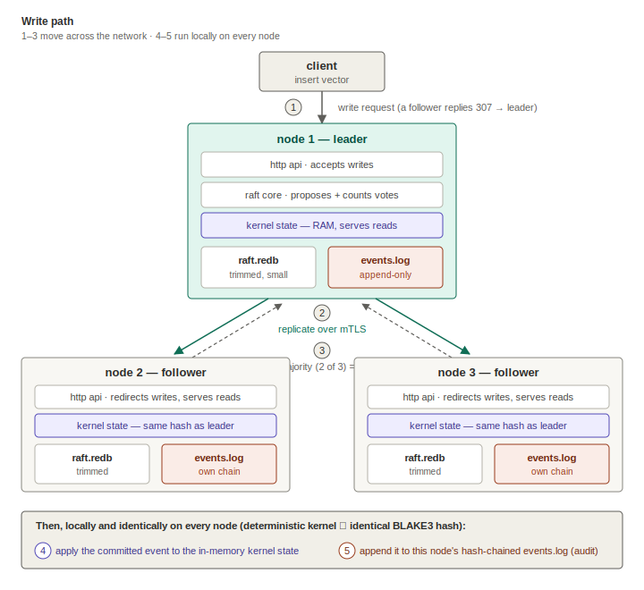
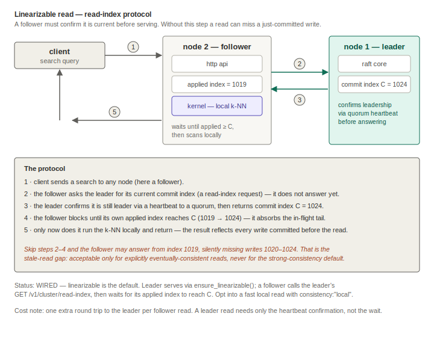
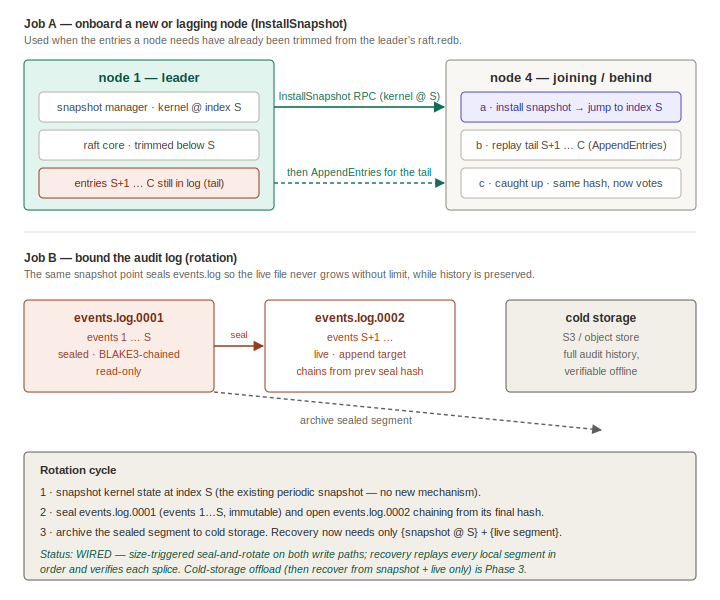

# Valori cluster architecture

How a 3-node Valori cluster moves data, stays consistent, and onboards new
nodes — and what each node stores. The full narrative lives in the phase
reports ([docs/phases/](../phases/README.md)); this page is the picture.

A status tag marks each protocol: **[wired]** is in the current build,
**[designed]** is the intended protocol not yet in code. Drawing the designed
paths here is deliberate — the design is only solid once they are explicit.

---

## 1. Write flow

Steps **1–3 are network movements**; steps **4–5 run locally and identically
on every node**. Keeping that distinction visible is the point of the redraw —
apply and audit are not things the *leader* does, they are things *each* node
does once an entry is committed.

1. **Write request** — the client hits any node. A follower answers
   `307 Temporary Redirect` with the leader's address in `Location`; the
   leader accepts. **[wired]**
2. **Replicate** — the leader appends the event to its own `raft.redb` and
   pushes it to every follower over mutually-authenticated TLS (peers without
   a certificate from this cluster's CA are refused at the handshake). **[wired]**
3. **Commit** — the moment a majority (2 of 3) has the entry on disk it is
   *committed*: it cannot be lost, even if the leader dies immediately after. **[wired]**
4. **Apply** — every node independently applies the committed event to its
   in-memory kernel. The kernel is deterministic, so all three end up
   byte-identical — CI asserts the BLAKE3 state hashes match. **[wired]**
5. **Audit** — only after a successful apply does each node append the event
   to its own `events.log`: the append-only, hash-chained diary that
   `valori-verify` checks. **[wired]**

## 2. Linearizable read (read-index)

Reads are served locally on any node — that is what the replicas' RAM buys.
But "locally" is not automatically "currently": a follower at applied index
1019 must not answer a query that should reflect a write committed at 1024.

The **read-index protocol** closes that gap. Before serving, the follower asks
the leader for its commit index `C`; the leader confirms it is still the leader
via a heartbeat to a quorum and returns `C`; the follower blocks until its own
applied index reaches `C`, then runs the query. The result then reflects every
write committed before the read began.

- **[wired]** — linearizable is the **default** read consistency. The leader
  serves via openraft's `ensure_linearizable()`; a follower calls the leader's
  `GET /v1/cluster/read-index`, then `wait().applied_index_at_least(C)` before
  scanning local state. One extra leader round trip per follower read is the
  cost (leader reads pay only the heartbeat confirmation).
- A client may opt into a faster, eventually-consistent read with
  `consistency: "local"` (SDK: `search(..., consistency="local")`), which skips
  the read-index round trip and serves immediately from the queried node.

With read-index wired, the cluster is end-to-end linearizable by default:
strongly-consistent writes *and* reads, with local reads available as an
explicit opt-in.

## 3. The snapshot's two jobs

One periodic snapshot of kernel state does double duty.

**Job A — onboarding (InstallSnapshot). [wired]**
When node 4 joins, or a follower falls so far behind that the leader has
already trimmed the Raft entries it needs, the leader ships the kernel snapshot
via the `InstallSnapshot` RPC. The joiner installs it to jump to the snapshot
index `S`, then replays the remaining tail `S+1…C` through normal
`AppendEntries`. openraft drives this automatically; the state machine
implements `get_snapshot_builder` / `begin_receiving_snapshot` /
`install_snapshot`, and the gRPC transport carries the RPC. Without this path,
a new node could never catch up once the log it needs has been compacted.

**Job B — rotation. [wired]**
"Append-only forever" is correct for audit but unbounded on disk. Once the live
`events.log` passes a size threshold (`VALORI_EVENT_LOG_ROTATION_BYTES`, default
256 MiB), it is sealed to `events.log.NNNNNN` (named by segment sequence, never
a timestamp — so two rotations in the same second can't collide), and a fresh
segment opens chaining from the sealed segment's final hash. Both write paths
rotate: the standalone `EventCommitter` and the cluster `EventLogAuditSink`.
The BLAKE3 chain carries across segment boundaries, and **recovery replays every
local segment in sequence order**, verifying each splice — so a rotated log
recovers losslessly (a missing or substituted archive breaks the splice and is
caught, not silently skipped). Moving sealed segments to cold storage (S3) and
recovering from `{snapshot @ S} + live segment` alone is the Phase-3 step;
today the sealed segments stay local and are all replayed.

---

## The two files per node

| File | Role | Lifecycle |
|---|---|---|
| `raft.redb` | consensus scratchpad — entries being voted on, this node's ballot | trimmed after every snapshot; stays small |
| `events.log` | the audit diary — committed events only, BLAKE3-chained | append-only, rotated into sealed+archived segments (Job B) |

Three nodes therefore hold three independently verifiable copies of one logical
history. Any single node's diary (plus its archived segments) is sufficient
evidence — the other two machines can be gone.

## The one rule

**Raft commits, kernel applies, audit log records.** The Raft log is internal
plumbing; the audit log is forever; the kernel is never modified by the
consensus layer — its determinism is the load-bearing wall.

## Active divergence detection **[wired]**

Each node runs a background watcher (default period: 30 s, env:
`VALORI_STATE_HASH_CHECK_SECS`) that calls `/v1/proof/state` on every peer and
compares the BLAKE3 state hash. The result is published as the Prometheus gauge
`valori_raft_state_hash_match` (1 = all agree, 0 = any mismatch). Mismatches
are also logged at `ERROR` and counted by
`valori_raft_divergence_detections_total`. Alert on `valori_raft_state_hash_match == 0`.

In a correct cluster this gauge is always 1. A `0` means either a genuine
state divergence (a bug — file an issue immediately) or a transient probe
failure during a rolling restart (unreachable peers are not counted as mismatches
to avoid false positives; only a hash mismatch fires the gauge).

The cluster-wide BLAKE3 proof *broadcast* (every node pushing its hash to every
other node and surfacing via `/v1/cluster/proof`) and cold-storage offload of
sealed audit segments to S3 are Phase-3 additions.
