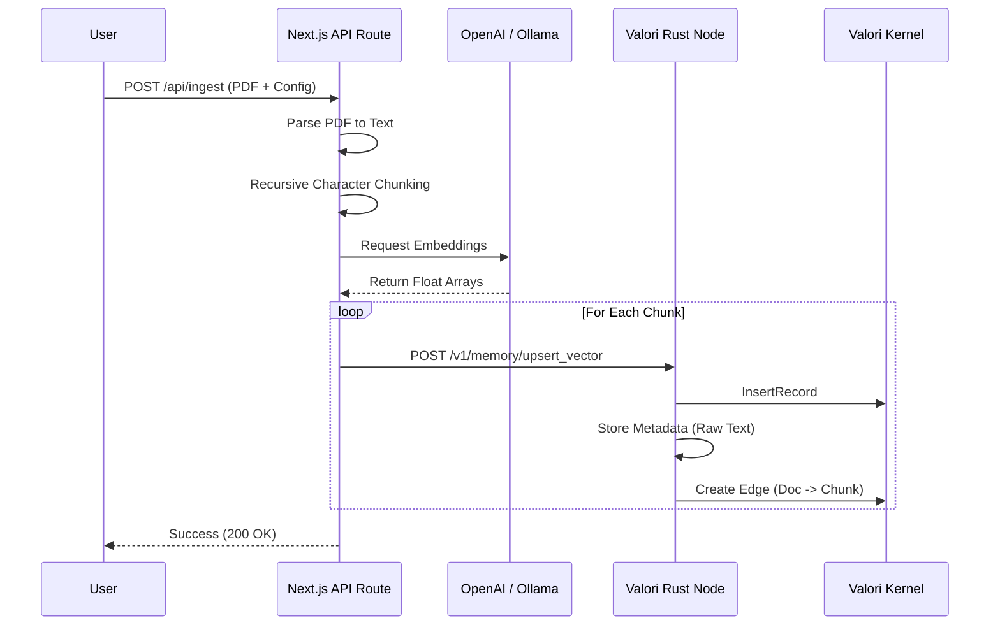

# Phase 4: UI Ingestion Pipeline

To preserve the `#![no_std]` and deterministic moat of the Valori Rust Kernel, we explicitly decouple all non-deterministic document parsing, embedding generation, and HTTP calls into the Next.js UI layer (or the Python SDK `valoricore`).

This document outlines the architecture for the Next.js Ingestion Pipeline implemented in Phase 4.

## Architecture Diagram

## Supported Features

### Document Types
- **PDF**: Supported via `pdf-parse`.
- **TXT**: Native support.
- **DOCX**: Supported via `mammoth` (pending UI implementation).

### Chunking Strategy
We use a **Recursive Character Text Splitter** implemented purely in TypeScript to avoid bloating the frontend bundle with heavy LangChain dependencies.
- **Configurable Chunk Size**: 100 - 2000 characters.
- **Configurable Overlap**: 0 - 50% of chunk size.
- **Guardrails**: Prevents malicious inputs (e.g., chunk size of 1) that could DDoS embedding providers.

### Embedding Strategy Pattern
We implement a unified `EmbeddingProvider` interface to effortlessly support multiple models:
1. **Local Open Source (`TransformersProvider`)**: Uses `@xenova/transformers` to run models natively inside the Next.js API route without any external API dependencies. Supports:
   - `bge-base-en-v1.5` (768 dims)
   - `all-MiniLM-L6-v2` (384 dims)
   - `e5-base-v2` (768 dims)
2. **OpenAI (`text-embedding-3-small`)**
3. **Ollama (`nomic-embed-text`)**

Adding support for Cohere or Anthropic in Phase 5 requires zero refactoring of the chunking or upsert logic.

## Storage and Knowledge Graph
When a document is ingested:
1. The UI creates a `Document` node in the Valori Knowledge Graph.
2. The UI pushes each chunk's embedding to the vector store.
3. The UI creates a `Chunk` node for each embedding and automatically links it to the `Document` node using a `ParentOf` edge.
4. The raw chunk text is safely persisted in the Valori Node's sidecar metadata registry.
